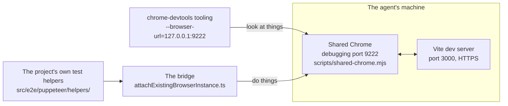
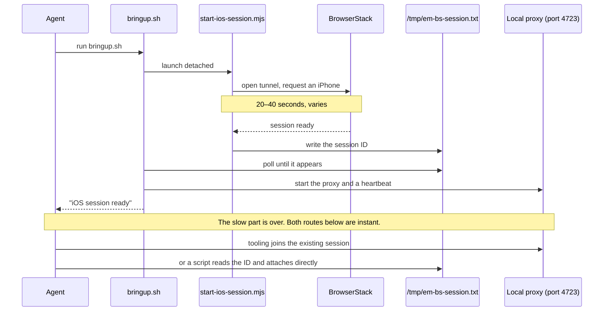

# Environment

The agent wakes up in a machine that has already been prepared for it. Understanding what is already running — and why it was set up that way rather than left to the agent — explains most of the odd-looking decisions in the skills.

## What the setup step builds

[`.github/workflows/copilot-setup-steps.yml`](../../.github/workflows/copilot-setup-steps.yml) runs before the agent's session begins. The file name and the job name inside it must both be exactly `copilot-setup-steps`, or Copilot will not use it.

| Step | Why |
| --- | --- |
| Install dependencies | So the agent does not spend its first minutes on `yarn` |
| Install and start a virtual display | The machine has no screen, and Chrome needs one to run |
| Write BrowserStack credentials to a local env file | So the iOS test runner finds them; the file is git-ignored |
| Pre-pull the browserless Docker image | Downloading it later would happen inside the agent's run instead |
| Start a shared Chrome with debugging on port 9222 | See below — this is the important one |
| Start the Vite dev server on port 3000 | So the app is already there to be driven |

Both background services are started detached with their output redirected to a log, and the step then polls until each responds before finishing. Failing here, loudly, is much better than the agent starting up and finding a half-built environment.

**The agent is told not to redo any of this.** Both prompt files carry an Environment section saying the dev server is already running, dependencies are already installed, and logs are at `/tmp/dev-server.log`. Without that, an agent will helpfully run `yarn start`, hit an occupied port, and spend a while confused.

### The dev server serves HTTPS

The dev server uses HTTPS with a self-signed certificate. It only serves plain HTTP if started with `HTTP=1`, which the setup step does not do — but since that override exists, nothing should hard-code the scheme. The standard check tries HTTPS first and falls back:

```bash
curl -fsSk -o /dev/null https://localhost:3000 || curl -fsS -o /dev/null http://localhost:3000
```

The `-k` accepts the self-signed certificate. The shared Chrome is launched with certificate errors ignored, so the agent should never see a browser warning page.

## One browser, two ways in

The single most useful thing in this setup is that **the agent's tooling and the project's test helpers drive the same browser.**



The tooling is configured with `--browser-url`, which means it **joins** the already-running Chrome rather than launching its own. The bridge connects to the same one. So the agent can inspect the page with one tool, act on it with a helper through the other, and both are looking at the same window.

This is what makes the observe-versus-act rule practical. Reading state uses whatever tool is convenient; acting on the app goes through the helpers the test suite already uses — which means a reproduction is already most of the way to being a test.

Because the tooling joins rather than launches, **Chrome must already be running**. If a tooling call cannot connect, the answer is to start `scripts/shared-chrome.mjs`, not to launch a browser some other way.

### What the bridge actually is

[`src/e2e/puppeteer/attachExistingBrowserInstance.ts`](../../src/e2e/puppeteer/attachExistingBrowserInstance.ts) connects to the shared Chrome, finds the tab with the app in it, and hands it to the helpers as the page they operate on.

There is a concrete reason it exists rather than just using the tooling for everything: connecting this way restores real touch input, which the general tooling does not expose. Real touch is what makes the actual gesture helper work — the same code the test suite runs, rather than an approximation of it.

Using it means writing a small throwaway script that imports the bridge and whichever helpers are needed, and running it:

```ts
import { attachExistingBrowserInstance } from '<repo>/src/e2e/puppeteer/attachExistingBrowserInstance'
import gesture from '<repo>/src/e2e/puppeteer/helpers/gesture'

const main = async () => {
  const { browser, page } = await attachExistingBrowserInstance()
  try {
    await gesture('rd')
    console.log(JSON.stringify(await page.evaluate(() => document.querySelectorAll('[data-editable]').length)))
  } finally {
    await browser.disconnect() // disconnect, never close — the tooling is using this browser too
  }
}
main().catch(e => {
  console.error(e)
  process.exit(1)
})
```

Two things to get right. **Disconnect, never close** — closing would take the browser out from under the agent's other tools. And the script is glue only: call helpers, compose them, never re-implement what one already does.

## iOS

iOS runs the real app on a real iPhone through BrowserStack, giving access to both the native layer and the web page in a single session.

### Why the session is created by a shell script

This looks convoluted until you know the constraint. BrowserStack takes 20 to 40 seconds to allocate a physical iPhone, and it varies. The tooling that would normally create the session has a request timeout that is fixed and cannot be configured, and the allocation wait can exceed it.

So session creation is moved out of the tooling entirely:



Nothing waits on a tool call during the slow part. A detached background process does the waiting, and the agent polls a file — and the shell tool's own timeout is generous.

Three pieces come out of this:

- **[`scripts/start-ios-session.mjs`](../../scripts/start-ios-session.mjs)** opens a tunnel so the phone can reach the dev server, requests the device, and stays alive so the tunnel can be shut down cleanly on exit. The tunnel binary itself is a self-daemonizing process that would survive the script — staying alive is about owning its cleanup, not holding it open.
- **[`.github/skills/browser-control-ios/heartbeat.sh`](../../.github/skills/browser-control-ios/heartbeat.sh)** pings the session every 90 seconds so BrowserStack does not reclaim it while the agent is thinking. It gives up after three consecutive failures and writes out BrowserStack's own explanation of what happened — which is the only after-the-fact clue available if a session dies.
- **[`scripts/mcp-session-proxy.mjs`](../../scripts/mcp-session-proxy.mjs)** is a small local server. The three separate problems it solves are laid out in [MCP servers](mcp.md#why-there-is-a-shim-in-the-middle). The tooling connects to it and asks to start a session; instead of creating one, it hands back the session that already exists, instantly.

The proxy solves a second problem too. The sandbox's firewall rejects certain outgoing requests because of a malformed header, so the proxy forwards requests itself in a way the firewall accepts. Everything from the agent to the proxy is local traffic, which is never inspected.

### The app on the device

iOS runs a pre-built app uploaded to BrowserStack under the name `em-server-mode`. It is not rebuilt per run — day-to-day web changes do not need one, since the app loads the dev server through the tunnel.

Two ways this bites, both ending in a black screen and a timeout, and both needing a human at a Mac:

- **The upload lapsed.** BrowserStack deletes apps 30 days after last use.
- **The build is bad.** The app has its dev-server address baked in and needs the self-signed certificate handler compiled in, and a build made any other way than `yarn build:ios:browserstack` (which bakes the address and forces a Debug configuration) tends to get one of them wrong — the webview then loads nothing. The skill doc explains how to tell the two bad-build modes apart from inside a session.

Either way it has to be rebuilt and re-uploaded with `yarn build:ios:browserstack` from a Mac with Xcode signing set up.

### The iOS bridge

[`src/e2e/iOS/attachExistingSession.ts`](../../src/e2e/iOS/attachExistingSession.ts) reads the session ID from the file, attaches, and switches into the web layer. From there, working with the page is identical to any other platform.

Worth knowing: the first attach costs tens of seconds while the connection to the web layer warms up. Compose several actions into one script rather than running several scripts.

Two iOS-specific gotchas: the standard `click` does nothing on iOS, so use the `tap` helper. And editing a source file triggers a reload on the device, which wipes app state — so re-create anything you had set up after an edit.

## Running the actual tests

The skills draw a hard line between **driving the live app** and **running a test**.

Reproduction drives the live app: the shared Chrome, the dev server on port 3000, the interactive tooling. Exploratory and messy by design.

Running a test uses the real test harness instead, which starts its own browser in Docker on port 7566 and its own server on port 2552. It handles launching the app and resetting state between tests. **Do not point it at the exploration setup** — it manages its own.

One wrinkle worth knowing, because it produces a baffling error otherwise. The puppeteer script only starts Docker and its own server when it thinks it is not in CI. The agent's machine claims to be CI but does not provide those services, so the test tries to connect to a browser that was never started. Clearing the variable for that one command fixes it:

```bash
GITHUB_ACTIONS="" ./src/e2e/puppeteer/test-puppeteer.sh src/e2e/puppeteer/__tests__/<file>.ts -t "<test name>"
```

iOS tests run on BrowserStack, the same as reproduction, but the runner opens its own separate session.

## The firewall

Outbound network access is blocked by default. Allowed hosts are listed in `COPILOT_AGENT_FIREWALL_ALLOW_LIST_ADDITIONS` in the setup workflow — currently the BrowserStack hubs, its API, and the tunnel service.

A blocked host usually does not produce a clear error. It looks like a hang or a confusing connection failure. **If something external suddenly stops working, check this list first.**
