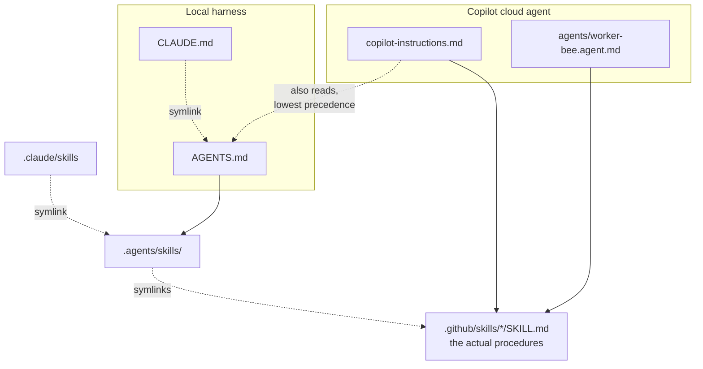

# External agents

Everything else in this folder describes the GitHub Copilot cloud agent. This page describes the other half: **agents running on a developer's own machine** — Codex, Claude Code, or anything else that reads a repository-level instruction file.

They are two environments that deliberately share their procedures. A cloud agent wakes up in a runner where the dev server is already listening, Chrome is already up on a debugging port, and BrowserStack credentials are already in the environment. None of that is true on a laptop. But *how to plan a change*, *how to write a test that fails for the right reason*, and *how to end a session honestly* do not depend on any of it.

The environments are separate; the instruction files are not. The cloud agent reads the local entry point as well as its own, which constrains how that file can be written.

## The two entry points

| | Cloud agent | Local agent |
| --- | --- | --- |
| Reads | `.github/copilot-instructions.md`, `.github/agents/worker-bee.agent.md`, `.github/instructions/*` — **and `AGENTS.md` and `CLAUDE.md`** | `AGENTS.md` (Claude Code via `CLAUDE.md` → symlink) |
| Skills in | `.github/skills/` | `.agents/skills/` → symlinks → `.github/skills/` |
| Browser work | Yes — provisioned Chrome and real iPhones | No |

The cloud agent's row is the surprising one, and it shapes everything below — see [Copilot reads AGENTS.md too](#copilot-reads-agentsmd-too).



`AGENTS.md` is the canonical local entry point and `.agents/skills/` the canonical local skill directory. Claude Code's `CLAUDE.md` and `.claude/skills` are symlinks onto them, so a Claude Code session and a Codex session read byte-identical instructions. Both tools follow symlinks.

The `CLAUDE.md` symlink is required, not decorative: Claude Code does **not** read `AGENTS.md` natively, and `ln -s AGENTS.md CLAUDE.md` is Anthropic's own documented workaround.

## Copilot reads AGENTS.md too

This was designed on the assumption that the two entry points were read by two different agents. That assumption was wrong, and it is worth stating plainly because it constrains how `AGENTS.md` can be written.

Since August 2025 the Copilot coding agent reads `AGENTS.md` — and `CLAUDE.md`, and `GEMINI.md` — [alongside](https://github.blog/changelog/2025-08-28-copilot-coding-agent-now-supports-agents-md-custom-instructions/) its own files. They are **combined, not overridden**: "all sets of relevant instructions are provided to Copilot", in [this order of precedence](https://docs.github.com/en/copilot/concepts/response-customization):

1. Path-specific — `.github/instructions/*.instructions.md`
2. Repository-wide — `.github/copilot-instructions.md`
3. Agent instructions — `AGENTS.md`, `CLAUDE.md`, `GEMINI.md`

There is no documented way to switch that off, so this cannot be solved by exclusion. Two consequences follow.

**Every statement in `AGENTS.md` has to be true for the cloud agent as well.** An early draft opened by declaring that the Copilot agent does not read the file, and elsewhere stated that the browser and device skills were unavailable. Copilot would have read both as being about itself — and the second is precisely the belief [`issue-repro`](skills.md#issue-repro) exists to fight, since agents talk themselves out of iOS work given any excuse. Anything environment-specific belongs in the Copilot files, which the cloud agent reads at higher precedence anyway.

**`AGENTS.md` is deliberately the softer document.** It describes rather than dictates, because a developer's own machine is their own workflow — branch naming, commit granularity, and when to run what are not this file's business. That register is safe *because* of the precedence order: the strict forms of the rules that protect shared state, like the exit gate and the documentation obligation, are stated independently in `.github/copilot-instructions.md`, which outranks this file. The rule to remember when editing: **do not soften something only `AGENTS.md` says**, or the cloud agent inherits the soft version by default.

Because `CLAUDE.md` is a symlink, Copilot ingests the same content twice, once under each name. That is wasteful rather than harmful, and it is the price of Claude Code support.

## Why the skills are symlinked rather than copied

This repository has twice been bitten by the same defect: content duplicated across two files that then quietly disagreed. First the two Copilot prompt files, which drifted over several commits and had to be re-unified. Then `docs/agents/skills.md`, which restated each skill's steps and went stale the moment a step was added.

A symlink makes that failure impossible rather than merely detectable. There is one file. Editing it from either side edits both, and there is no diff to remember to run.

That is also why a skill needing slightly different behaviour per harness gets **one clause**, not a fork:

> A draft PR exists for the branch. On Copilot, create it with the `runtime-tools-create_pull_request` tool — do not shell out to `git` or `gh` to open one. In a local harness, where that tool does not exist, `gh pr create --draft` is the equivalent.

The skill states *what* must be true and lets a single clause carry *how* per environment. A forked hundred-and-fifty-line skill would drift; a two-clause sentence will not.

## What is shared, and what is not

**Shared** — [`write-issue`](skills.md#write-issue), [`plan`](skills.md#plan), [`tdd-write-failing-test`](skills.md#tdd-write-failing-test), [`test-diagnosis`](skills.md#test-diagnosis), [`puppeteer-update-snapshots`](skills.md#puppeteer-update-snapshots), [`ci-monitor`](skills.md#ci-monitor), [`docs-sync`](skills.md#docs-sync), [`end-session`](skills.md#end-session).

Three of those needed a per-harness clause. `end-session` and `ci-monitor` name a Copilot tool that has no local equivalent — opening a pull request, listing workflow runs — and now name the `gh` command alongside it. `test-diagnosis` was written as though a failure could only arrive from CI; its trigger now covers a suite run locally, where the output is already on screen rather than in a log to be fetched.

`write-issue` needed nothing — it shells out to `gh` and names no provisioned resource.

The rest of it was portable untouched. `puppeteer-update-snapshots` turned out to be the *most* local skill in the set — its command explicitly unsets `GITHUB_ACTIONS` so that the Docker and Vite setup runs, which is exactly the local path.

**Not shared** — [`browser-control`](skills.md#browser-control) and its Chrome and iOS halves, [`issue-repro`](skills.md#issue-repro), and [`run-test`](skills.md#run-test).

These depend on things the runner provides: Chrome already listening on a debugging port, a dev server already up, BrowserStack credentials, and MCP servers configured outside this repository. `issue-repro` and `run-test` are not conceptually cloud-only — reproduce before theorising, and never let a skipped test's "0 tests run" masquerade as a pass, are good rules anywhere — but both delegate to `browser-control`, so adapting them means solving the local browser story first. `AGENTS.md` states the reproduce-first principle in prose instead, so the discipline survives even though the skill does not.

One idea inside `browser-control` is worth knowing wherever you drive this app, because it is a property of **em** rather than of any harness: *observing is free, but actuating goes through the project's own e2e helpers*, since em's controls use `fastClick` and a raw mouse click silently no-ops under touch emulation. It has not been extracted into a shared skill — do that if it starts causing trouble locally.

## Changing any of this

**Adding a skill to the shared set** is one symlink:

```bash
ln -s ../../.github/skills/<name> .agents/skills/<name>
```

Then add a row to the table in `AGENTS.md`, and update the shared list on this page. Check first that the skill names no cloud-only tool or provisioned resource — and if it names one in a single line, prefer the one-clause treatment above to leaving it out.

**The two prompt files are not symlinked to each other, and should not be.** `AGENTS.md` and `.github/copilot-instructions.md` genuinely differ: one describes an environment that is already running, the other an environment you have to start, and one dictates where the other suggests. Their overlap is the parts already delegated to skills. Do not try to unify them — unify the procedures they both call instead. Remember that the cloud agent reads *both*, so they must not contradict each other, only differ in what they cover.

**`allowed-tools` is an open question.** Every skill declares it with Copilot's vocabulary — `bash`, and the MCP *server* names `chrome-devtools` and `wdio`. Claude Code expects its own tool names, and none of the skills installed locally on any developer machine here use the field at all. Whether an unrecognised value is ignored or is treated as a restriction granting nothing has not been tested. If a shared skill behaves as though it has no tools, this is the first thing to check.
