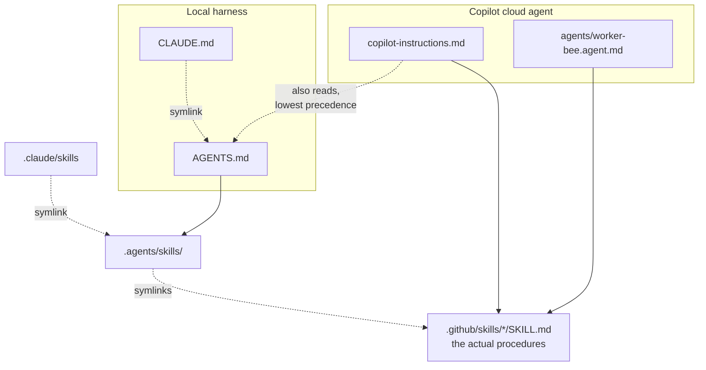

# External agents

Everything else in this folder describes the GitHub Copilot cloud agent. This page describes the other half: **agents running on a developer's own machine** — Codex, Claude Code, or anything else that reads a repository-level instruction file.

They are two environments that deliberately share their procedures. A cloud agent wakes up in a runner where the dev server is already listening, Chrome is already up on a debugging port, and BrowserStack credentials are already in the environment. None of that is true on a laptop. But *how to plan a change*, *how to write a test that fails for the right reason*, and *how to end a session honestly* do not depend on any of it.

The environments are separate; the instruction files are not. The cloud agent reads the local entry point as well as its own, which constrains how that file can be written.

## The two entry points

| | Cloud agent | Local agent |
| --- | --- | --- |
| Reads | `.github/copilot-instructions.md`, `.github/agents/worker-bee.agent.md`, `.github/instructions/*` — **and `AGENTS.md` and `CLAUDE.md`** | `AGENTS.md` (Claude Code via `CLAUDE.md` → symlink) |
| Skills in | `.github/skills/` | `.agents/skills/` → symlinks → `.github/skills/` |
| Browser work | Yes — provisioned Chrome and real iPhones | No |

The cloud agent's row is the surprising one, and it shapes everything below — see [Copilot reads AGENTS.md too](#copilot-reads-agentsmd-too).


```mermaid
flowchart TD
    subgraph cloud["Copilot cloud agent"]
        CI["copilot-instructions.md"]
        WB["agents/worker-bee.agent.md"]
    end
    subgraph local["Local harness"]
        AG["AGENTS.md"]
        CL["CLAUDE.md"]
        CL -.symlink.-> AG
    end
    SK[".github/skills/*/SKILL.md<br/>the actual procedures"]
    AS[".agents/skills/"]
    CS[".claude/skills"]

    CS -.symlink.-> AS
    AS -.symlinks.-> SK
    CI --> SK
    WB --> SK
    AG --> AS
    CI -.also reads,<br/>lowest precedence.-> AG

    click SK "https://github.com/cybersemics/em/blob/HEAD/docs/agents/skills.md" "What each skill does"
    click CI "https://github.com/cybersemics/em/blob/HEAD/.github/copilot-instructions.md" "Open copilot-instructions.md"
    click AG "https://github.com/cybersemics/em/blob/HEAD/AGENTS.md" "Open AGENTS.md"
```

`AGENTS.md` is the canonical local entry point and `.agents/skills/` the canonical local skill directory. Claude Code's `CLAUDE.md` and `.claude/skills` are symlinks onto them, so a Claude Code session and a Codex session read byte-identical instructions. Both tools follow symlinks.

Local Codex, Claude Code, Pi, OpenCode, and Cursor Agent commits use the repo's `.hooks/commit-msg` hook, installed through `postinstall` via `core.hooksPath`. The hook itself is a bash check that exits at once unless one of those agents' session variables is set, so a developer's own commits never start Node or touch the message. In an agent's shell it hands the message to `.hooks/commit-msg.mjs`, a Node script with no dependencies — Node rather than Python because every machine that has these hooks installed them through `yarn`. Each harness is one entry in that script's `HARNESSES` table, naming its session variable, its co-author identity, and how to read the model and effort from its session record; supporting another harness means adding an entry there and its variable to the bash check. When `CODEX_SESSION_ID` is present, it reads the latest model and effort from that session's local record and normalizes the message to one Codex co-author trailer. When `CLAUDE_CODE_SESSION_ID` is present instead, it does the same from the Claude Code transcript (`~/.claude/projects/<project>/<session>.jsonl`, or under `CLAUDE_CONFIG_DIR`), taking the model ID and the `effort` field from the latest main-thread assistant record, and replaces the display-name trailer Claude Code writes on its own. Pi's agent exports `PI_SESSION_ID`, `PI_MODEL`, and `PI_REASONING_LEVEL` to every command it runs (from Pi 0.82), so its entry reads the model and level straight from the environment; `PI_CODING_AGENT` is not used because Pi also sets it for commands the user types with `!`. OpenCode sets `OPENCODE=1` but no session ID, so `.opencode/plugins/session-env.js` uses OpenCode's `shell.env` plugin hook to export `OPENCODE_SESSION_ID`. The hook then opens OpenCode's SQLite database (`~/.local/share/opencode/opencode.db`, or `OPENCODE_DB`) read-only through Node's built-in `node:sqlite`, taking the model from the session's latest assistant message and the effort from the latest user message's variant. A message records a variant only when one was chosen, so the hook falls back to the session's own, which is usually `default` — the model's provider default rather than a chosen level. It leaves other co-authors and Git commits without any of these session markers alone, and skips cherry-picks, rebases, reverts, and merges to preserve replayed commits. A missing session field becomes `unknown`; `config.toml` is a default that can be overridden, so the hook does not infer from it. None of these session record formats is a stable public interface, which is why an unreadable record also produces `unknown` rather than a guessed value.

Cursor Agent's shell carries `CURSOR_CONVERSATION_ID` and `CURSOR_REQUEST_ID`, the conversation and generation IDs, but not the model, which Cursor gives only to its own hooks. So `.cursor/hooks.json` runs `.cursor/hooks/save-prompt-model.mjs` on every prompt, saving the payload's `model`, `model_id`, and `model_params` under `cursor-attribution-cache/` in the Git metadata directory, in a file named by the SHA-256 of the conversation ID. The `commit-msg` hook keys off `CURSOR_CONVERSATION_ID` rather than `CURSOR_AGENT`, so a commit typed in Cursor's own terminal never gets a Cursor trailer. It reads that conversation's record and uses it only when its generation ID equals `CURSOR_REQUEST_ID`, so an earlier prompt's model is never credited. The effort is Cursor's `effort` or `reasoning_effort` parameter. When Cursor exposes only Auto, default, or another non-specific model, both fields become `unknown`, since an effort without a named model would describe whatever Auto routed to. Cursor's Commit Attribution setting adds a bare `Co-authored-by: Cursor <cursoragent@cursor.com>` with `--trailer`; Git applies it before `commit-msg` runs, so the hook replaces it rather than leaving a duplicate.

The `CLAUDE.md` symlink is required, not decorative: Claude Code does **not** read `AGENTS.md` natively, and `ln -s AGENTS.md CLAUDE.md` is Anthropic's own documented workaround.

## Copilot reads AGENTS.md too

This was designed on the assumption that the two entry points were read by two different agents. That assumption was wrong, and it is worth stating plainly because it constrains how `AGENTS.md` can be written.

Since August 2025 the Copilot coding agent reads `AGENTS.md` — and `CLAUDE.md`, and `GEMINI.md` — [alongside](https://github.blog/changelog/2025-08-28-copilot-coding-agent-now-supports-agents-md-custom-instructions/) its own files. They are **combined, not overridden**: "all sets of relevant instructions are provided to Copilot", in [this order of precedence](https://docs.github.com/en/copilot/concepts/response-customization):

1. Path-specific — `.github/instructions/*.instructions.md`
2. Repository-wide — `.github/copilot-instructions.md`
3. Agent instructions — `AGENTS.md`, `CLAUDE.md`, `GEMINI.md`

There is no documented way to switch that off, so this cannot be solved by exclusion. Two consequences follow.

**Every statement in `AGENTS.md` has to be true for the cloud agent as well.** An early draft opened by declaring that the Copilot agent does not read the file, and elsewhere stated that the browser and device skills were unavailable. Copilot would have read both as being about itself — and the second is precisely the belief that the [`reproduce`](skills.md#reproduce) skill exists to fight, since agents talk themselves out of iOS work given any excuse. Anything environment-specific belongs in the Copilot files, which the cloud agent reads at higher precedence anyway.

**`AGENTS.md` is deliberately the softer document.** It describes rather than dictates, because a developer's own machine is their own workflow — branch naming, commit granularity, and when to run what are not this file's business. That register is safe *because* of the precedence order: the strict forms of the rules that protect shared state, like the exit gate and the documentation obligation, are stated independently in `.github/copilot-instructions.md`, which outranks this file. The rule to remember when editing: **do not soften something only `AGENTS.md` says**, or the cloud agent inherits the soft version by default.

Because `CLAUDE.md` is a symlink, Copilot ingests the same content twice, once under each name. That is wasteful rather than harmful, and it is the price of Claude Code support.

## Why the skills are symlinked rather than copied

This repository has twice been bitten by the same defect: content duplicated across two files that then quietly disagreed. First the two Copilot prompt files, which drifted over several commits and had to be re-unified. Then `docs/agents/skills.md`, which restated each skill's steps and went stale the moment a step was added.

A symlink makes that failure impossible rather than merely detectable. There is one file. Editing it from either side edits both, and there is no diff to remember to run.

That is also why a skill needing slightly different behaviour per harness gets **one clause**, not a fork:

> A draft PR exists for the branch. On Copilot, create it with the `runtime-tools-create_pull_request` tool — do not shell out to `git` or `gh` to open one. In a local harness, where that tool does not exist, `gh pr create --draft` is the equivalent.

The skill states *what* must be true and lets a single clause carry *how* per environment. A forked hundred-and-fifty-line skill would drift; a two-clause sentence will not.

## What is shared, and what is not

**Shared** — [`bisect`](skills.md#bisect), [`create-issue`](skills.md#create-issue), [`plan`](skills.md#plan), [`tdd-write-failing-test`](skills.md#tdd-write-failing-test), [`compare-debug-log`](skills.md#compare-debug-log), [`test-diagnosis`](skills.md#test-diagnosis), [`puppeteer-update-snapshots`](skills.md#puppeteer-update-snapshots), [`ci-monitor`](skills.md#ci-monitor), [`docs-sync`](skills.md#docs-sync), [`end-session`](skills.md#end-session), [`liminal`](skills.md#liminal), [`report-review-gaps`](skills.md#report-review-gaps).

Three of those needed a per-harness clause. `end-session` and `ci-monitor` name a Copilot tool that has no local equivalent — opening a pull request, listing workflow runs — and now name the `gh` command alongside it. `test-diagnosis` was written as though a failure could only arrive from CI; its trigger now covers a suite run locally, where the output is already on screen rather than in a log to be fetched.

`create-issue` needed nothing — it shells out to `gh` and names no provisioned resource. Neither did `liminal`, which is CSS and a pointer to an image in the repo, nor `report-review-gaps`, whose script only calls `gh`.

`bisect` was written shared from the start. It reproduces through `browser-control` on Copilot and through whatever browser, simulator, or device tooling a local harness has, and its one per-harness clause is where it bisects: in the checkout on a disposable runner, in a separate worktree on a developer's machine, so their work is never checked out from under them.

`compare-debug-log` is shared even though it borders the browser story, because the half that carries the insight does not need a browser: comparing two logs is two files and a script. Only the capture step wants a live session, and a local agent that has one — a dev server and a Chrome on a debugging port — gets that too. Given a log a reporter attached and one captured any other way, the comparison runs anywhere.

The rest of it was portable untouched. `puppeteer-update-snapshots` turned out to be the *most* local skill in the set — its command explicitly unsets `GITHUB_ACTIONS` so that the Docker and Vite setup runs, which is exactly the local path.

**Not shared** — [`browser-control`](skills.md#browser-control) and its Chrome and iOS halves, [`reproduce`](skills.md#reproduce), and [`run-test`](skills.md#run-test).

These depend on things the runner provides: Chrome already listening on a debugging port, a dev server already up, BrowserStack credentials, and MCP servers configured outside this repository. The `reproduce` and `run-test` skills are not conceptually cloud-only — reproduce before theorising, and never let a skipped test's "0 tests run" masquerade as a pass, are good rules anywhere — but both delegate to `browser-control`, so adapting them means solving the local browser story first. `AGENTS.md` states the reproduce-first principle in prose instead, so the discipline survives even though the skill does not.

One idea inside `browser-control` is worth knowing wherever you drive this app, because it is a property of **em** rather than of any harness: *observing is free, but actuating goes through the project's own e2e helpers*, since some of em's controls (the toolbar buttons and color swatches) are bound to touch events only when `isTouch`, so a raw mouse click silently no-ops under touch emulation. It has not been extracted into a shared skill — do that if it starts causing trouble locally.

## Claude Code in the cloud

"Local" above means *not the Copilot cloud agent*, which is not quite the same as *on a laptop*: a Claude Code session started from [claude.ai/code](https://claude.ai/code) reads `AGENTS.md` through the same `CLAUDE.md` symlink and the same `.agents/skills/`, but runs on a disposable Anthropic-managed runner rather than on a developer's machine. Everything above still applies to it. Two properties of that runner do not apply to either of the others, and [`end-session`](skills.md#end-session) Step 8 is where they turn into rules.

The runner is **reclaimed once the session goes idle**, and reopening the session provisions a fresh one. That makes idling the cheap state and waking the expensive one, which inverts the usual instinct to keep a session running: there is no compute charge for the runner, but every wake re-reads the whole conversation. A session whose work is finished should be allowed to end.

The session can also be **woken by pull request activity**, which it subscribes to per pull request. Subscription is the right way to wait, because it costs nothing until GitHub actually emits something. A scheduled check-in on top of it is not, because it fires on a clock rather than on an event and pays to rebuild the runner that idling correctly released. The one blind spot is a conflict created when the base branch advances, which GitHub emits no webhook for at all — [`copilot-conflicts.yml`](../../.github/workflows/copilot-conflicts.yml) covers that from CI on every push to `main`, though it scans only pull requests authored by the Copilot account.

Dependencies are installed when a new cloud session starts, by the SessionStart hook in [`.claude/hooks/SessionStart/yarn-install.sh`](../../.claude/hooks/SessionStart/yarn-install.sh), registered in `.claude/settings.json`. It runs the Yarn release committed at `yarnPath` in `.yarnrc.yml` directly with `node`, not the `yarn` on `PATH`, because the runner's network policy blocks `repo.yarnpkg.com`: plain `yarn` works only until something runs `corepack enable`, after which Corepack tries to download Yarn from there and the install fails. The committed release needs no download, so the install works with no environment variables or per-environment settings. The hook is registered for new sessions only, since a resumed, cleared or compacted session already has `node_modules` and a repeat install costs about 40 seconds, and it exits immediately outside the cloud so a developer's own checkout is left alone. For the same reason, an agent in a cloud session should not run `corepack enable` as the CI workflows do.

A second SessionStart hook, [`.claude/hooks/SessionStart/browserless.sh`](../../.claude/hooks/SessionStart/browserless.sh), prepares the Puppeteer harness. The runner does not start the Docker daemon on its own, so the hook starts it and pulls the browserless image whose tag it reads from `src/e2e/puppeteer/test-puppeteer.sh`. The pull reaches `ghcr.io`, whose layers download from `pkg-containers.githubusercontent.com`, a host the default **Trusted** network level blocks. It succeeds only in an environment set to **Custom** network access with that host added and "Also include default list of common package managers" checked. Use the organization's shared environment, or configure a personal one the same way. The hook runs in the background, on every session start including resumes, and never fails, so in an environment without that host the session works normally and only Puppeteer runs fail. Its output is in `/tmp/browserless-setup.log`. Like the install hook, it exits immediately outside the cloud.

## Changing any of this

**Adding a skill to the shared set** is one symlink:

```bash
ln -s ../../.github/skills/<name> .agents/skills/<name>
```

Then mention it in `AGENTS.md`, where the shared skills are named in prose rather than tabulated, and update the shared list on this page. Check first that the skill names no cloud-only tool or provisioned resource — and if it names one in a single line, prefer the one-clause treatment above to leaving it out.

**The two prompt files are not symlinked to each other, and should not be.** `AGENTS.md` and `.github/copilot-instructions.md` genuinely differ: one describes an environment that is already running, the other an environment you have to start, and one dictates where the other suggests. Their overlap is the parts already delegated to skills. Do not try to unify them — unify the procedures they both call instead. Remember that the cloud agent reads *both*, so they must not contradict each other, only differ in what they cover.

**`allowed-tools` is an open question.** Every skill declares it with Copilot's vocabulary — `bash`, and the MCP *server* names `chrome-devtools` and `wdio`. Claude Code expects its own tool names, and none of the skills installed locally on any developer machine here use the field at all. Whether an unrecognised value is ignored or is treated as a restriction granting nothing has not been tested. If a shared skill behaves as though it has no tools, this is the first thing to check.
