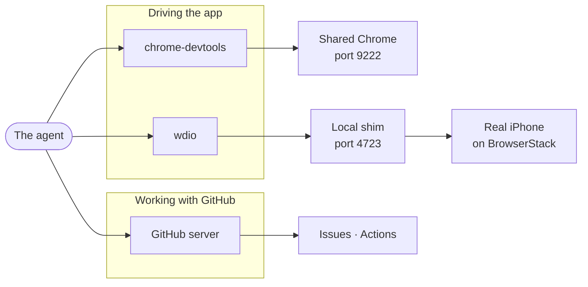
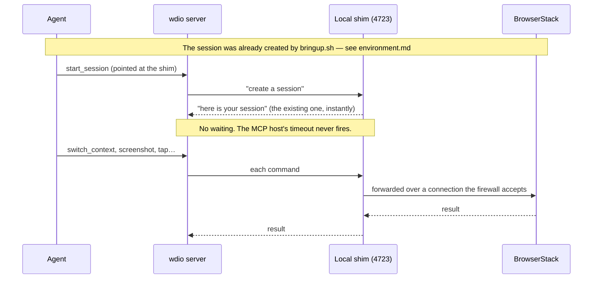
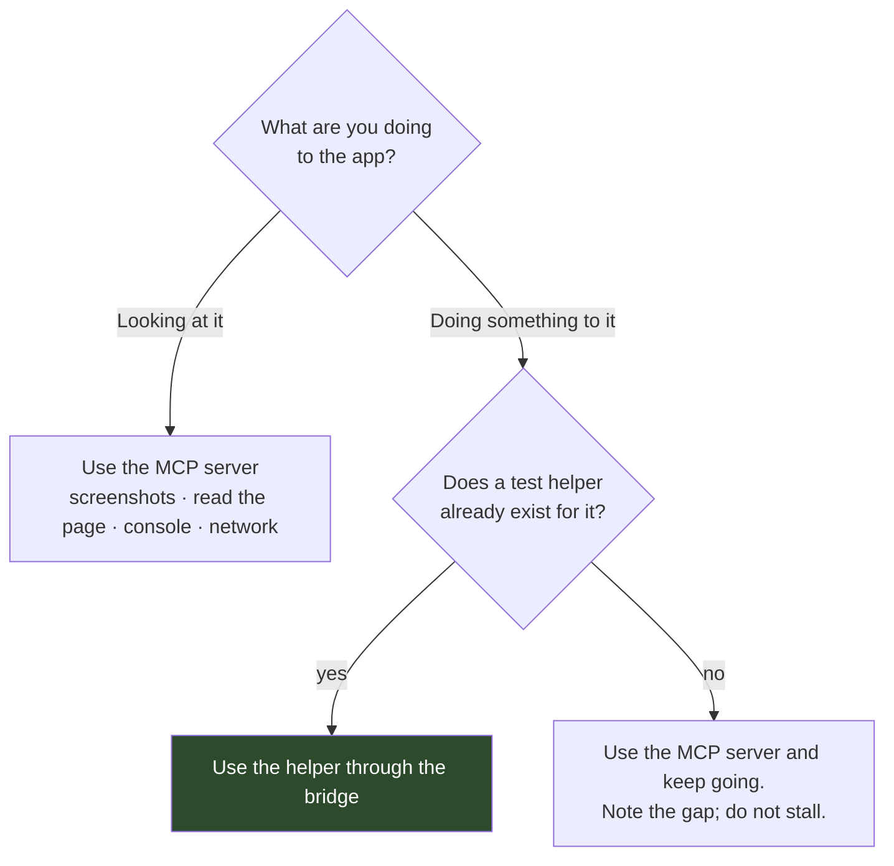

# MCP servers

An **MCP server** is a separate program that gives the agent tools it would not otherwise have. MCP stands for Model Context Protocol, and the idea is simple: the server advertises a set of named tools, the agent calls them, the server does the work and returns a result. Without one, the agent has a shell and a text editor. With one, it can drive a browser, drive a phone, or read a GitHub issue.

Three of them matter here.

| Server | What it gives the agent | Used by |
| --- | --- | --- |
| [`chrome-devtools`](#chrome-devtools) | Driving Chrome — navigate, inspect, screenshot, emulate a phone | [`browser-control-chrome`](skills.md#browser-control-chrome) |
| [`wdio`](#wdio) | Driving a real iPhone through BrowserStack | [`browser-control-ios`](skills.md#browser-control-ios) |
| [GitHub](#the-github-server) | Reading issues, listing CI runs | [`issue-repro`](skills.md#issue-repro), [`ci-monitor`](skills.md#ci-monitor) |



## The most important thing to know

**None of this is configured in the repository.** MCP servers are set up in Copilot's own settings, outside version control. Nothing here will tell you when that configuration changes, breaks, or disagrees with what the skills expect.

That matters because at least one setting is load-bearing. If `chrome-devtools` is not given the right argument, it launches its own browser instead of joining the shared one, and the agent's tools and the project's test helpers end up driving two different windows. Everything appears to work; nothing lines up.

So when browser work starts failing in a way that makes no sense, **check the server configuration before you debug the skills.**

## chrome-devtools

Drives Chrome for web and Android work. The agent uses it to navigate, look at the page, take screenshots, read the console, and switch on phone emulation.

It must be configured to **join the browser that is already running** rather than start a new one:

```
--browser-url=http://127.0.0.1:9222
```

That port is the shared Chrome that [`copilot-setup-steps.yml`](../../.github/workflows/copilot-setup-steps.yml) starts via [`scripts/shared-chrome.mjs`](../../scripts/shared-chrome.mjs). Joining it is what lets the agent inspect the page with one tool and act on it with the project's test helpers through another, both looking at the same window. That arrangement is described in [Environment](environment.md#one-browser-two-ways-in).

Two consequences:

- **Never call `launch_chrome`.** There is already a browser; a second one is not connected to anything.
- **If a call cannot connect, Chrome is not running.** Because this server joins rather than launches, it cannot recover on its own. Start `scripts/shared-chrome.mjs` and try again.

One capability it does *not* offer is real touch input. That is the reason the bridge exists — see [choosing between the server and the bridge](#when-to-use-a-server-and-when-to-use-the-bridge).

## wdio

Drives a real iPhone on BrowserStack, via Appium. Used for switching between the app's native layer and its web page, taking device screenshots, and simple interactions.

### Why there is a shim in the middle

The agent does not point this server at BrowserStack. It points at a small local program, [`scripts/mcp-session-proxy.mjs`](../../scripts/mcp-session-proxy.mjs), which stands between the two:



The shim solves three separate problems, and it is worth knowing all three because each produces a different symptom:

1. **The server can only create sessions, never join one.** It has no concept of attaching to a session someone else made. The shim answers the "create a session" request with the session that already exists, so the server adopts it while believing it made it itself.

2. **Creating a session for real takes too long.** Allocating a physical iPhone takes 20 to 40 seconds and varies. The MCP host has a fixed request timeout that cannot be configured, and the allocation can exceed it. Because the shim answers instantly, nothing ever waits inside a tool call. The actual waiting happens in a background script — see [Environment](environment.md#why-the-session-is-created-by-a-shell-script).

3. **The sandbox firewall rejects the server's requests.** The firewall inspects outgoing traffic and, in doing so, duplicates a header on requests made by the HTTP library this server uses. BrowserStack's front end rejects the duplicate outright with a `400`. The shim re-sends each request itself using a different HTTP library that produces a single clean header, which the firewall leaves alone. The hop from the server to the shim is local traffic, which is never inspected.

So the session is configured like this — pointing at localhost, not at BrowserStack:

```json
{
  "provider": "local",
  "platform": "ios",
  "noReset": true,
  "appiumConfig": { "protocol": "http", "host": "127.0.0.1", "port": 4723, "path": "/wd/hub" }
}
```

**Do not point `start_session` at BrowserStack directly.** It reintroduces the slow provisioning inside a tool call and can hit the timeout the shim exists to avoid.

If a call comes back with an HTML `400 Bad Request` page, the shim's forwarding has broken. Capture `/tmp/em-mcp-proxy.log` and stop — do not try to work around it by making raw web requests, which is exactly what problem 3 above prevents from working.

## The GitHub server

Used in two places:

- [`issue-repro`](skills.md#issue-repro) calls `get_issue` to read the full body and comments of the issue being worked on.
- [`ci-monitor`](skills.md#ci-monitor) lists workflow runs for the current branch, through the **actions** tool with `method: "list_workflow_runs"`. A standalone `list_workflow_runs` tool used to exist and no longer does — a good example of an external tool surface changing underneath the skills that call it.

Opening the pull request is *not* done through this server. Both prompt files specify the `runtime-tools-create_pull_request` tool, which Copilot provides directly, and explicitly forbid shelling out to `git` or `gh` to open one.

## Which skills may use which

Every skill declares what it is allowed to use in its `allowed-tools` frontmatter. Most need nothing but a shell — the browser servers are concentrated in exactly the skills that drive the app.

| Skill | `bash` | `chrome-devtools` | `wdio` |
| --- | :-: | :-: | :-: |
| [`browser-control`](skills.md#browser-control) | ✓ | ✓ | ✓ |
| [`browser-control-chrome`](skills.md#browser-control-chrome) | ✓ | ✓ | ✓ |
| [`browser-control-ios`](skills.md#browser-control-ios) | ✓ | | ✓ |
| [`issue-repro`](skills.md#issue-repro) | ✓ | ✓ | ✓ |
| [`plan`](skills.md#plan) | ✓ | | |
| [`tdd-write-failing-test`](skills.md#tdd-write-failing-test) | ✓ | | |
| [`run-test`](skills.md#run-test) | ✓ | | |
| [`ci-monitor`](skills.md#ci-monitor) | ✓ | | |
| [`test-diagnosis`](skills.md#test-diagnosis) | ✓ | | |
| [`puppeteer-update-snapshots`](skills.md#puppeteer-update-snapshots) | ✓ | | |

[`browser-control`](skills.md#browser-control) and [`issue-repro`](skills.md#issue-repro) list both browser servers because they route to either platform without knowing in advance which it will be.

## When to use a server, and when to use the bridge

The agent has two ways to interact with the running app, and picking the wrong one is a common source of wasted time.



**Looking at the app is free** — use whatever tool is convenient.

**Acting on the app should go through the project's own test helpers**, run against the live session by the bridge. Two reasons: those helpers already encapsulate details that are easy to get wrong by hand, and a reproduction built from them converts into a real test almost for free.

There is a hard technical reason too, not just a stylistic one. **The `chrome-devtools` server cannot produce real touch input.** The app's controls respond to touch events under phone emulation, so a click through the server does nothing at all — no error, no effect. An agent that clicks a button, sees nothing happen, and concludes the button is broken has just invented a bug. Connecting through the bridge restores real touch, which is why the actual gesture helper works there and not through the server.

If no helper covers what you need, use the server and carry on. Reproduction must not stall waiting for a helper to be written.

## When something breaks

| Symptom | Likely cause |
| --- | --- |
| `chrome-devtools` cannot connect | The shared Chrome is not running — start `scripts/shared-chrome.mjs` |
| The agent's browser and the helpers disagree about what is on screen | `--browser-url` is missing, so the server launched its own browser |
| Clicking a control does nothing, with no error | Real touch is missing — use the `click` helper through the bridge, not the server |
| iOS `start_session` hangs or times out | It was pointed at BrowserStack instead of the shim on port 4723 |
| An HTML `400 Bad Request` from an iOS call | Shim forwarding is broken — capture `/tmp/em-mcp-proxy.log` and stop |
| An iOS call says the session is not started | The BrowserStack session ended. Check `/tmp/heartbeat-<id>.log`, then re-run `bringup.sh` |
| A GitHub tool reports an unknown tool name | The server's tool surface changed — check its current tools rather than the skill's wording |
| Any outbound call hangs with no clear error | The firewall — see [Environment](environment.md#the-firewall) |

## Adding a new one

Four things need doing, and only one of them is in this repository:

1. **Configure the server** in Copilot's settings. Not here. Note any argument that is load-bearing.
2. **Allow its hosts through the firewall** by adding them to `COPILOT_AGENT_FIREWALL_ALLOW_LIST_ADDITIONS` in [`copilot-setup-steps.yml`](../../.github/workflows/copilot-setup-steps.yml). A blocked host usually presents as a hang rather than a clear failure.
3. **Add it to `allowed-tools`** in each skill that may use it.
4. **Write it down here**, including the configuration that lives outside the repository. That is the part nobody can recover by reading the code.

Worth considering before adding one at all: a server's tools are available for the whole session, whereas a skill costs nothing until invoked. If the capability can be reached with a script and a helper, that is usually the cheaper answer.
