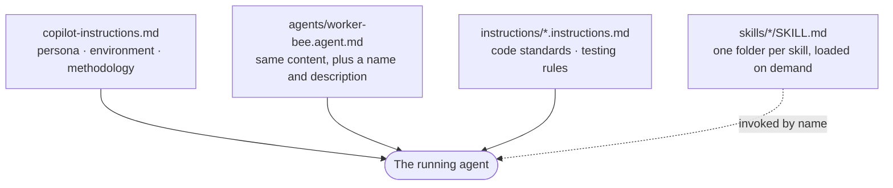
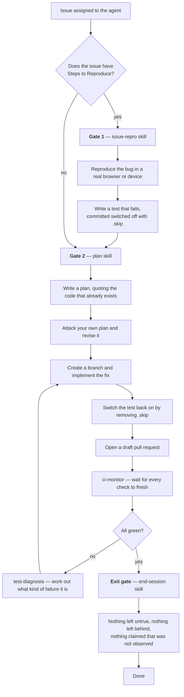

# Agent Infrastructure

This repository is set up so that GitHub Copilot's cloud coding agent can pick up an issue and work it end to end — reproduce the bug, plan a fix, write it, open a pull request, and keep fixing until CI is green — without a human driving each step.

Making that work takes more than a prompt. It takes a described environment, a browser the agent can actually drive, the project's own test helpers exposed to it, and CI that checks the agent did the honest thing rather than the convenient thing. This folder documents all of it.

We targeted Copilot specifically because the project already runs on GitHub — issues, pull requests, and CI are all here, so the agent lives where the work already is.

> Agents running on a developer's own machine — Codex, Claude Code — share a subset of these skills through symlinks. See [External agents](external-agents.md).

| Document                              | What it covers                                                                     |
| ------------------------------------- | ---------------------------------------------------------------------------------- |
| This page                             | The map: what the pieces are, what loads when, how a task flows through them       |
| [Skills](skills.md)                   | Every skill, what each one does, and how they call each other                      |
| [Environment](environment.md)         | What the runner sets up, how the agent drives a browser, how iOS works             |
| [MCP servers](mcp.md)                 | The three external tool servers, what each gives the agent, and how they are wired |
| [The TDD workflow](tdd.md)            | Why regression tests are committed switched off, and what the CI checks mean       |
| [External agents](external-agents.md) | Codex and Claude Code — what they share with the cloud agent, and what they cannot |

## The four kinds of file

Everything the **cloud agent** reads lives under `.github/`. (A local agent reads `AGENTS.md` and `.agents/skills/` instead — see [External agents](external-agents.md).) There are four kinds of file, and the difference between them is **when the agent reads them**.

| Kind                    | Where                                    | When it is read                                |
| ----------------------- | ---------------------------------------- | ---------------------------------------------- |
| Repository instructions | `.github/copilot-instructions.md`        | Every run, automatically                       |
| Agent definition        | `.github/agents/worker-bee.agent.md`     | When you assign work to that named agent       |
| Scoped instructions     | `.github/instructions/*.instructions.md` | Alongside the above                            |
| Skills                  | `.github/skills/<name>/SKILL.md`         | Only when something invokes that skill by name |



The split matters because the agent's attention is finite. Anything in the first three is competing for room on every single run, so it has to earn its place. A skill costs nothing until it is needed, which is why the detailed procedures — how to bring up an iOS device, how to run one test, how to read a CI failure — are skills rather than standing instructions.

### Why there are two near-identical prompt files

From testing, it seems that Copilot more strongly follows custom instructions when they're defined as a **custom agent** than in the `copilot-instructions.md` custom instruction file.

For **the vast majority of development tasks**, we recommend you assign your tasks to the **"🐝 Worker Bee"** coding agent. This'll make sure you're taking advantage of all of the agent optimizations in the project.

However, in some cases, it's **just not possible to assign tasks to a custom agent in Copilot**. For these cases, we keep `copilot-instructions.md` as a backup.

**If you edit one, make the same edit to the other.** Use this command to diff and see if they've drifted:

```bash
diff <(tail -n +6 .github/agents/worker-bee.agent.md) \
     <(tail -n +3 .github/copilot-instructions.md)
```


## How a task actually flows

The agent is not allowed to jump straight to writing code. Two **gates** stand in front of implementation — a gate being a step it must complete and then declare out loud, in a fixed wording, before it may continue.



Both gates exist to stop the same failure. An agent that starts reading source code before it has seen the bug happen will form a theory from the code and then go looking for evidence to support it. Making it reproduce the problem first means it has a real observation to work from. Making it write the plan against quoted, existing code means it extends what is there instead of building something new beside it.

The declarations are literal. After the first gate the agent must print one of these lines exactly:

```
issue-repro: not applicable — the issue has no Steps to Reproduce.
issue-repro: applicable — executing .github/skills/issue-repro/SKILL.md before any investigation.
```

and after the second:

```
plan: complete — architectural plan produced and critique passed per .github/skills/plan/SKILL.md.
```

They are there so that a human reading the transcript can see at a glance whether the process was followed, rather than having to infer it. Both prompts also spell out that printing the line does **not** end the agent's turn — an earlier version of this design had agents printing the line and then stopping to wait for a human who was not there.

### The exit gate

A third gate, [`end-session`](skills.md#end-session), sits right at the end, before the agent is allowed to finish. This skill contains a checklist that the agent must work through it before every ending — finished, escalating, or a turn it believes changed nothing.

```
end-session: complete — checklist passed per .github/skills/end-session/SKILL.md.
end-session: escalating — checklist passed per .github/skills/end-session/SKILL.md; blocked on <one-line reason>.
```


## Where everything lives

```
.github/
├── copilot-instructions.md          Read on every run
├── agents/
│   └── worker-bee.agent.md          The named agent; same content
├── instructions/
│   ├── code-standards.instructions.md
│   ├── testing.instructions.md
│   └── estimate/                    Not a Copilot instruction — see below
├── skills/                          One folder per skill — see skills.md
├── actions/
│   ├── install/                     Cached dependency install
│   ├── serve/                       Start the built app and wait for it
│   └── unskip-added-tests/          Switches .skip tests back on — see tdd.md
└── workflows/
    ├── copilot-setup-steps.yml      Builds the agent's environment
    └── tdd.yml                      Checks new tests genuinely fail first

scripts/
├── shared-chrome.mjs                One Chrome that agent and tests share
├── start-ios-session.mjs            Opens the BrowserStack iOS session
└── mcp-session-proxy.mjs            Lets the iOS tooling join that session

src/e2e/
├── puppeteer/attachExistingBrowserInstance.ts   Web and Android bridge
└── iOS/attachExistingSession.ts                 iOS bridge
```

And the local half, which is almost entirely symlinks into the above — see [External agents](external-agents.md):

```
AGENTS.md                            Read by Codex and Claude Code
CLAUDE.md            → AGENTS.md
.agents/skills/                      The shared subset, one symlink each
└── <name>           → .github/skills/<name>
.claude/skills       → .agents/skills
```

Two workflows are part of this system rather than ordinary CI:

- **[`copilot-setup-steps.yml`](../../.github/workflows/copilot-setup-steps.yml)** builds the environment the agent wakes up in — the display, the browser, the dev server, credentials. It must be named exactly that, and its job must be called `copilot-setup-steps`, or Copilot ignores it. Covered in [Environment](environment.md#what-the-setup-step-builds).
- **[`tdd.yml`](../../.github/workflows/tdd.yml)** independently verifies that any new test genuinely fails before the fix. Covered in [The TDD workflow](tdd.md#how-the-check-works).

The rest (`test`, `lint`, `puppeteer`, `ios`, the Vercel and Tauri workflows) are normal project CI. The agent has to make them pass, but they were not built for it.

## Things this depends on that are not in the repository

Worth knowing about, because nothing here will tell you when one of them breaks:

- **[MCP server configuration](mcp.md).** An MCP server is an external tool the agent can call. Three matter here: [`chrome-devtools`](mcp.md#chrome-devtools) for driving Chrome, [`wdio`](mcp.md#wdio) for driving iOS, and [the GitHub server](mcp.md#the-github-server) for reading issues and CI runs. They are configured in Copilot's own settings, not in this repository. In particular, `chrome-devtools` must be given `--browser-url=http://127.0.0.1:9222` so that it joins the browser the setup step already started instead of launching a second one.
- **The pre-built iOS app.** iOS work runs against an app binary uploaded to BrowserStack under the name `em-server-mode`. BrowserStack deletes uploads 30 days after they were last used, and if it lapses, iOS reproduction stops working until someone rebuilds it. Rebuilding is one command on a Mac with Xcode signing set up — `yarn build:ios:browserstack` — and nothing warns you before it expires.
- **Secrets.** `BROWSERSTACK_USERNAME`, `BROWSERSTACK_ACCESS_KEY`, and `OPENAI_API_KEY` are repository secrets.
- **Network allowances.** The agent runs behind a firewall that blocks outbound traffic by default. Hosts it needs are listed in `COPILOT_AGENT_FIREWALL_ALLOW_LIST_ADDITIONS` in the setup workflow. A new external dependency needs adding there or it will fail in a way that looks like a hang.

## Changing any of this

A few habits that keep it coherent:

- **Edit both prompt files together, and run the diff.** See above. This is the most common mistake.

- **Put procedures in skills, not in the prompts.** If it is a series of steps for a particular situation, it belongs in a skill, where it costs nothing until needed. The prompts should say *when* to reach for something, not *how* to do it.

- **Say why, not just what.** Most of these files explain their own reasoning — why iOS sessions are created outside the tooling, why a raw click silently fails, why a test is committed switched off. That is not padding. An agent that knows the reason handles the case the instructions did not anticipate; one following a rule blindly does something confidently wrong. The same goes for whoever reads this in six months.

- **Check cross-references still hold.** These files refer to each other constantly, and to `docs/` and to real source paths. When you rename or restructure something, grep `.github/` for the old name.

## Related but separate: issue estimation

`.github/instructions/estimate/` contains a prompt and 21 sample issues used to guess how long an issue will take, then sync that to Everhour. Three workflows drive it: on issue open, on an `/estimate` comment, and a manual backfill.

Despite living under `instructions/`, **this is not read by Copilot and is not part of the coding agent.** It is a prompt loaded by a separate Node program in `scripts/estimate/`, which calls OpenAI directly. It is documented in [`scripts/estimate/README.md`](../../scripts/estimate/README.md).
