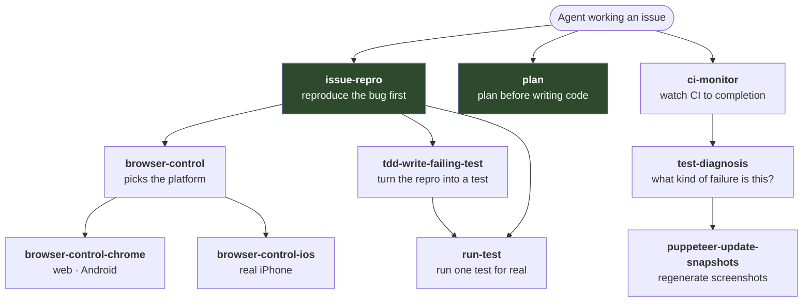

# Skills

A skill is a folder under `.github/skills/` containing a `SKILL.md` file. It holds a procedure for a given situation — how to reproduce a bug, how to run a single test, how to read a failing CI run — and the agent reads it **only when something invokes it by name**.

That "only when invoked" part is the key benefit of skills. Custom instructions are read on every run, and compete for the agent's attention whether or not they are relevant. A skill costs nothing until it is needed, so they can afford to be long and specific.

In general, if you want to add an additional capability to the agent, you should:

- Create a new skill.
- Reference the skill in custom instructions (Worker Bee, github-instructions)

## The skills



The two green boxes are the gates — the agent must run them before it is allowed to write code. Everything else it reaches for as needed.

| Skill | What it does | Source |
| --- | --- | --- |
| [`issue-repro`](#issue-repro) | Reproduce a reported bug for real, then capture it in a test, before touching the cause | [SKILL.md](../../.github/skills/issue-repro/SKILL.md) |
| [`plan`](#plan) | Write an architectural plan grounded in existing code, then attack it | [SKILL.md](../../.github/skills/plan/SKILL.md) |
| [`browser-control`](#browser-control) | Bring up a browser or device for a given platform | [SKILL.md](../../.github/skills/browser-control/SKILL.md) |
| [`browser-control-chrome`](#browser-control-chrome) | The web and Android half of that | [SKILL.md](../../.github/skills/browser-control-chrome/SKILL.md) |
| [`browser-control-ios`](#browser-control-ios) | The iOS half — a real iPhone on BrowserStack | [SKILL.md](../../.github/skills/browser-control-ios/SKILL.md) |
| [`tdd-write-failing-test`](#tdd-write-failing-test) | Turn a reproduction into a permanent test that fails for the right reason | [SKILL.md](../../.github/skills/tdd-write-failing-test/SKILL.md) |
| [`run-test`](#run-test) | Run one test in the real harness and report what happened | [SKILL.md](../../.github/skills/run-test/SKILL.md) |
| [`ci-monitor`](#ci-monitor) | Wait for every CI check and report which passed | [SKILL.md](../../.github/skills/ci-monitor/SKILL.md) |
| [`test-diagnosis`](#test-diagnosis) | Classify a CI failure and decide how to fix it | [SKILL.md](../../.github/skills/test-diagnosis/SKILL.md) |
| [`puppeteer-update-snapshots`](#puppeteer-update-snapshots) | Regenerate screenshot comparisons after an intended visual change | [SKILL.md](../../.github/skills/puppeteer-update-snapshots/SKILL.md) |

## The gates

### issue-repro

**Source: [`.github/skills/issue-repro/SKILL.md`](../../.github/skills/issue-repro/SKILL.md)**

Runs when an issue contains a "Steps to Reproduce" section, or something close to it like "How to reproduce".

It reads the issue for the steps, the current and expected behaviour, and the platform; hands that platform to [`browser-control`](#browser-control) to bring up a browser or device; follows the steps exactly until the reported failure actually occurs; turns that reproduction into a failing test through [`tdd-write-failing-test`](#tdd-write-failing-test) while it is still fresh; and only then goes looking for the cause. The fix is not finished until that test passes, with a bounded number of attempts before escalating.

Until the failure has actually been observed, the agent may not read source code to form theories, guess at causes, edit files, or open a pull request. That restriction is the entire value of the skill. An agent that reads the code first builds a theory from the code and then finds evidence for it; one that has watched the bug happen is working from an observation.

**Picking the platform** happens from the issue's tags first, then from words in the body:

| Signal | Platform |
| --- | --- |
| `[iOS]`, `[Safari]`, or words like "iPhone", "WebKit" | `ios` |
| `[Android]`, or "Chrome on mobile" | `android` |
| `[Mobile]`, or general touch words like "tap", "swipe", "on-screen keyboard" | `android`, falling back to `ios` |
| No platform signal, or desktop words like "click", "hover" | `web` |

`[Mobile]` means Android first because mobile Chrome is far cheaper than a real device and catches nearly all mobile-only behaviour. But if the bug will not reproduce there, it is probably genuinely iOS-specific, so the skill retries on a real iPhone before giving up. An explicit `[Android]` tag gets no such fallback.

The skill is blunt about one thing in particular: **iOS is always reproducible here.** "This needs a physical device" and "I cannot automate iOS" are not acceptable reasons to skip reproduction, because real iPhones are available through BrowserStack. That paragraph exists because agents kept talking themselves out of iOS work.

### plan

**Source: [`.github/skills/plan/SKILL.md`](../../.github/skills/plan/SKILL.md)**

Runs before implementation on anything non-trivial. For a bug with reproduction steps it runs *after* the bug has been reproduced and captured in a test — you cannot judge what a change might break until you have seen what is actually broken.

It is two stages performed by the same agent in one pass. First write the plan, then attack it. There is no separate reviewer.

The load-bearing part is what the plan has to establish before it may propose anything, and the standard of proof it is held to. **Evidence means a `file.ts:120-134` reference with the actual lines quoted** — "I looked at the selectors" does not count.

It has to establish **what already exists** that touches the idea, found by reading the relevant files in `docs/` and then grepping the source, and recorded with what each piece quietly *assumes* as well as what it does — a regex anchored to the start of a string only handles the leading case, and building a whole-string scanner next to it is both wasted work and a bug. It has to decide **extend or build new** against that evidence, with extending as the default and a new path needing a defended reason; "it was easier to write fresh" is not one. And it has to enumerate **what else might break** — for anything touching the editor, that means explicitly considering deletion, text selection, caret position, undo, IME composition, copy and paste, gestures, and multi-cursor, because changing one path in an editor routinely breaks its neighbour.

Beyond that it compares more than one approach, to break first-instinct lock-in, and sketches where the change will live in plain words rather than code.

Then the critique stage re-opens the cited files and checks the quotes really say what the plan claimed, tries to defeat any decision to build something new, names an adjacent behaviour the plan glossed over, and checks nothing contradicts the design intent recorded in `docs/`. If any check fails, revise and critique again.

The skill names the ways this goes wrong: filling in plausible sections with no quoted evidence, writing a plan and then building something else, and over-planning a change smaller than the plan.

## Driving the app

### browser-control

**Source: [`.github/skills/browser-control/SKILL.md`](../../.github/skills/browser-control/SKILL.md)**

A router, not a driver. The caller passes in a platform, and this skill checks the dev server is alive, then hands off to the right sub-skill: `web` and `android` go to Chrome, `ios` goes to the iPhone. It will not guess the platform — if the caller has not said, it stops and asks, because loading the app under the wrong profile fails in confusing ways rather than obvious ones.

It also defines the rule that governs every interaction with the app, which is the most important idea in the whole ecosystem:

> **Observing is free. Acting goes through the project's own test helpers.**

Reading state — running a script, inspecting the page, taking a screenshot, checking the console — can use any available tool. But anything that *drives* the app — tapping a thought, a toolbar button, a menu item, typing, gestures, selecting text — must go through the helpers in `src/e2e/<platform>/helpers/`, the same ones the test suite uses.

Two reasons. Those helpers already encapsulate details that are easy to get wrong by hand. And a reproduction built out of helper calls converts into a real test almost for free, which is exactly what the next skill needs.

There is one trap that makes this non-negotiable. The app's buttons respond to **touch** events under mobile emulation. A plain mouse click does nothing at all — no error, no effect, no warning. An agent that clicks a button and sees nothing happen will conclude the button is broken and go hunting for a bug that does not exist. The `click` helper taps correctly for the platform. A tap is not "simple enough to do by hand" just because it is a tap.

If no helper covers what is needed, the instruction is to drive it directly and keep going. Reproduction must not stall waiting for a helper to be written. The rule is only about not re-implementing a helper that already exists.

### browser-control-chrome

**Source: [`.github/skills/browser-control-chrome/SKILL.md`](../../.github/skills/browser-control-chrome/SKILL.md)**

Handles web and Android. Chrome is already running from the setup step, exposing a debugging port that both the agent's tooling and the test helpers connect to, so they drive the same browser.

For Android, mobile emulation must be applied **before navigating**, not after. The app checks the device profile once when it loads, so navigating first and emulating second produces a desktop layout wearing a mobile user agent. Gestures also need touch, so this is not optional for gesture work.

After navigating, wait for the app to actually appear before touching anything. The page returns before React has finished starting, and reaching for an element too early finds an empty page.

### browser-control-ios

**Source: [`.github/skills/browser-control-ios/SKILL.md`](../../.github/skills/browser-control-ios/SKILL.md)**

Runs the real Capacitor app on a real iPhone through BrowserStack, exposing both the native layer and the web layer in one session.

The default is to work in the web layer, because it is the same page as every other platform. Drop to the native layer only for things that do not exist in the page — the keyboard, text-selection handles, the share sheet, system dialogs — and for screenshots, which should always be native so they capture the whole device screen.

The session is created by a shell script rather than by the tooling, and the reason is worth knowing: BrowserStack takes 20 to 40 seconds to allocate a physical iPhone, and that wait can exceed a fixed timeout in the tooling that cannot be configured. So the session is created by a detached background process that writes its ID to a file, a heartbeat keeps it alive, and a small local proxy lets the tooling adopt the already-running session instantly. Full detail in [Environment](environment.md).

One real limitation: **autocorrect cannot be tested.** Shared BrowserStack devices have iOS auto-correction switched off and it cannot be enabled. Bugs that depend on the live autocorrect engine cannot be reproduced and should be escalated.

## Testing

### tdd-write-failing-test

**Source: [`.github/skills/tdd-write-failing-test/SKILL.md`](../../.github/skills/tdd-write-failing-test/SKILL.md)**

Turns a fresh reproduction into a permanent test, before the bug is fixed. The project's rule is that every bug fix ships with a test.

The conversion is mostly mechanical, which is why it happens immediately: the reproduction was already built from the same helpers the test will use. Drop the line that connects to the live browser, since the test framework supplies that, and add an assertion.

**Always assert what the fixed behaviour should be**, never the buggy one. The reproduction handed over both numbers — the broken value observed and the correct value the issue asked for — so writing `expect(opacity).toBe('1')` fails now and passes after the fix with no inverted logic anywhere.

The test is committed **switched off**, as `it.skip`. That is the subtle part of this system and it has its own page: [The TDD workflow](tdd.md).

Then the gate. Run the new test against the unfixed code, and it must fail **on the assertion**, showing the broken value:

- Fails on the assertion with the expected-versus-actual values from the reproduction → good, carry on.
- Fails on a timeout, a missing element, or a setup error → **the test is wrong, not the code.** Fix the test and try again.

A test that errors for the wrong reason is the most dangerous outcome available here, because it looks exactly like coverage while proving nothing at all.

### run-test

**Source: [`.github/skills/run-test/SKILL.md`](../../.github/skills/run-test/SKILL.md)**

Runs one test — a file, or a single case by name — in the real test harness, and reports what happened. Not through the interactive browser tooling; through the actual runner, which handles starting the app and resetting between tests.

It has one rule that exists purely to prevent a specific lie. Regression tests are committed switched off, and a runner asked to run a switched-off test reports "0 tests run" — which on a quick read looks exactly like passing. So **run-test always switches the test back on for the run**, then restores the file afterwards. If the result says skipped, that is not a pass, it is a mistake.

When reporting a failure it must say which kind it is, because callers act on the difference:

- **An assertion failed** — a real result about behaviour. Report the expected and actual values.
- **Something broke** — a timeout, a missing element, a driver or Docker problem. Not a result about behaviour at all; the test or the environment is wrong.

### puppeteer-update-snapshots

**Source: [`.github/skills/puppeteer-update-snapshots/SKILL.md`](../../.github/skills/puppeteer-update-snapshots/SKILL.md)**

Regenerates the stored screenshots that visual tests compare against. Deliberately hedged about, because it is the single easiest way for an agent to make a real failure disappear: a test says the UI changed, and regenerating the screenshot makes the complaint go away without anyone finding out whether the change was wanted.

So: only use it when the visual change was intentional, never to silence a failure, and always explain to the user why it seemed necessary.

## Handling CI

### ci-monitor

**Source: [`.github/skills/ci-monitor/SKILL.md`](../../.github/skills/ci-monitor/SKILL.md)**

Lists the workflow runs for the current branch and waits for all of them to finish before reporting. Derives the repository from the git remote rather than assuming, and filters by the current branch.

Its central instruction: **never claim tests pass without checking.** The skill says outright that hallucinating test results is the worst thing it can do. If CI still fails after five fix-and-push cycles, stop and hand back to a human.

### test-diagnosis

**Source: [`.github/skills/test-diagnosis/SKILL.md`](../../.github/skills/test-diagnosis/SKILL.md)**

Sorts a CI failure into one of: a build error, a lint or formatting error, a failed unit test, a mismatched screenshot, a timeout, or a known flaky test. Then fixes them in that order — nothing else matters if the code does not build, and lint failures are quick and mechanical.

The rule that matters most is for failing tests: **fix the code, not the test**, unless you are genuinely certain the test is wrong. Never edit a test into passing without understanding why it failed.

For suspected flakiness it checks the project's open issues labelled "test" for known cases. If a test looks flaky but is not on that list, stop and say so rather than deciding for yourself.

## Writing a new skill

Create `.github/skills/<name>/SKILL.md` starting with frontmatter:

```yaml
---
name: my-skill
description: >-
  ALWAYS USE THIS SKILL when <the situation>. <What it does.>
allowed-tools:
  - bash
---
```

- **`name` must match the folder name**, and that is what callers use to invoke it. A mismatch or a typo means the skill is simply never found.
- **`description` is how the agent decides whether this applies.** It is read when the skill is *not* loaded, so it must describe the triggering situation, not the procedure. Several existing skills open with `ALWAYS USE THIS SKILL when…` to make the trigger unmissable.
- **`allowed-tools`** lists what the skill may use — `bash`, `chrome-devtools`, `wdio`.

Beyond the frontmatter, patterns worth copying from the existing ones:

**Explain the reasoning, not just the steps.** Nearly every skill here says why. The [`plan`](#plan) skill opens by naming the failure it exists to prevent. [`browser-control`](#browser-control) explains why a raw click silently fails. An agent that understands the reason handles the situation the steps did not anticipate.

**Name the ways it goes wrong.** `plan` lists three failure modes by name; [`tdd-write-failing-test`](#tdd-write-failing-test) describes exactly what a wrongly-failing test looks like. Naming a trap is how you stop an agent walking into it.

**Say what to do when stuck.** Every skill ends with escalation rules, and most end with the same line: default to acting on your own, escalate only when the right path is genuinely unclear. Without that, agents either stop constantly or never stop at all.

**Split large skills by what the caller needs.** `browser-control` routes to a Chrome half and an iOS half so that a web task never loads several hundred lines about BrowserStack.
