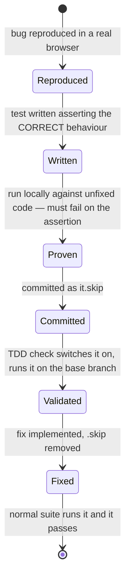
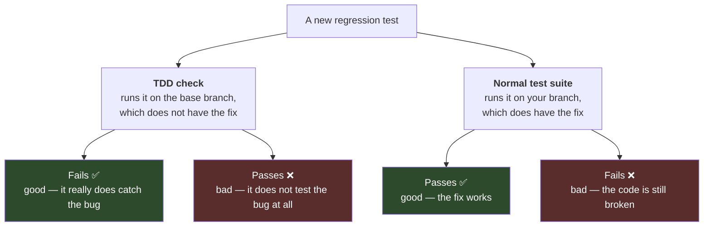
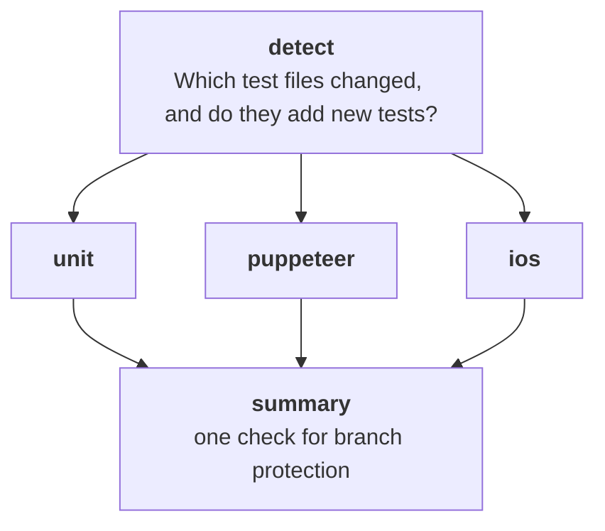

# The TDD workflow

Every bug fix in this project should ship with a test. That much is ordinary. The part that surprises people is that **the test is committed switched off**, and that a CI check exists whose whole job is to confirm the test *fails*.

This is the most confusing part of the agent setup, and the part most likely to be misread by a human skimming a pull request. It is worth ten minutes.

## The problem it solves

A test written to capture a bug has to fail before the fix and pass after it. If it passes before the fix, it is not testing the bug — it is testing something that already worked, and it will never catch a regression.

Checking that automatically means running the new test against the code *without* the fix and requiring it to fail. Which creates two problems at once:

- **A legitimately failing test makes CI red.** The agent is told to work until CI is green. A red check that is supposed to be red puts it in a loop, "fixing" a test that was correct.
- **A test that passes on the unfixed code is worthless**, and nothing ordinarily notices.

The `.skip` protocol solves both. The test is committed switched off, so the normal suite ignores it and stays green. A separate check switches it back on, runs it against the unfixed code, and requires failure.

## The life of a regression test



Written switched off, so nothing goes red early. Switched on temporarily by the check that proves it captures a real bug. Switched back on for good when the fix lands.

**A test must never be merged still switched off.** A permanently skipped test gives no protection at all. The skip is temporary scaffolding, removed when the fix arrives.

## The two checks mean opposite things

This is the bit that catches people out.



So **"CI failed" does not on its own mean the bug is unfixed.** You have to look at which check failed:

- **The TDD check is red** — the new test passes on code without the fix. The test is not actually testing the reported bug. Fix the test.
- **The normal suite is red** — something is genuinely broken. Fix the code.

Both prompt files and the [`tdd-write-failing-test`](skills.md#tdd-write-failing-test) skill spell this out, because an agent that misreads it will "fix" a perfectly good test until it stops catching anything.

## How the check works

[`.github/workflows/tdd.yml`](../../.github/workflows/tdd.yml) runs on every pull request in four stages.



**detect** compares the pull request against the point it branched from, and sorts changed test files into unit, puppeteer, and iOS. It then filters twice: to files that actually add new test cases, and to files that add switched-off ones. That first filter matters — editing the inside of an existing test should not trigger any of this.

It then decides whether to skip. It skips if no test files changed; if the pull request carries a `skip-tdd` label; or if *only* test files changed with no application code, which usually means someone is adding coverage for behaviour that already works. That last exemption does not apply when switched-off tests were added, since those are exactly the ones that need validating.

**unit, puppeteer, ios** each do the same thing for their kind of test:

1. Check out the base branch — the code *without* the fix.
2. Copy the changed test files across from the pull request, along with any changed test infrastructure they may depend on — helpers, config/setup directories, and shared `src/e2e/*.ts` files.
3. Switch any newly-added skipped tests back on, via [`.github/actions/unskip-added-tests`](../../.github/actions/unskip-added-tests/action.yml).
4. Run them, and **require them to fail.**

Step 2 copies the files individually rather than applying a patch, because a brand-new test file has nothing on the base branch to patch against. Test infrastructure comes across too, since a test that calls a new helper cannot even compile on the base branch without it.

**summary** collapses the three into a single check, so branch protection has one thing to require.

### Escape hatches

| Label | Effect |
| --- | --- |
| `skip-tdd` | Skip all of it |
| `skip-tdd-unit` | Skip only unit tests |
| `skip-tdd-puppeteer` | Skip only puppeteer tests |
| `skip-tdd-ios` | Skip only iOS — worth its own switch, since it costs real device time |

There is also `/tdd <commit>` at the start of a line in the pull request description, which runs the tests against that commit instead of the branch point. Useful when the branch point is not the right comparison — for instance when the fix arrived before the test.

The legitimate reason to reach for a label is adding coverage for behaviour that already works. Such a test *should* pass on the base branch, so the check flagging it is correct, and the label is how you say so.

## Why locally run tests ignore the skip

The [`run-test`](skills.md#run-test) skill always switches a test on before running it, then puts the file back.

Without that, asking a runner to run a switched-off test gets you "0 tests run" — which reads almost exactly like a pass. An agent validating its own work would take that as success and move on with a test that never executed.

**A result of "skipped" is never a pass.** If `run-test` reports the test as skipped, the un-skipping failed.

## Writing the test itself

Handled by the [`tdd-write-failing-test`](skills.md#tdd-write-failing-test) skill; the essentials:

**One test for the reported bug.** If an issue lists several ways to trigger the same underlying problem, pick one. They share a cause, and one test proves the fix.

**Assert the correct behaviour, never the broken one.** The reproduction gives you both numbers — what it does and what it should do. Assert the second. It fails now and passes later with no clever inversion.

**Reuse the reproduction's helper calls.** Same helpers, same order. Strip out the exploratory poking. The test is the minimal repeatable form of the reproduction, not a transcript of the investigation.

**Label it with just the issue URL.** One bare comment above the test:

```ts
// https://github.com/cybersemics/em/issues/4331
```

No "regression test" label — it is just a test — and no comment explaining the skip, which is temporary and should leave no trace once removed.

**Adding a test hook is fine; changing behaviour is not.** If the element being asserted on has no sensible way to identify it, add a minimal `data-testid` in the source and commit it with the test. That is part of writing the test, not part of the fix, so it is allowed before the planning gate. Prefer an existing meaningful selector where one exists.

**Prove it fails for the right reason before going any further.** The test must fail *on the assertion*, showing the broken value the reproduction found. Failing on a timeout or a missing element means the test is wrong, not that the bug is confirmed — and that is the dangerous case, because it looks like coverage while proving nothing.