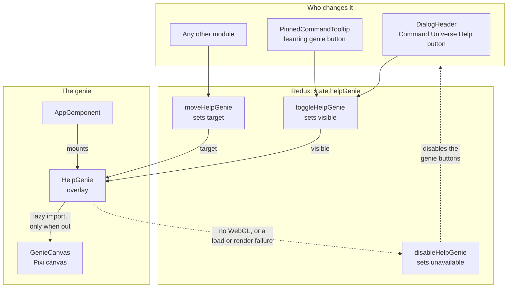
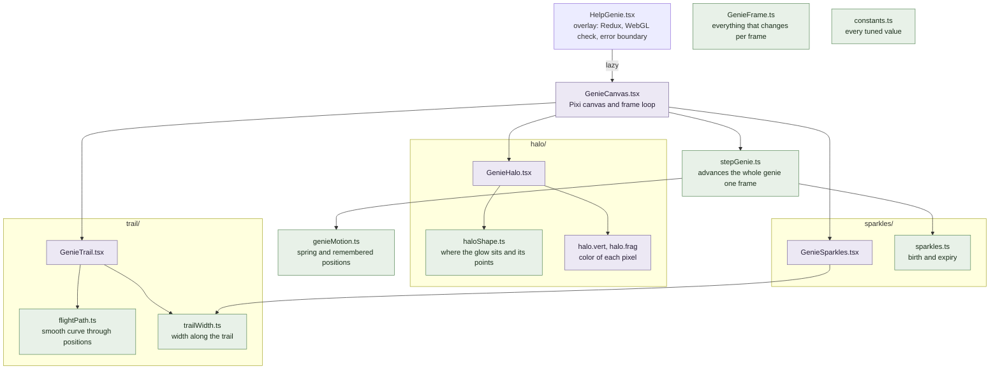
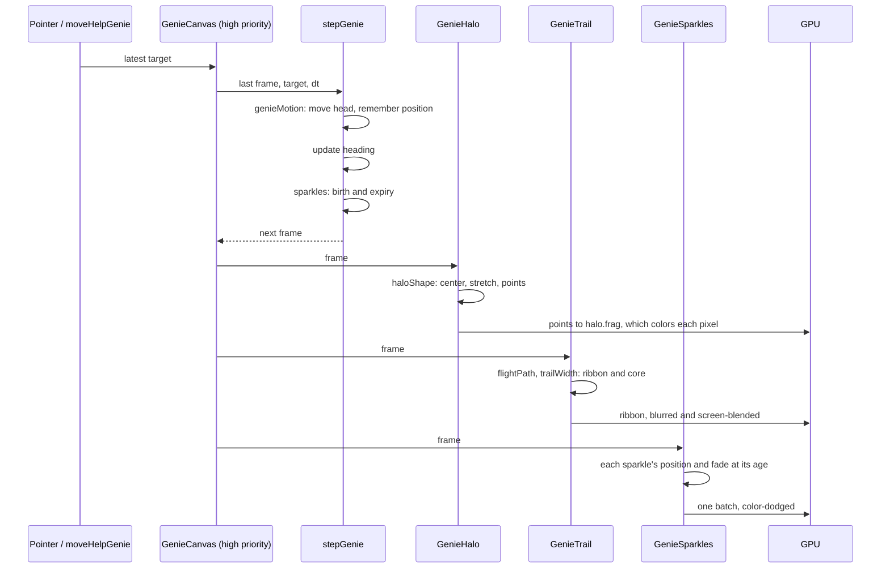

# Help Genie Architecture

Diagrams of how the help genie's modules fit together, for reasoning about changes to it. What the genie is, its state, and how it behaves are described in [learning.md → Help genie](learning.md#help-genie). All paths below are under [`src/components/HelpGenie`](../src/components/HelpGenie) unless noted.

## How it connects to the app

Redux holds what the app wants from the genie: whether it is out, where it has been sent, and whether it can run. The buttons and any other module change that state through actions; `HelpGenie` reads it. The genie's motion never goes through Redux.

## Modules

Each part of the genie has a folder holding its maths and its drawing. The pure modules have no Pixi or React and are unit-tested; the components draw with Pixi. The layers depend only on the frame and the constants, never on each other, except that the sparkles use the trail's width to stay inside it.

Green modules are pure TypeScript; purple ones draw with Pixi. `GenieFrame` and `constants` are used by nearly every module, so their arrows are left out.

em's standards allow one default export per file, and a component file may export only components, so a helper shared between two files needs a file of its own. Helpers used by one component stay inside it, like `trailColor` and `ribbonQuad` in `GenieTrail`. The separate files are there for one of two reasons:

- **Shared:** `trailWidth` is used by the trail and the sparkles; `sparkles.ts` by `stepGenie` and, through the frame, `GenieSparkles`.
- **Tested:** `flightPath`, `haloShape`, `genieMotion`, and `stepGenie` hold the least obvious maths, and a function must be exported to be unit-tested.

## One frame

Every frame runs the same pipeline on Pixi's ticker. `GenieCanvas` steps the genie first, at high priority, so all three layers draw the same frame; then each layer draws it. The frame lives in one ref in `GenieCanvas`, and the layers only read it.

The steps up to each arrow into the GPU run in JavaScript on the CPU: deciding where things go, a few hundred numbers a frame. The GPU turns them into pixels, which is the heavy part.
