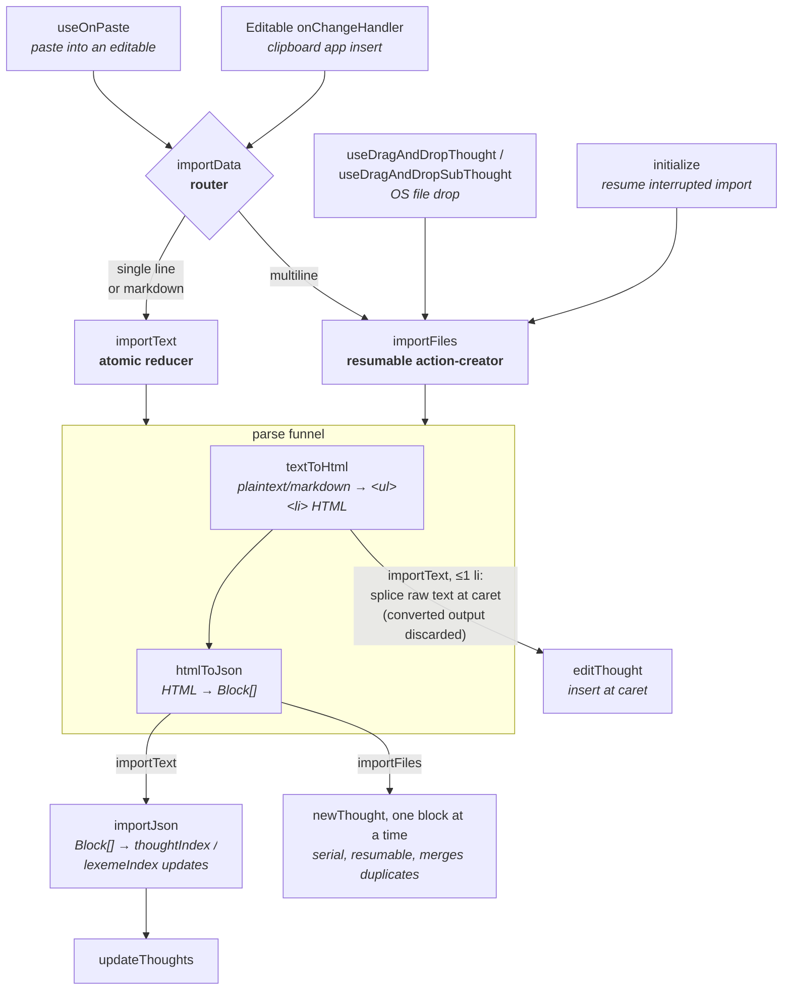
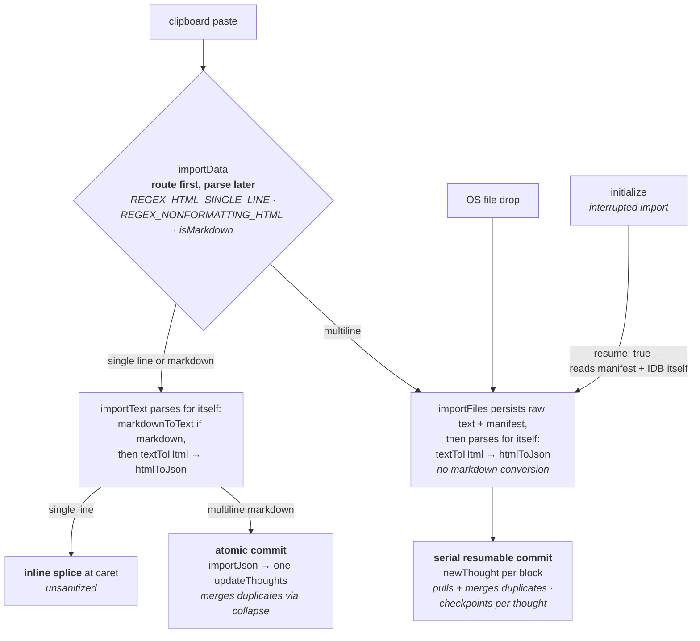
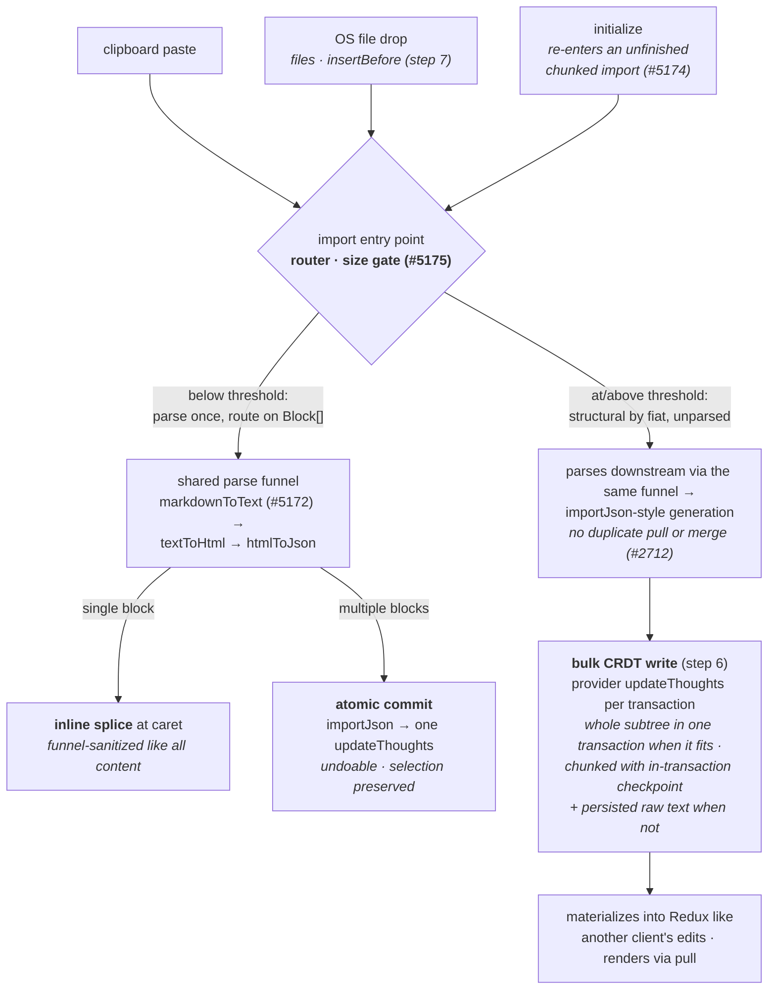

# Import Pipeline

Importing is every path by which text becomes thoughts: pasting into a thought, dropping a file onto the app, a clipboard manager mutating the contenteditable, or resuming an interrupted import on startup. All of these converge on a small set of shared stages. Bug fixes belong inside those stages — a paste bug fixed in a component handler instead of the router, or a sanitization rule added outside the two existing sanitization points, creates a divergent code path that the next bug report will land between.

This doc covers the entry points, the `importData` router, the two import executors (`importText` and `importFiles`), the parse/sanitize funnel, and the copy side that produces em's own clipboard data. The final sections map open issues to the stage where each fix belongs and lay out the planned consolidation sequence.

## Overview

## Entry points

| Entry point | Trigger | Dispatches |
|---|---|---|
| [`useOnPaste`](../src/components/Editable/useOnPaste.ts) | Paste event on an [`Editable`](../src/components/Editable.tsx) (including the transient editable for new thoughts) | `importData` with `text/plain` (HTML-escaped), `text/html`, `rawDestValue`, and the `isEmText` flag |
| [`Editable` `onChangeHandler`](../src/components/Editable.tsx) | A clipboard app (Paste for iOS, the Android clipboard viewer) mutates the contenteditable directly; detected by `
` insertion | `importData` with the inserted text, `
`s converted back to newlines |
| [`useDragAndDropThought`](../src/hooks/useDragAndDropThought.tsx) / [`useDragAndDropSubThought`](../src/hooks/useDragAndDropSubThought.tsx) | OS files dropped onto a thought | `importFiles` directly |
| [`initialize`](../src/initialize.ts) | App startup with an unfinished import in the resume manifest | `importFiles({ resume: true })` |
| [`importToContext`](../src/test-helpers/importToContext.ts) / [`paste`](../src/test-helpers/paste.ts) | Test helpers (RTL and Puppeteer) | `importText` directly |

`useOnPaste` also detects a raw `State` JSON payload (a `thoughtIndex` dump) and asks for confirmation before overwriting.

## The router: importData

[`importData`](../src/actions/importData.ts) is the single place that decides *how* clipboard content is imported. Its inputs are the plain text, the HTML flavor (if any), and `isEmText` — true when the clipboard carries the `text/em` marker written by em's own copy handlers (or when running under automation, since Puppeteer cannot set custom MIME types).

Routing proceeds in order:

1. **Meta-charset cleanup.** When `isEmText` is set, a browser-injected `<meta charset='utf-8'>` wrapper is stripped from the HTML. Chrome prepends this to all clipboard HTML, and `<meta` matches `REGEX_NONFORMATTING_HTML`, which would misclassify an inline em paste as multiline (#3806).
2. **Single-line HTML detection.** `REGEX_HTML_SINGLE_LINE` matches one line of content inside `<body>` (Windows Chrome, macOS PDF copies) or after a `<meta charset>` prefix (Mac desktop Chrome). A match is treated as inline content to insert at the caret, not as a structure to import.
3. **Multiline detection.** For HTML, [`REGEX_NONFORMATTING_HTML`](../src/constants.ts) (`<html`, `<!doctype`, `<li`, `<meta`, `<ol`, `<ul`) marks the content as structural. Formatting-only HTML (`<b>`, `<i>`, spans) does not. For plain text, any interior newline does.
4. **Markdown detection.** [`isMarkdown`](../src/util/isMarkdown.ts) checks for headings, links, or images. Markdown is always routed to `importText`, even when multiline.
5. **Dispatch.** Single-line or markdown content goes to `importText` along with the caret offset and any selection range to replace. Multiline content goes to `importFiles`, wrapped in a `VirtualFile` named "from clipboard".

The trade-off between the two executors: `importText` is atomic, synchronous, and preserves the browser selection, but cannot resume and does not pull pending descendants for duplicate merging. `importFiles` imports one thought at a time with a progress bar, persists a resume manifest, and merges duplicates against pulled descendants, but drops the selection and is much slower.

## importText: atomic import

[`importText`](../src/actions/importText.ts) is a reducer. It first normalizes its input: Roam JSON passes through [`validateRoam`](../src/util/validateRoam.ts)/[`roamJsonToBlocks`](../src/util/roamJsonToBlocks.ts); markdown is converted with [`markdownToText`](../src/util/markdownToText.ts) and then, like everything else, with [`textToHtml`](../src/util/textToHtml.ts). The number of `<li` occurrences in the converted HTML decides between two very different paths.

### Single-line path (numLines ≤ 1)

The pasted string is spliced into the destination thought's value at the caret and committed with a single `editThought`:

- `caretPosition`, `replaceStart`, and `replaceEnd` are plain-text offsets; [`textOffsetToHtmlOffset`](../src/actions/importText.ts) converts them to offsets in the HTML value so the splice never lands inside a tag.
- `rawDestValue` is the destination's untrimmed innerHTML (with formatting preserved via `strip(…, { preserveFormatting: true, preventTrim: true })`), so pasting after trailing whitespace or into a formatted thought does not corrupt the value.
- [`addEmojiSpace`](../src/util/addEmojiSpace.ts) runs on the combined value, and the caret offset is adjusted if a space was inserted.
- `editableRender` forces a re-render so the caret is restored instead of jumping to the start of the thought.

**The single-line path performs no sanitization.** `textToHtml` runs on every input — the `<li` count of its output is what selects this path — but the splice at [`importText.ts`](../src/actions/importText.ts) inserts the **raw** input string and discards the converted output. Whatever sanitization `textToHtml` performed is thrown away, and `htmlToJson`'s tag and style stripping never runs at all. So whatever HTML string reaches this path — including a raw `` matched by the single-line regex from an external source — is inserted into the thought value verbatim. This asymmetry is the root of most external-color paste bugs (see [Known issues](#known-issues-and-where-fixes-belong)).

### Multi-line path

The converted HTML goes through [`htmlToJson`](../src/util/htmlToJson.ts) into `Block[]`, then [`importJson`](../src/util/importJson.ts) generates `thoughtIndex`/`lexemeIndex` updates for the whole tree at once, applied with a single `updateThoughts`.

When the destination has existing children (or an empty destination has siblings), `importText` imports into a **dummy thought** and then collapses it with [`uncategorize`](../src/actions/uncategorize.ts) (twice if the destination was an empty thought), so that top-level imports merge with existing siblings. Collapse uses `moveThought`, which triggers `mergeThoughts` — so duplicate merging happens as a side effect of the collapse rather than in `importJson` itself. `setLastImportedCursor` then reconstructs the cursor path across the collapse, including the case where the last imported thought was merged into an existing sibling.

## importFiles: resumable import

[`importFiles`](../src/actions/importFiles.ts) is an async action-creator that imports **one thought per dispatch**, serially. It accepts `VirtualFile`s (real files from drag-and-drop, or the clipboard wrapper from `importData`) and:

1. Persists a `ResumeImport` manifest (localStorage) plus the raw file text (IndexedDB) before importing, so an interrupted import is offered for resume by `initialize` on next launch. The alert UI in [`Alert.tsx`](../src/components/Alert.tsx) can delete a resumable file.
2. Parses the text through the same funnel: `textToHtml` → `htmlToJson` → `Block[]`, then [`flattenTree`](../src/util/flattenTree.ts) turns the tree into a serial task list.
3. For each block: pulls pending descendants ([`pullDuplicateDescendants`](../src/actions/importFiles.ts)) so duplicates can be detected against the full tree, then either merges into an existing child with the same value or dispatches `newThought` with the block's scope as the value. Empty thoughts are never treated as duplicates (#4448).
4. Updates the progress alert and resume manifest after every thought, and sets the cursor on the first *visible* imported thought (skipping meta attributes).

Note that `importFiles` never calls `importText`; the two executors share only the parse funnel.

## The parse funnel

Both executors normalize input through the same two stages. This funnel is the only place where imported content is parsed, restructured, and sanitized.

### textToHtml

[`textToHtml`](../src/util/textToHtml.ts) produces `<ul><li>`-structured HTML that himalaya can parse:

- Input already recognized as HTML (`REGEX_NONFORMATTING_HTML`, or starting with a closed tag) is passed through **unchanged** — no sanitization on this branch.
- Plaintext and indented outlines are parsed with [`text-block-parser`](https://github.com/cybersemics/text-block-parser) into nested blocks. Each block's value is sanitized with DOMPurify against [`ALLOWED_TAGS` / `ALLOWED_ATTR`](../src/constants.ts), plaintext bullet characters (`-`, `•`, `*` …) are stripped, and empty bullet lines are preserved as empty `<li>`s.
- Markdown `**bold**` and `*italic*` are converted to `<b>`/`<i>` line by line.

### htmlToJson

[`htmlToJson`](../src/util/htmlToJson.ts) parses the HTML with [himalaya](https://github.com/andrejewski/himalaya) and converts the node tree to `Block[]`:

- Tags not in `ALLOWED_TAGS` are stripped by regex (their text content is kept); `<head>`, `<meta>`, `<style>`, and `<script>` are dropped with their content.
- Runs of inline formatting nodes and text ([`isFormattingTag`](../src/util/isFormattingTag.ts)) are merged into a single text scope by [`formattingNodeToHtml`](../src/util/formattingNodeToHtml.ts), which converts `` to `` and filters every `style` attribute through [`stripStyleAttribute`](../src/util/stripStyleAttribute.ts).
- Special cases: WorkFlowy notes (`aria-label="note"` → `=note` subthought), ` ` handling, and ChatGPT/macOS `
` output, whose nesting is reconstructed from the class number since the markup is flat.

### stripStyleAttribute: which styles survive

[`stripStyleAttribute`](../src/util/stripStyleAttribute.ts) is the whitelist that decides which inline styles survive a structural import:

- `color` — kept, **except** plain black or white with no background color (so default-colored text from a light-themed source does not become invisible on em's dark background).
- `background`/`background-color` — kept, except white with no text color.
- `font-style` / `font-weight` — kept only for actual emphasis (weight > 400, normalized to 700).
- `text-decoration` — kept unless `none`.
- Everything else (font family/size, margins, spacing…) — dropped.

### strip

[`strip`](../src/util/strip.ts) is the inverse-direction utility: it reduces HTML to plain text, or to formatting-only HTML with `preserveFormatting`. It is used for plain-text export, `rawDestValue`, `splitThought`, and the copy handlers. Its `stripColors` option — reduce to the neutral [`EXTERNAL_FORMATTING_TAGS`](../src/constants.ts) (`b`, `i`, `u`, `strong`, `strike`), dropping color spans — has no remaining caller; it is the remnant of the pre-parse sanitization removed in #2814, described next.

### Sanitize after parsing, not before

The funnel's shape is a deliberate decision, recorded in [#2814](https://github.com/cybersemics/em/pull/2814). Until early 2025, `importData` ran the whole clipboard HTML through `strip({ preserveFormatting: isEmText, stripColors: !isEmText })` *before* `textToHtml`, and `textToHtml` itself flattened app-generated HTML (macOS/iOS Notes, WebStorm) to text and re-parsed it as an indented outline. That implemented external-color stripping ([#2499](https://github.com/cybersemics/em/pull/2499)) and Notes-app import ([#1154](https://github.com/cybersemics/em/pull/1154)), but `strip` is a DOMPurify + regex pass with no structural awareness: applied to a document, it collapsed nested `<ul>` lists into a single line ([#2807](https://github.com/cybersemics/em/issues/2807)), and the HTML → text → JSON → HTML round trip could not distinguish app-specific markup structurally. #2814 removed both, knowingly re-opening #2467 and breaking the Notes-app cases — the skipped tests marked "See commit" in [`importData.ts`](../src/actions/__tests__/importData.ts) and the TODO at the top of [`importData`](../src/actions/importData.ts) refer to it — in exchange for a funnel that parses first and transforms the parsed tree.

Two consequences for anyone extending the pipeline:

- Source-specific handling (Notes, ChatGPT, WorkFlowy) and any external-vs-internal sanitization belong in `htmlToJson`, operating on himalaya nodes; the ChatGPT `p1/p2` branch and `stripStyleAttribute` are the existing examples. Do not reintroduce a pre-parse `strip` of the raw HTML.
- `importText` and `importFiles` are expected to converge on one funnel and one router, with two commit strategies — an atomic foreground Redux commit for small trees, a background bulk write into the TreeCRDT store for large — chosen by parsed size rather than by regex heuristics ([#5175](https://github.com/cybersemics/em/issues/5175)). New behavior goes into the shared funnel, not into `importText`'s paths. The work is laid out in [Consolidation sequence](#consolidation-sequence).

## The copy side

Internal copy/paste round-trips depend on what em manages to put on the clipboard. Three flavors are written where possible:

- `text/plain` — [`exportContext`](../src/selectors/exportContext.ts) in `text/plain` mode: an indented `- ` outline with `<b>`/`<i>` converted to markdown asterisks and all other formatting stripped.
- `text/html` — `exportContext` in `text/html` mode: nested `<ul><li>` with the full value HTML, including colors.
- `text/em` — a marker (`'true'`) identifying em as the source. Read by `useOnPaste` to set `isEmText`.

Writers:

| Writer | Trigger | Flavors |
|---|---|---|
| [`useOnCopy`](../src/components/Editable/useOnCopy.ts) / [`useOnCut`](../src/components/Editable/useOnCut.ts) | Native copy/cut event on a focused editable; exports the full multicursor selection when one is active (#3993) | all three |
| [`Note`](../src/components/Note.tsx) copy handler | Copy within a note | all three |
| [`copyCursor`](../src/commands/copyCursor.ts) command | Cmd+C with collapsed selection, Command Center gear on mobile | delegates to `device/copy` |
| [`device/copy`](../src/device/copy.ts) | Programmatic copy for `copyCursor`, export modal, etc. | platform-dependent, below |

[`device/copy`](../src/device/copy.ts) is the platform matrix, and it explains most mobile formatting loss:

| Platform | Mechanism | Flavors written |
|---|---|---|
| Chrome & Chromium (incl. Puppeteer) | Hidden contenteditable + `execCommand('copy')`, `setData` in the copy event | `text/plain` + `text/html` + `text/em` |
| Desktop Safari | Capture-phase document listener on the *user-initiated* Cmd+C copy event (Safari ignores `setData` during programmatic copies) | `text/plain` + `text/html` + `text/em` |
| Mobile Safari | ClipboardJS programmatic copy (Command Center tap fires no native copy event) | `text/plain` only |
| Capacitor (iOS/Android app) | `@capacitor/clipboard` `Clipboard.write({ string })` | `text/plain` only |

On the plain-text-only platforms, a copied thought tree survives as an indented outline (structure preserved on paste), but underline, strikethrough, colors, and the `text/em` marker are lost, and `<b>`/`<i>` degrade to markdown asterisks. This is the direct cause of #3959 and #3960.

## Testing

- [`src/actions/__tests__/importData.ts`](../src/actions/__tests__/importData.ts) — integration tests through the real store with fake timers (required because `importFiles` is async): routing, single-line insertion, real-world clipboard payloads (macOS/iOS Notes, WebStorm, ChatGPT, Windows/Mac Chrome). The skipped tests are a catalog of known parse-funnel regressions, several tracked by open issues (#2154–#2157).
- [`src/actions/__tests__/importText.ts`](../src/actions/__tests__/importText.ts) — reducer-level tests for both `importText` paths.
- [`importToContext`](../src/test-helpers/importToContext.ts) / [`paste`](../src/test-helpers/paste.ts) — the standard way to seed test state with an outline (see [testing.md](testing.md)). #2980 tracks migrating component tests from raw `importText` dispatches to `paste`.
- Clipboard behavior itself (real `ClipboardEvent`s, flavor selection) can only be covered in Puppeteer; `setData` with custom MIME types is unavailable there, which is why `navigator.webdriver` forces `isEmText`.

## Known issues and where fixes belong

The unifying principle: the router (`importData`), the funnel (`textToHtml`/`htmlToJson`/`stripStyleAttribute`), and the platform matrix (`device/copy`) are the extension points. A fix that adds a new detection regex in a component, a second sanitizer, or a bespoke paste branch will drift from the pipeline; a fix inside the right stage benefits every entry point at once.

### External formatting must be stripped; internal formatting must survive

[#2467](https://github.com/cybersemics/em/issues/2467) (strip external colors), [#4161](https://github.com/cybersemics/em/issues/4161) (browser formatting carried over), [#3438](https://github.com/cybersemics/em/issues/3438) (imported font size kept), [#4073](https://github.com/cybersemics/em/issues/4073) (black text invisible after Safari↔Capacitor paste).

The internal/external signal already exists: `isEmText` in `useOnPaste`/`importData`, derived from the `text/em` marker that #2499 introduced for exactly this purpose. Its original use — `strip({ stripColors: !isEmText })` on the raw clipboard HTML — was removed in #2814 because pre-parse stripping destroyed nested structure (see [Sanitize after parsing, not before](#sanitize-after-parsing-not-before)); since then the flag is used only for meta-charset cleanup. The fix is to reintroduce the distinction **inside the funnel**, not in front of it:

- **Structural path**: pass `isEmText` through `importText`/`importFiles` into `htmlToJson`, and have `formattingNodeToHtml` apply a stricter `stripStyleAttribute` profile for external content — drop `color`/`background-color` and font sizes entirely, keep only [`EXTERNAL_FORMATTING_TAGS`](../src/constants.ts) — while keeping the current whitelist for em content. This operates on parsed nodes, so nested lists are unaffected.
- **Single-line path**: the inline splice in `importText` bypasses `htmlToJson` entirely, which is why even plain black text that `stripStyleAttribute` would already drop reaches the thought value. The fix consistent with the convergence direction is to run the single-line fragment through the same `htmlToJson` call and splice the resulting block's `scope`. A single-line fragment has no list structure, so #2807's failure mode cannot recur. This removes the asymmetry rather than adding a second sanitizer.

#4073 is the same bug through a different door: mobile Safari and Capacitor copies carry no `text/em` marker (plain-text-only platforms), so an em→em paste across the two iOS shells is treated as external, and the `text/html` flavor iOS supplies carries `color: #000` (black on em's dark background). Stripping external colors fixes the symptom regardless of which side wrote the clipboard.

### iOS synthesizes useless HTML from plain text

[#3067](https://github.com/cybersemics/em/issues/3067) (multiple plain-text thoughts pasted as one on iOS).

When the HTML flavor is merely a wrapper around the plain text (iOS share-sheet copies), the HTML wins routing but contains no structure, so the multi-line plain text is treated as a single line. A robust check in `importData`: if `getTextContentFromHTML(html)` equals the plain text and the plain text is multiline, prefer the plain-text branch. This belongs in the router, next to the existing meta-charset and single-line special cases — not in `useOnPaste`.

### Plain-text-only platforms lose formatting on copy

[#3959](https://github.com/cybersemics/em/issues/3959) (bold pastes as literal `**One**`), [#3960](https://github.com/cybersemics/em/issues/3960) (underline/strikethrough/color not carried on mobile).

Two independent layers:

1. **Copy**: `device/copy` cannot write `text/html` on mobile Safari (no native copy event) or through `@capacitor/clipboard` (string-only API). Capacitor is fixable: extend the native plugin (or use the platform clipboard APIs directly) to write an HTML flavor plus the `text/em` marker. That work belongs entirely in `device/copy`'s platform matrix.
2. **Paste**: `exportContext`'s `text/plain` encodes bold/italic as markdown asterisks. `textToHtml` converts them to `<b>`/`<i>` (`REGEX_MARKDOWN_BOLD`/`REGEX_MARKDOWN_ITALICS`) — but the single-line `importText` path splices the raw text and discards the converted output, so the asterisks survive literally. Splicing the already-converted output instead of the raw text removes the asymmetry and fixes the literal `**One**` without touching the copy side.

### Destination formatting must survive a paste

[#3816](https://github.com/cybersemics/em/issues/3816) (destination formatting stripped on mobile paste), [#4758](https://github.com/cybersemics/em/issues/4758) (pasted plain text does not adopt the thought's color).

- #3816: `useOnPaste` preserves the destination value with `strip(innerHTML, { preserveFormatting: true, preventTrim: true })` (fixed for desktop in #3835), but the clipboard-app branch in `Editable`'s `onChangeHandler` builds `rawDestValue` with `strip(innerHTML, { preventTrim: true })` — no `preserveFormatting` — so the mobile clipboard-app path still wipes the destination's formatting. The `onChangeHandler` branch should match `useOnPaste` exactly; better, per the TODO at that site, the clipboard-insert detection should move into `importData` so there is only one paste preparation path.
- #4758: `textOffsetToHtmlOffset` maps an end-of-thought caret to `html.length`, which is *after* the closing tag of a formatting span that wraps the whole value, so the pasted text lands outside the colored span. The fix is in the single-line splice: when the insert position falls at the boundary of a formatting tag that wraps the entire value, insert inside it. `applyOuterTag` in [`Editable.tsx`](../src/components/Editable.tsx) (built for #3673) already reapplies an outer wrapping tag and is the mechanism to reuse.

### Structural paste edge cases

- [#3622](https://github.com/cybersemics/em/issues/3622) (paste at same indentation does nothing): pasted top-level thoughts that duplicate existing siblings are merged (by `importFiles`' duplicate check, or by the collapse-merge in `importText`), so a copy → paste of siblings into the same context appears to no-op. Any fix must decide the product question — merge vs. duplicate siblings — inside the existing duplicate handling in `importFiles`/`mergeThoughts`, not by adding a pre-check in the paste handler. The decision has since been made in [#2712](https://github.com/cybersemics/em/issues/2712): do not merge duplicates on import.
- [#2826](https://github.com/cybersemics/em/issues/2826) (stuck at "Storing from clipboard" with trailing whitespace): reproduce at the funnel level (`textToHtml` → `htmlToJson` → `flattenTree` on the exact input) before touching `importFiles`; the hang is in parsing, not persistence.
- [#3510](https://github.com/cybersemics/em/issues/3510) (ChatGPT list loses nesting), [#2897](https://github.com/cybersemics/em/issues/2897) (Wikipedia nesting false positive), [#1033](https://github.com/cybersemics/em/issues/1033) (iOS Notes structure), [#2154](https://github.com/cybersemics/em/issues/2154)–[#2157](https://github.com/cybersemics/em/issues/2157): all are `htmlToJson`/`textToHtml` parse bugs with skipped tests already written in [`importData.ts`](../src/actions/__tests__/importData.ts) / [`importText.ts`](../src/actions/__tests__/importText.ts) — restore the test first, then fix the funnel. The fragile spots are `joinChildren` (sibling/child chunking) and the ChatGPT `p1/p2` class heuristic.
- [#3479](https://github.com/cybersemics/em/issues/3479) (Unknown inline token, hang on large paste): `isMarkdown`'s link regex false-positives on ordinary bracketed text, routing huge plain-text files through the atomic markdown path. Tighten `isMarkdown` and make `markdownToText`'s unknown-token case lossless (emit `token.raw`) rather than adding size limits elsewhere.

## Consolidation sequence

The pipeline is being consolidated toward one funnel, one router, and two commit strategies chosen by parsed size: an atomic foreground commit through Redux for small content, and a background bulk write into the TreeCRDT store ([`src/data-providers/treecrdt/`](../src/data-providers/treecrdt/)) for large.

### Current

Today's shape, schematically — the [Overview](#overview) diagram has the full detail. Routing precedes parsing and runs on regex heuristics; each executor invokes the parse funnel for itself; markdown conversion is reachable only through `importText`; drag-and-drop and resume bypass the router, and resume reaches into storage from inside `importFiles`.

### Expected

After the sequence below: every source calls one entry point; small content is parsed once, routed on the parsed tree, and committed through Redux in the foreground; large content is structural by fiat and imported in bulk — parsed downstream through the same funnel, written to the TreeCRDT store in one or a few sqlite transactions, and materialized into Redux like another client's edits, rendering through the normal pull mechanism so only the visible slice enters app state. Raw text is persisted, next to its checkpoint in sqlite, only for imports that span multiple transactions. Nothing merges duplicates on import.

### Steps

The work is decomposed into independently landable steps, in dependency order:

1. [#2712](https://github.com/cybersemics/em/issues/2712) — remove duplicate-descendant merging from import. The starting point, and a hard prerequisite for step 6: it deletes `pullDuplicateDescendants` and the per-thought pull that makes serial import slow, and decides #3622's merge-vs-duplicate product question. Merging also made import path-dependent — each block's destination depended on what earlier blocks had merged into — so removing it turns the whole import into a pure function of `Block[]` + destination, which is what allows a subtree to be written at once. Caveat for the interim: merging currently makes resume accidentally idempotent — once it is removed, a stale `thoughtsImported` checkpoint produces real duplicates, so the per-thought un-throttled manifest update in `importFiles` is load-bearing until step 6's in-transaction checkpoint removes the drift possibility.
2. [#5172](https://github.com/cybersemics/em/issues/5172) — move markdown conversion into the shared funnel, so dropped `.md` files import with the same structure as pasted markdown. Relatively self-contained.
3. [#5173](https://github.com/cybersemics/em/issues/5173) — retire `importData`'s markdown routing branch; multiline markdown imports resumably. Depends on #5172; closes the routing half of #3479.
4. [#5174](https://github.com/cybersemics/em/issues/5174) — move resume reconstruction out of `importFiles` into `initialize`, scoped to the seam only: `initialize` hands the entry point text, path, and offset instead of `importFiles` reaching into storage itself. The storage substrate — localStorage manifest, IDB raw text, per-thought checkpointing — is deliberately left untouched, because step 6 replaces it wholesale.
5. [#5175](https://github.com/cybersemics/em/issues/5175) — parse before routing behind a size threshold: below it, route on the parsed `Block[]` — single block → inline splice, small tree → atomic commit, large tree → bulk import — and hand the blocks to the executor alongside the raw text; at or above it, content is structural by fiat and reaches the bulk-import path unparsed. Raw text remains the only persisted form of content. Retires the routing regexes.
6. Import large content directly into the TreeCRDT store (not yet filed) — replace the per-thought Redux loop entirely: the parsed tree feeds `importJson`-style generation, written through the provider's `updateThoughts` ([`thoughtspace.ts`](../src/data-providers/treecrdt/thoughtspace.ts)) — the whole subtree in one sqlite transaction when it fits, chunked with the checkpoint committed in the same transaction as its batch when it does not, so checkpoint and data can never drift. Imported ops materialize into Redux via [`applyMaterializedThoughtsToStore`](../src/data-providers/treecrdt/sync/applyMaterializedThoughtsToStore.ts) like another client's edits and render through the normal pull mechanism, so only the visible slice enters app state. Design seams: materialization must classify the import's same-tab writes as ingest-worthy, since they have no optimistic Redux twin; bulk imports sit outside undo history, so "undo" is deleting the imported subtree; progress moves to batch completions and cursor placement to first materialization; transaction size doubles as a sync-load knob. Absorbs #5174's substrate — the localStorage manifest and IDB raw text retire into sqlite, kept only for imports that span multiple transactions.
7. Route drag-and-drop through the same entry point (not yet filed): drops pass `files` and `insertBefore` to the router and benefit from the same size gate. Carries an open product question — whether a single-line file drop splices into the target thought's value like a paste, or inserts a new thought like a thought drop (current behavior).
