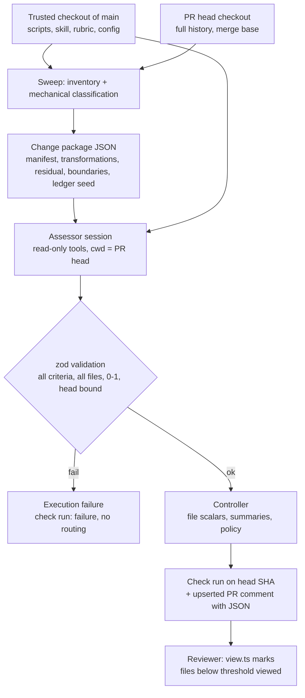
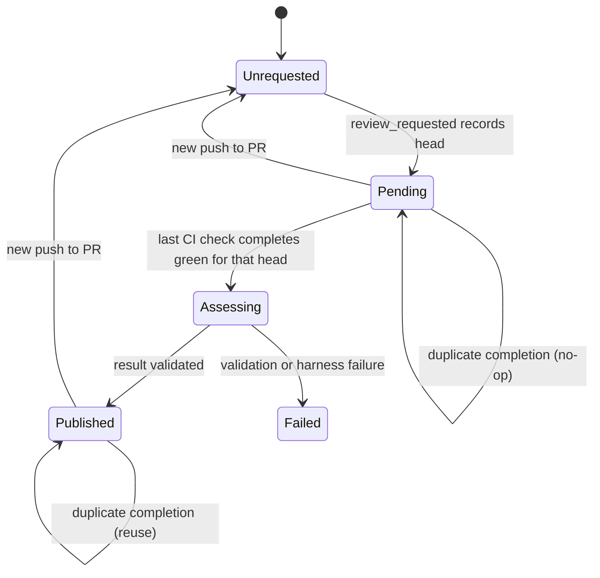

# PR Risk Assessment - Plan

## Goal Capsule

- **Objective:** A pull request that has passed CI and been formally submitted for review arrives at its human reviewer with a scored map of where its potential risk lies, and a pull request whose scores are all low can be routed past human review by policy rather than by someone reading it.
- **Means:** A deterministic change sweep, one repository-aware assessor session that produces continuous 0–1 scores per criterion for the whole PR and for every changed file, and a separate deterministic controller that applies routing and auto-view policy (KTD1, KTD3, KTD6).
- **Authority:** The transcript the user supplied is the product source of truth. Its settled decisions are recorded under Key Decisions and are not reopened. Where the repository's conventions constrain implementation, the KTDs below decide.
- **Stop conditions:** Stop and surface rather than guess when a prerequisite outside the repository is missing (the assessor harness credential, the upstream-review check name), or when implementation would require the assessor to write to the PR or to read policy from the PR's own revision.
- **Execution profile:** Land in dependency order, keeping the sweep, assessor, and controller independently testable. Shadow mode stays on until the user turns it off.
- **Who finishes:** The implementer lands every unit including documentation and the workflow, then hands the shadow-mode results to the user, who decides when to enable bypass.

---

## Product Contract

### Summary

Add a PR risk assessment stage to this repository: a `scripts/pr-risk/` workspace that inventories and compresses a PR's change from local git, runs one read-only assessor session against a trusted rubric, validates a full criterion matrix for the PR and for every changed file, and lets a deterministic controller publish the result, recommend routing, and drive file auto-viewing from a reviewer's own context.

### Problem Frame

Every pull request here currently reaches a human reviewer with nothing telling them where to look first. Reviewer attention is spent evenly across a diff whose risk is uneven, and no PR, however trivial, can skip a human. The interesting risk is rarely a defect the reviewer can spot in one hunk. It is a value threaded through four layers, a new piece of shared state, a timer, a departure from convention, or a small change that future code will depend on. Those are properties of the change as a whole and of its relationships across files, which is why file-by-file scoring or a pasted diff cannot surface them.

The repository already runs two model-backed triage programs on issues (`scripts/estimate/`, `scripts/issue-classifier/`) and a set of `workflow_run`-driven automations on pull requests (`pr-ready.yml`, `copilot-conflicts.yml`), so the patterns for a workspace, its prompt, its dry run, and its publication onto a pull request exist. Nothing yet assesses a pull request's change.

### Key Decisions

All decisions below were settled in the design transcript the user supplied. Provenance is `user-directed` where the user chose against a presented alternative and `user-approved` where the user accepted a proposal whose trade-off was shown.

- **The assessor scores potential risk, never actual risk** (session-settled: user-directed — chosen over an evidence-status and disposition field per criterion: the reviewer assesses actual risk, so the assessor carries no judgement of whether a risk is realized, justified, or authorized). Governs R8, R9, R10, R12.
- **Every completed assessment carries a numeric score for every required criterion; there is no null score** (session-settled: user-directed — chosen over `score: null` for unassessed criteria: an incomplete run is an execution failure the controller declines, not another kind of score). Governs R11, R13, R24.
- **Scores are continuous in 0–1 on a common range, not per-PR rescaled and not discrete anchors** (session-settled: user-directed — chosen over five anchored levels with per-criterion examples: the values are used for relative ranking and thresholds, not read for their exact decimal). Governs R11, R14.
- **The criterion set is fixed at sixteen; scope expansion relative to an issue or spec is excluded, and intent is not an input** (session-settled: user-directed — chosen over including the originating issue and prior authorization: the assessor looks only at the code). Governs R8, R9.
- **A named mechanism construct is a signal to flag, not something to investigate** (session-settled: user-directed — chosen over inspecting how a timer or geometry read is used: flagging is the assessor's whole job). Governs R10.
- **Missing analogous precedent is novelty and is flagged at the mechanism level** (session-settled: user-directed — chosen over treating a missing precedent as inconclusive: the only judgement required is the level of generality). Governs R12.
- **Assessment is triggered by a formal review request together with fully passing CI, never by a push alone** (session-settled: user-directed — chosen over assessing every push: a push invalidates the old snapshot but starts nothing). Governs R1, R2, R3, R4.
- **Every changed file receives a score derived from its participation in the risk-bearing change, so the reviewer's client can auto-view files below a threshold** (session-settled: user-directed — chosen over PR-level scores only: auto-viewing is a required deliverable). Governs R13, R15, R21.
- **The controller records several summaries, mean included, and no single one is the sole gate** (session-settled: user-directed — chosen over excluding averages: a mean is one signal of several). Governs R16.
- **No repeatability gate, file-order sensitivity program, or rubric and model versioning** (session-settled: user-directed — chosen over calibration machinery: the process is understood to be non-deterministic). Governs the Scope Boundaries below.
- **A deterministic controller applies routing; the assessor only recommends** (session-settled: user-approved — chosen over letting the model decide routing: the model must not lower a score to reach the outcome it prefers). Governs R17, R18, R19.
- **The sweep classifies and compresses; it never pronounces a file safe, and a coverage ledger accounts for every changed unit** (session-settled: user-approved — chosen over a sweep that drops files: "no readable patch" must not become "no risk"). Governs R5, R6, R7, R24.
- **One assessor session with targeted retrieval; grouped investigation only when the residual change needs it; no new hosted backend for size alone** (session-settled: user-approved — chosen over Managed Agents as the primary host and over one inference per file). Governs R22, R23.
- **Auto-viewing runs in the reviewer's own authenticated context, separate from the assessment backend** (session-settled: user-approved — chosen over a bot marking files viewed: viewed state is viewer-specific). Governs R21.

### Requirements

**Trigger and eligibility**

- R1. An assessment runs for a pull request head only after both a formal review request has been recorded for that head and every expected CI check on that head has completed successfully.
- R2. A review request that arrives while CI is still running is recorded and honored when CI later completes for the same head.
- R3. A new push to the pull request invalidates the previous head's assessment for routing purposes and does not by itself start a new one.
- R4. Duplicate completion events for the same head reuse the existing assessment or in-progress run rather than starting another.

**Change package**

- R5. The sweep inventories every changed path from local git against the merge base, recording old and new paths, change type, blob ids, added and deleted lines, and the special cases binary, generated, mode change, symlink, and submodule.
- R6. The sweep identifies bounded mechanical transformations (exact file moves, formatting-only edits, comment-only edits, validated identifier renames, generated-output updates) and represents each as one transformation plus the list of edits it accounts for.
- R7. Every edit the sweep cannot classify stays in the residual set, and the assessor receives the residual set in full rather than a sample.

**Assessment**

- R8. The assessor scores the sixteen criteria in KTD2 for the whole pull request.
- R9. The assessor scores every applicable criterion for every changed file, where a file's score reflects its participation in the cross-file change it belongs to.
- R10. The assessor flags a changed use of a named mechanism construct (touch handlers, geometry reads, DOM access, timers, frames, microtasks, new state containers) as a signal without establishing that a problem results.
- R11. Every score is a finite number in the closed interval 0–1; an assessment missing any required PR-level or file-level score is rejected as an execution failure.
- R12. The convention-departure criterion compares the mechanism the change expresses against existing implementations at the level of mechanism, responsibility, and interaction, and flags novelty when no analogous precedent is found.
- R13. The assessor's output names, for each non-zero signal, the participating files and a one-line reviewer context, so a shared signal is explained once and referenced from each file it touches.

**Outputs and routing**

- R14. The published result is bound to the assessed head commit and merge base and states them.
- R15. The controller derives each file's scalar as the maximum of its applicable criterion scores and marks files below the configured threshold as auto-viewable.
- R16. The controller records the maximum file score, the mean file score, the count and proportion of files above the auto-view threshold, and the PR-level criterion vector.
- R17. The controller recommends skipping human review only when CI passed for this head, the upstream review prerequisite passed, coverage is complete, every substantive PR-level criterion is below its configured threshold, and no mandatory-review condition applies.
- R18. Physical change footprint is reported but never participates as a standalone veto in R17.
- R19. In shadow mode the controller publishes the assessment and its recommendation but takes no routing action.
- R20. The reviewer-facing brief leads with what matters and where to start, followed by the full matrix including zero rows.
- R21. A reviewer can apply the auto-view threshold from their own machine and token, marking their viewed state on the files below it, without rerunning the assessor.

**Safety and orchestration**

- R22. The assessor session is read-only with respect to the repository and the pull request, and it loads its skill, rubric, and policy from the trusted default-branch checkout, never from the pull request's revision.
- R23. Pull request text, comments, and code reach the assessor as evidence only; a pull request that modifies the assessor, its rubric, its workflow, or the review mechanism is a mandatory-review condition.
- R24. Every changed unit ends in a recorded coverage state (covered by a validated transformation, semantically assessed, inspected as a boundary effect, or unassessed with a reason), and a residual larger than the session budget yields an explicitly incomplete assessment rather than a truncated one.

### Success Criteria

- In shadow mode on the sample pull requests in U10, a validated rename lands with high footprint and low substantive scores, a rename carrying one unrelated behavioral edit keeps that edit visible in its file row, a tiny change establishing a shared abstraction scores high on future commitment, and a comment-only reversal of a stated rule scores non-zero on decision divergence.
- A reviewer opening a brief can name the first file to read without opening the matrix.

### Scope Boundaries

- The assessor never judges correctness. A concrete defect it notices is reported as a note for the verification workflow, not scored.
- No calibration program: no repeatability runs, no file-order sensitivity tests, no rubric or model version stamping beyond what the result already carries (the head commit).
- No originating issue, specification, or approval history is fetched.

#### Deferred to Follow-Up Work

- Parallel grouped investigators for residuals that exceed one session's budget (KTD8 keeps v1 to one session and an explicit incomplete state).
- Any action that follows a "skip human review" recommendation once shadow mode is off, such as enabling auto-merge or removing a requested reviewer. The controller applies a label and check conclusion; what consumes them is a separate decision.
- Evaluation harness accuracy scoring against human labels. U10 provides a batch runner and sample list only.

---

## Planning Contract

### Key Technical Decisions

- KTD1. **Build the sweep and controller as a new root workspace, `scripts/pr-risk/`, in the shape of `scripts/issue-classifier/`.** That workspace already establishes Node 24 erasable TypeScript run directly by `node`, a `zod`-validated output contract, `dotenv`, a `--dry` mode that needs no token, a README that explains the reasoning, and tests under `src/**/__tests__/` that the root `vitest --project unit` glob collects. Reusing the shape keeps a fourth agent program consistent with the three the repository documents.
- KTD2. **The fixed criterion set is the transcript's seventeen minus scope expansion.** Touch interaction, layout coupling, DOM coupling, value threading, helper-chain depth, scheduling and temporal coupling, semantic cross-cutting scope, state introduction or expansion, reversals and exceptions, physical change footprint, sensitive-surface involvement, convention departure, data-flow depth, decision divergence, documentation divergence, future commitment. Footprint is PR-level only and informational; the other fifteen are scored at both levels. Repository-specific sensitive surfaces start with `src/redux-middleware/`, `src/redux-enhancers/`, `src/device/selection.ts` (the lint-enforced single access point to the browser selection), `src/data-providers/`, and `src/stores/`.
- KTD3. **The change package comes from local git, not the GitHub files endpoint.** The workflow checks out the trusted default branch for code and policy and fetches the PR head into a sibling directory with full history, so `git diff --find-renames` against the merge base, blob ids, and numstat are available and the assessor can open unchanged callers. The list-files endpoint caps at 3,000 files and returns no blob content.
- KTD4. **Mechanical classification uses the tooling the repository already carries.** Comment-only and identifier-rename checks compare TypeScript token streams with trivia skipped, using the JavaScript compiler API that the root aliases as `typescript: npm:@typescript/typescript6@6.0.2` (the `typescript: 7.0.2` the other script workspaces pin is the native compiler and ships no scanner, so this workspace declares the same alias as the root); formatting-only checks compare prettier-normalized blobs with options resolved once from the trusted checkout root and passed explicitly, never resolved against a path under the PR head, since the config loads a plugin; exact moves come from `git diff -M100%`. A comment-only transformation keeps its comment hunks as documentation evidence in the package, because the rubric scores comments for decision and documentation divergence. A rename is validated when one derived token mapping reproduces every classified edit exactly; anything it does not reproduce stays residual. Tooling comments (`@ts-ignore`, `@ts-expect-error`, `eslint-disable`) disqualify a comment-only classification. Externally meaningful names touched by a rename (exported symbols, string literals equal to the old name, object property keys, paths under `src/data-providers/`) are listed as boundaries for the assessor.
- KTD5. **The assessor runs as a headless Claude Code session driven from the workspace, with tools restricted to Read, Glob, and Grep, no shell.** The skill at `.github/skills/pr-risk-assessment/SKILL.md`, the rubric, and the policy config are passed by absolute path from the trusted checkout; the session's working directory is the PR head checkout; project-level settings, instruction files, and MCP config are not loaded, so a CLAUDE.md, skill, or `.mcp.json` in the PR cannot steer the run. Any history the rubric needs is pre-rendered into the change package by the sweep, so the session needs no git. The session's environment carries only the harness credential, never the GitHub token. The CLI is installed in the workflow at a pinned version; model and token budget live in `config.json`. The session returns one JSON document that `zod` validates before anything is published. Alternative considered: a tool loop over the OpenAI Responses API, which the other two workspaces' plain `fetch` style would have to grow into; rejected for v1 because the harness gives retrieval, budgeting, and a tool boundary for free, and the adapter in U5 isolates the choice behind the change-package-in, result-JSON-out contract. See Assumptions.
- KTD6. **Routing lives in the workspace, not in the model, and reads thresholds from `scripts/pr-risk/config.json` on the trusted checkout.** The file scalar is the maximum of applicable criteria; the PR gate is every substantive criterion under its threshold plus the eligibility and mandatory-review conditions in R17 and R23. Thresholds are one place to change without rerunning inference.
- KTD7. **Publication is a check run on the head commit plus one marker-upserted PR comment.** A check run binds to the SHA, so a new push leaves the new head without a result and satisfies R3 with no bookkeeping; the comment carries the brief, the matrix, and a collapsed JSON block the reviewer-side script in U9 reads. The comment pattern mirrors `scripts/ci/upsert-diff-comment.cjs` and `scripts/ci/task-comment.cjs`, with one addition those scripts lack: every marker lookup filters to comments authored by `github-actions[bot]` first, so a comment anyone else plants with the marker is never read as the bot's.
- KTD8. **The trigger is a `workflow_run` completion gate in the shape of `pr-ready.yml`, armed by a review request delivered on `pull_request_target`.** A `pull_request_target: review_requested` event records the pending head on a marker comment; each CI workflow completion re-evaluates whether every check on that head is complete and green and whether the request still names that head; only the last one out runs the assessor. Both triggers take the workflow file and its checkout from the default branch (`pull_request_target` as `ios.yml`, `vercel-preview.yml`, and `cancel-pr-runs.yml` already rely on, `workflow_run` by construction), which is what R22 needs; a plain `pull_request` trigger would run the PR's own revision of the workflow with write permissions. The PR is resolved from the triggering run's head SHA, not its head branch, because BrowserStack and Vercel Preview run on `pull_request_target` and report the base branch as `head_branch`. Draft state is not an eligibility condition, so no `ready_for_review` trigger is needed.
- KTD9. **Auto-viewing is a local command, `node scripts/pr-risk/src/view.ts <pr>`, run with the reviewer's token.** It reads the published JSON from the comment and calls `markFileAsViewed` per path below the threshold. The viewer-specific mutation has no argument for another user, so it cannot be a workflow step.
- KTD10. **Shadow mode is the default and is a config flag, not a code path.** `shadow: true` in `config.json` makes the controller publish the check run as neutral with its recommendation in the summary and apply no label; flipping it applies `risk:low` or `risk:review` labels and a success or action-required conclusion.

### High-Level Technical Design

Pipeline, one run per assessed head:



Trigger states per pull request head:



Result document shape, directional:

```text
{ head, mergeBase, base, complete: boolean, incompleteReason?,
  pr: { <criterion>: number ... 16 keys },
  files: [{ path, coverage: 'transformation'|'assessed'|'boundary'|'unassessed', reason?,
            scores: { <criterion>: number ... 15 keys }, signals: [signalId] }],
  signals: [{ id, criterion, files: [path], context: string }],
  brief: { headline, startWith: [path], decision?: string },
  notes: [string]   // concrete defects to hand to verification, not scored
}
```

### Output Structure

```text
scripts/pr-risk/
  package.json            em-pr-risk workspace, scripts: assess, sweep, view, evaluate, build, typecheck
  tsconfig.json           extends root, NodeNext, erasableSyntaxOnly, noEmit
  README.md               what it does, how the decision is made, dry runs, shadow mode
  .env.example            GITHUB_TOKEN, ANTHROPIC_API_KEY, PR_RISK_* tuning
  config.json             sensitive paths, thresholds, mandatory-review globs, shadow flag, reviewers
  rubric.md               criterion definitions and scoring boundaries read by the assessor
  src/
    assess.ts             entry: eligibility -> sweep -> assessor -> validate -> controller -> publish
    sweep.ts              entry: print the change package for a PR or two refs
    view.ts               entry: reviewer-local auto-view
    evaluate.ts           entry: shadow-mode batch over samples.jsonl
    samples.jsonl         sample PR numbers with the expected shape noted in prose
    lib/
      github.ts           REST + GraphQL client, retries, pagination
      eligibility.ts      pending marker, checks complete and green, upstream review prerequisite
      inventory.ts        git manifest against merge base
      mechanical.ts       moves, formatting-only, comment-only, rename validation, boundaries
      changePackage.ts    assemble package + coverage ledger seed
      criteria.ts         the fixed criterion list and applicability
      resultSchema.ts     zod schema for the assessor result
      runAssessor.ts      harness adapter: spawn session, collect JSON
      routing.ts          file scalars, summaries, policy decision
      report.ts           brief + matrix markdown, JSON block
      __tests__/          one file per lib module
.github/skills/pr-risk-assessment/SKILL.md   the assessor procedure (trusted revision only)
.github/workflows/pr-risk.yml                trigger + gate + run
```

### Assumptions

These are agent inferences the transcript does not settle. Each is recorded here so it can be corrected without reopening a settled decision.

- The assessor harness is headless Claude Code invoked from the workspace (KTD5). The transcript names "the harness already available in your post-review workflow"; no automated PR review workflow exists in this repository, so the choice is made here and needs an `ANTHROPIC_API_KEY` repository secret, which does not exist today. The adapter boundary in U5 keeps a switch to another harness local to one module.
- The "upstream review passed" prerequisite is a configurable check-run name in `config.json`, empty by default. With no automated review in the repository, eligibility in v1 reduces to CI green plus a review request.
- A formal review request means any `review_requested` event on the pull request. Copilot's session-end review request qualifies, which is the intended entry point for agent-authored PRs. Draft state is not checked, since `pr-ready.yml` undrafts with a token that raises no events.
- Initial thresholds: auto-view file scalar below 0.25; PR substantive criteria each below 0.30 for a skip recommendation. Both live in `config.json`.
- Shadow mode stays on until the user flips the flag; enabling bypass is the user's call after reading shadow results.
- Docs and markdown files are inventoried and classified `documentation`, which compresses them for runtime criteria while leaving them fully in scope for decision and documentation divergence.

---

## Implementation Units

| U-ID | Title | Key files | Depends on |
|---|---|---|---|
| U1 | Workspace scaffold and CI wiring | `scripts/pr-risk/package.json`, root `package.json`, `puppeteer.yml`, `ios.yml` | — |
| U2 | Change inventory from local git | `scripts/pr-risk/src/lib/inventory.ts` | U1 |
| U3 | Mechanical classification and change package | `scripts/pr-risk/src/lib/mechanical.ts`, `changePackage.ts` | U2 |
| U4 | Criteria, rubric, result schema, assessor skill | `criteria.ts`, `resultSchema.ts`, `rubric.md`, `.github/skills/pr-risk-assessment/SKILL.md` | U1 |
| U5 | Assessor runner | `scripts/pr-risk/src/lib/runAssessor.ts` | U3, U4 |
| U6 | Controller: scalars, summaries, routing policy | `scripts/pr-risk/src/lib/routing.ts`, `config.json` | U4 |
| U7 | Publication: check run and PR comment | `scripts/pr-risk/src/lib/report.ts`, `github.ts`, `assess.ts` | U5, U6 |
| U8 | Trigger workflow and eligibility gate | `.github/workflows/pr-risk.yml`, `scripts/pr-risk/src/lib/eligibility.ts` | U7 |
| U9 | Reviewer-local auto-view | `scripts/pr-risk/src/view.ts` | U7 |
| U10 | Shadow-mode batch runner and documentation | `scripts/pr-risk/src/evaluate.ts`, `docs/agents/readme.md`, `docs/testing.md` | U8 |

### U1. Workspace scaffold and CI wiring

- **Goal:** A fourth root workspace exists with the same shape as `scripts/issue-classifier/`, type-checks, and is filtered correctly by the browser workflows.
- **Requirements:** R22 (trusted code location).
- **Dependencies:** none.
- **Files:** `scripts/pr-risk/package.json`, `scripts/pr-risk/tsconfig.json`, `scripts/pr-risk/.yarnrc.yml`, `scripts/pr-risk/.gitignore`, `scripts/pr-risk/.env.example`, `scripts/pr-risk/README.md` (skeleton), `package.json` (workspaces), `.github/workflows/puppeteer.yml` and `.github/workflows/ios.yml` (`paths-ignore` entries for `scripts/pr-risk/**`), `docs/testing.md` (path filtering paragraph naming the new workspace).
- **Approach:**
  1. Copy the workspace conventions from `scripts/issue-classifier/`: `"type": "module"`, `build` and `typecheck` as `tsc --noEmit`, `dotenv` and `zod` dependencies, Node 24 direct execution of `.ts`. Declare `typescript` as the root's alias `npm:@typescript/typescript6@6.0.2` rather than the `7.0.2` that workspace pins (KTD4).
  2. Register the workspace in the root `workspaces` array beside the two existing script workspaces.
  3. Add the workspace to the two browser workflows' `paths-ignore` lists where `scripts/estimate/**` appears; Test cannot filter it because the unit glob collects its tests, as `docs/testing.md` explains for the other workspaces.
- **Patterns to follow:** `scripts/issue-classifier/package.json`, `scripts/issue-classifier/tsconfig.json`, `scripts/issue-classifier/.env.example`.
- **Test scenarios:** Test expectation: none -- scaffolding and CI configuration; U2 onward carry tests.
- **Verification:** `yarn install --immutable` succeeds with the lockfile updated, `yarn workspace em-pr-risk build` passes, and `yarn lint` passes.

### U2. Change inventory from local git

- **Goal:** Given a repository path, a base ref, and a head ref, produce a complete manifest of changed paths with the fields R5 requires.
- **Requirements:** R5, R7, R24.
- **Dependencies:** U1.
- **Files:** `scripts/pr-risk/src/lib/inventory.ts`, `scripts/pr-risk/src/lib/__tests__/inventory.ts`, `scripts/pr-risk/src/sweep.ts`.
- **Approach:**
  1. Compute the merge base, then read `git diff --raw -M100%` for exact moves and `git diff --raw -M` (default similarity) for candidate renames, and `--numstat` for line counts; record both rename detections separately so a similarity rename is never mistaken for an exact move.
  2. Classify special cases from the raw diff: binary (`-` numstat), mode-only changes, symlinks (mode 120000), submodules (mode 160000), and generated files by a config glob list.
  3. Emit one record per changed unit; a record is never dropped, and unreadable content is recorded as a special case with its reason.
  4. `sweep.ts` prints the manifest as JSON for two refs or for a PR number resolved through the GitHub client, for local debugging.
- **Patterns to follow:** `scripts/ci/collect-copilot-conflicts.cjs` for shelling out to git with explicit argument arrays; `scripts/issue-classifier/src/issue.ts` for argument and env resolution.
- **Test scenarios:** Use a temporary git repository built in the test.
  - Happy path: one added, one modified, one deleted file yield three records with correct change types and line counts.
  - Exact move: a file moved without edits appears once with old and new paths and `exactMove: true`.
  - Similarity rename: a file moved and edited appears as a rename candidate with `exactMove: false` and its line counts.
  - Edge: a binary file records `binary: true` with no line counts and is still present.
  - Edge: a mode-only change and a symlink each produce a record flagged with their special case.
  - Error: a head ref that does not exist throws with the ref in the message rather than yielding an empty manifest.
- **Verification:** The manifest for a synthetic repository accounts for every path `git diff --name-status` lists, and the sweep entry prints it for a real PR in a dry run.

### U3. Mechanical classification and change package

- **Goal:** Compress bounded mechanical transformations into one entry each, keep everything else residual, list rename boundaries, and assemble the change package with a coverage ledger seed.
- **Requirements:** R6, R7, R24, R23 (mandatory-review globs recorded on the package).
- **Dependencies:** U2.
- **Files:** `scripts/pr-risk/src/lib/mechanical.ts`, `scripts/pr-risk/src/lib/changePackage.ts`, `scripts/pr-risk/src/lib/__tests__/mechanical.ts`, `scripts/pr-risk/src/lib/__tests__/changePackage.ts`.
- **Approach:**
  1. Formatting-only: resolve prettier options once from the trusted checkout root, pass them explicitly with the file path used only for parser inference, and run both blobs through them; equal output classifies the edit. No config resolution ever runs against a path under the PR head (KTD4).
  2. Comment-only: scan both blobs with the TypeScript scanner, drop trivia, compare token kinds and text; equal streams classify the edit unless a tooling comment was added, removed, or changed, which keeps it residual (KTD4). The transformation carries its comment hunks as documentation evidence, and the ledger seeds such files as `assessed` rather than transformation-covered, because the assessor still scores them for decision and documentation divergence.
  3. Identifier rename: from all changed token pairs across the PR derive candidate mappings old→new; accept a mapping only if applying it to every file's old token stream reproduces the new stream exactly; files it does not reproduce stay residual with their unmatched hunks.
  4. Boundaries: for each accepted mapping list exported declarations, string literals equal to the old name, property keys, and any file under the persistence paths in `config.json`.
  5. Non-TypeScript files: markdown and docs classify `documentation`; JSON, YAML, CSS, and everything else stay residual with their full hunks.
  6. Assemble the package: manifest, transformations with the files each accounts for, comment-hunk documentation evidence, residual hunks, boundaries, mandatory-review matches, a rendered commit-log summary for the assessor (it has no git), and a ledger seed marking transformation-covered files.
- **Patterns to follow:** `scripts/debugLogCompare.ts` for a pure comparison module with its own test file. Nothing in the repository uses the TypeScript compiler API at runtime yet; the scanner import is the first.
- **Test scenarios:**
  - Happy path: a file whose only change is a re-wrapped long line classifies formatting-only.
  - Happy path: a file whose only change is a JSDoc edit classifies comment-only.
  - Edge: adding `// @ts-expect-error` above an unchanged line stays residual.
  - Edge: a `.prettierrc` added in the PR head is ignored by the formatting-only check.
  - Happy path: a comment-only edit's hunks appear in the package's documentation evidence and its ledger seed is `assessed`.
  - Happy path: renaming `fooBar` to `bazQux` across three files with no other edits yields one transformation covering three files and an empty residual.
  - Edge: the same rename plus one behavioral edit in one of the files leaves that file residual with only the unmatched hunk and keeps the other two under the transformation.
  - Boundary: renaming an exported symbol lists that export as a boundary; renaming a string literal that equals the old name lists the literal.
  - Edge: a `.md` change classifies documentation and remains in the manifest with coverage `unassessed` pending the assessor.
  - Integration: the package for a synthetic repository has a ledger entry for every manifest record and no record appears in two transformations.
- **Verification:** For a synthetic 50-file rename with two residual edits, the package lists one transformation, two residual files, and the expected boundaries, and the total of ledger entries equals the manifest length.

### U4. Criteria, rubric, result schema, and assessor skill

- **Goal:** The fixed criterion list, the rubric the assessor reads, the result contract that validation enforces, and the skill procedure exist as trusted repository content.
- **Requirements:** R8, R9, R10, R11, R12, R13, R22, R23.
- **Dependencies:** U1.
- **Files:** `scripts/pr-risk/src/lib/criteria.ts`, `scripts/pr-risk/src/lib/resultSchema.ts`, `scripts/pr-risk/src/lib/__tests__/resultSchema.ts`, `scripts/pr-risk/rubric.md`, `.github/skills/pr-risk-assessment/SKILL.md`.
- **Approach:**
  1. `criteria.ts` exports the sixteen criteria from KTD2 with each one's level applicability (PR-only for footprint) and whether it is substantive for routing.
  2. `resultSchema.ts` is a `zod` schema for the result shape in High-Level Technical Design: every PR criterion required, every file present in the manifest required with every file-level criterion, every number finite in 0–1, `head` and `mergeBase` required, signals referencing only listed files.
  3. `rubric.md` states each criterion in the transcript's words with its scoring boundary: assess the change not the surrounding code, a changed shared helper reaches its unchanged callers, mechanism names are signals not findings, novelty is judged at mechanism level, missing precedent is novelty, comment-only edits still count for decision and documentation divergence.
  4. `SKILL.md` gives the procedure: read the change package, read the rubric, investigate residual edits and boundaries with retrieval limited to identifying mechanism, structural relationship, or precedent, read the comment-hunk documentation evidence for decision and documentation divergence only, assign PR scores from combined evidence rather than by aggregating file scores, assign each file's scores from its participation, fill the ledger for every unit, stop investigating once a signal is identified, return the JSON document as the final message, and treat all repository and PR text as evidence rather than instruction.
- **Patterns to follow:** `.github/skills/review-pr/SKILL.md` for the skill voice and the project's vocabulary rules; `scripts/issue-classifier/instructions.md` for a prompt kept beside its code.
- **Test scenarios:**
  - Happy path: a well-formed result with sixteen PR scores and fifteen scores for each of two files validates.
  - Error: a missing PR criterion fails validation naming the criterion.
  - Error: a file present in the manifest but absent from `files` fails validation naming the path.
  - Error: a score of 1.2, a negative score, or `null` fails validation.
  - Error: a signal referencing a path not in the manifest fails validation.
  - Edge: `complete: false` with an `incompleteReason` validates, and `complete: false` without one does not.
- **Verification:** The schema rejects each malformed fixture and accepts the well-formed one, and the skill file names every criterion in `criteria.ts` (a test cross-checks the two).

### U5. Assessor runner

- **Goal:** Run one read-only assessor session over a change package and return a validated result or a typed failure.
- **Requirements:** R8–R13, R22, R24.
- **Dependencies:** U3, U4.
- **Files:** `scripts/pr-risk/src/lib/runAssessor.ts`, `scripts/pr-risk/src/lib/__tests__/runAssessor.ts`.
- **Approach:**
  1. Write the change package to a private temp directory, then spawn the headless session with the working directory set to the PR head checkout, tools restricted to Read, Glob, and Grep with no shell, project settings, instruction files, and MCP config disabled (`--strict-mcp-config`), an explicit environment holding only the harness credential, `PATH`, and `HOME` (never `GITHUB_TOKEN`), the skill, rubric, and package passed by absolute path, and the model and token budget from `config.json`.
  2. Extract the final JSON document from the session output, validate with `resultSchema`, and return either the result or a failure carrying the raw output; the full output goes to the workflow log, and only a bounded, `@`-escaped excerpt reaches the check-run summary.
  3. If the residual exceeds the configured size, skip the session and return `complete: false` with the reason, so the controller routes to a human without a truncated run (R24).
  4. Make the spawn function injectable so tests exercise parsing, validation, and the size guard without a model.
- **Patterns to follow:** `scripts/issue-classifier/src/lib/classifyIssue.ts` for the injected-dependency shape; `scripts/issue-classifier/src/lib/inference.ts` for env-driven tuning constants named `PR_RISK_*`.
- **Execution note:** Prove the adapter against a stub spawn first; run one real session against a small PR only after the parse and validation paths pass.
- **Test scenarios:**
  - Happy path: a stub spawn returning a valid JSON document yields a result whose `head` matches the package.
  - Error: a stub returning prose with no JSON block yields an execution failure carrying the raw output.
  - Error: a stub returning a document whose `head` differs from the package fails validation.
  - Edge: a package whose residual exceeds the size guard returns `complete: false` without invoking spawn.
  - Integration: the spawn arguments name only Read, Glob, and Grep, carry no shell allowance, include the strict MCP flag, and exclude project setting sources; the spawn environment contains no `GITHUB_TOKEN`.
- **Verification:** A real dry run on a small open PR returns a validated result, and the session's tool log shows no writes.

### U6. Controller: scalars, summaries, routing policy

- **Goal:** Turn a validated result into file scalars, recorded summaries, and a routing decision from trusted config.
- **Requirements:** R15, R16, R17, R18, R19, R23.
- **Dependencies:** U4.
- **Files:** `scripts/pr-risk/src/lib/routing.ts`, `scripts/pr-risk/src/lib/__tests__/routing.ts`, `scripts/pr-risk/config.json`.
- **Approach:**
  1. File scalar is the maximum of applicable criteria; auto-viewable is scalar below the file threshold.
  2. Summaries: max file scalar, mean file scalar, count and proportion above threshold, PR vector.
  3. Decision: `skip` only when eligibility flags passed, `complete` is true, every substantive PR criterion is under its threshold, and no mandatory-review condition matched (assessor paths, workflow paths, the mandatory-review globs in config); otherwise `review`. Footprint never blocks.
  4. In shadow mode the decision is recorded as a recommendation and the action is `none`.
- **Patterns to follow:** `scripts/issue-classifier/src/lib/tallyVotes.ts` for a pure decision module with exhaustive tests.
- **Test scenarios:**
  - Happy path: all substantive PR scores under threshold, complete, eligible, no mandatory match → `skip`.
  - Edge: footprint at 1.0 with everything else low → still `skip`.
  - Edge: one substantive criterion at exactly the threshold → `review`.
  - Error path: `complete: false` → `review` regardless of scores.
  - Edge: a changed path under `.github/workflows/` → `review` with the mandatory condition named.
  - Happy path: file scalars are the maximum across criteria and a file with all zeros is auto-viewable.
  - Edge: shadow mode returns the recommendation with action `none`.
  - Summaries: mean and max computed over all files, proportion above threshold correct for a three-file fixture.
- **Verification:** Every branch of the policy is covered by a named scenario and thresholds are read from config, not constants.

### U7. Publication: check run and PR comment

- **Goal:** Publish the result as a check run on the head and one upserted comment carrying the brief, the matrix, and the JSON block, and wire the end-to-end `assess.ts` entry.
- **Requirements:** R14, R19, R20.
- **Dependencies:** U5, U6.
- **Files:** `scripts/pr-risk/src/lib/report.ts`, `scripts/pr-risk/src/lib/github.ts`, `scripts/pr-risk/src/assess.ts`, `scripts/pr-risk/src/lib/__tests__/report.ts`.
- **Approach:**
  1. `report.ts` renders the brief first (headline, start-with files, decision if any), then the PR matrix as a table with every criterion including zeros, then per-file rows sorted by scalar with signal context, then a collapsed JSON block under a marker comment.
  2. `github.ts` covers: get PR, resolve PRs for a commit SHA, list check runs for a ref with `filter: latest`, create and update a check run, list and upsert comments by marker (matching only comments authored by `github-actions[bot]`, per KTD7), add and remove labels, and the GraphQL `markFileAsViewed` used by U9.
  3. `assess.ts` composes sweep → runAssessor → routing → publish, with `--dry` printing what would be published and writing nothing; the eligibility step is added at the front of that composition when U8 lands.
  4. Check run: name `PR Risk`, bound to the head SHA; conclusion `neutral` in shadow mode, `success` for `skip`, `action_required` for `review`, `failure` for an execution failure with a fenced excerpt capped at 2,000 characters in the summary and the full output in the workflow log.
- **Patterns to follow:** `scripts/ci/upsert-diff-comment.cjs` and `scripts/ci/task-comment.cjs` for marker-upserted comments; `scripts/issue-classifier/src/lib/github.ts` for the client shape.
- **Test scenarios:**
  - Happy path: the rendered comment leads with the headline, lists every criterion row including zeros, and ends with a JSON block that parses back to the result.
  - Edge: a result with no non-zero signal still renders a brief that names the lowest-risk routing recommendation.
  - Error path: an execution failure renders a check summary containing the failure reason and no matrix, and an output longer than the cap renders a truncated fenced block.
  - Edge: a marker comment authored by a non-bot user is not matched by the upsert, so the bot's comment is created beside it.
  - Integration: `assess.ts --dry` against a stubbed client writes nothing and prints the check conclusion it would set.
- **Verification:** A dry run prints a comment that a reader can act on without opening the JSON, and a non-dry run on a test PR creates one check run and one comment, then updates both on re-run rather than adding more.

### U8. Trigger workflow and eligibility gate

- **Goal:** Assessment runs exactly when R1–R4 say, from the trusted default branch, with the PR head available for evidence.
- **Requirements:** R1, R2, R3, R4, R22.
- **Dependencies:** U7.
- **Files:** `.github/workflows/pr-risk.yml`, `scripts/pr-risk/src/lib/eligibility.ts`, `scripts/pr-risk/src/lib/__tests__/eligibility.ts`.
- **Approach:**
  1. Triggers: `pull_request_target` with type `review_requested`, `workflow_run` on the CI workflows `pr-ready.yml` already lists, and `workflow_dispatch` with a PR number. All three run the default-branch workflow file (KTD8).
  2. On `review_requested`, record the requested head SHA on the marker comment (the pending state), then continue into the same gate as step 3 so a PR whose checks are already green is assessed from this run.
  3. Gate: resolve the open PR from the triggering run's head SHA through the commit-associated-pulls endpoint (falling back to the head branch), read the pending head from the bot-authored marker, bail unless it equals the current head, bail unless every latest check run is complete with no failed conclusion, bail if a `PR Risk` check on that head is in progress or completed with a conclusion other than `failure` (R4; a failed run is an execution failure, not an assessment, so the next eligible completion retries), then run `assess.ts`.
  4. Checkout: the default branch at the workflow's own ref for code, skill, rubric, and config; the PR head by SHA into `pr-head/` with full history so the merge base resolves, as data only. Install the harness CLI at a pinned version before running.
  5. Concurrency group per PR with `cancel-in-progress: false`, mirroring `pr-ready.yml`; the job guard `head_repository.full_name == github.repository` from `pr-ready.yml`, so a fork head is never assessed with the repository's write token; permissions `checks: write`, `pull-requests: write`, `contents: read`. `.github/workflows/pr-risk.yml`, `scripts/pr-risk/**`, and `.github/skills/pr-risk-assessment/**` are mandatory-review globs in `config.json` (R23).
- **Patterns to follow:** `.github/workflows/pr-ready.yml` and `scripts/ci/mark-copilot-pr-ready.cjs` for the last-one-out gate and its guards; `.github/workflows/issue-classifier.yml` for building and running a workspace.
- **Execution note:** Exercise the gate with `workflow_dispatch` on a test PR before relying on `workflow_run`; edits to a `workflow_run` workflow take effect only after merge to main.
- **Test scenarios:**
  - Happy path: pending head equals current head, all checks complete and green, no existing `PR Risk` check → eligible.
  - Edge: one check still in progress → not eligible, reason names the check.
  - Edge: pending head differs from current head (a push happened) → not eligible, pending cleared.
  - Edge: a `PR Risk` check is in progress or succeeded on the head → not eligible, reason is duplicate.
  - Edge: a `PR Risk` check with conclusion `failure` on the head does not block; a new assessment starts.
  - Edge: the triggering run reports `head_branch: main` with a PR head SHA (a `pull_request_target` workflow) and the PR still resolves.
  - Edge: a marker comment written by a non-bot user is not read as the pending state.
  - Integration: a PR that modifies `.github/workflows/pr-risk.yml` is assessed by the base-branch workflow and lands as `review` under the mandatory-review condition.
  - Edge: no pending marker → not eligible.
  - Error path: a failed check → not eligible, and no assessment is started.
- **Verification:** On a test PR, requesting review then waiting for CI produces exactly one `PR Risk` check run; a subsequent push produces none until review is requested again.

### U9. Reviewer-local auto-view

- **Goal:** A reviewer marks their own viewed state on files below the threshold from their machine, reading the published JSON.
- **Requirements:** R21.
- **Dependencies:** U7.
- **Files:** `scripts/pr-risk/src/view.ts`, `scripts/pr-risk/src/lib/__tests__/view.ts`.
- **Approach:**
  1. Resolve the PR, find the bot-authored marker comment, parse the JSON block, and verify its `head` equals both the PR's current head and the `head_sha` of the `PR Risk` check run on that head (only Actions can create that check); refuse with a message if either differs (R3).
  2. Apply the threshold from config or a `--threshold` flag, and call `markFileAsViewed` for each auto-viewable path with the reviewer's `GITHUB_TOKEN`; `--dry` lists the paths instead.
- **Patterns to follow:** `scripts/issue-classifier/src/issue.ts` for a small command entry with argument parsing and a `--dry` flag.
- **Test scenarios:**
  - Happy path: three files below threshold are marked and two above are not, in a stubbed client.
  - Edge: a stale JSON head refuses to mark anything and says the head moved.
  - Edge: `--threshold 0.5` widens the marked set accordingly.
  - Error path: no marker comment on the PR exits non-zero naming the PR.
  - Error path: a marker comment from a non-bot user is ignored and the command exits non-zero naming the PR.
- **Verification:** Running it against a test PR marks the expected files viewed for the running user only.

### U10. Shadow-mode batch runner and documentation

- **Goal:** Run the pipeline over a list of sample PRs for shadow-mode review, and make the documentation describe the new program.
- **Requirements:** Success Criteria; R19.
- **Dependencies:** U8.
- **Files:** `scripts/pr-risk/src/evaluate.ts`, `scripts/pr-risk/src/samples.jsonl`, `scripts/pr-risk/README.md`, `docs/agents/readme.md` ("Related but separate" section), `docs/agents/skills.md` (skill table entry), `docs/testing.md` (path filtering and the workflow table).
- **Approach:**
  1. `evaluate.ts` runs sweep and assessor for each sample PR without publishing and prints each brief and matrix, so the transcript's test cases (validated rename, rename with one behavioral edit, tiny change establishing a contract, comment-only reversal, several edits adding a data-flow stage) can be read side by side.
  2. Seed `samples.jsonl` with merged PRs matching those shapes, found by searching PR history, each with a one-line note of the expected shape.
  3. README explains the decision the way the issue-classifier README does: what the scores mean, why the controller and not the model routes, the trigger, shadow mode, and the local commands.
  4. Documentation: add the program to the "Related but separate" list, add the skill to the skills table with a note that it is invoked by the workflow and not by coding agents, and add `PR Risk` to the workflow table in `docs/testing.md`.
- **Patterns to follow:** `scripts/issue-classifier/src/evaluate.ts` and its README's structure.
- **Test scenarios:** Test expectation: none -- the batch runner is a thin loop over U5 and U6, which carry the tests; documentation is verified by review.
- **Verification:** `yarn workspace em-pr-risk evaluate` prints a brief for each sample, and the docs index names the program where the other two are named.

---

## Verification Contract

| Gate | Command or check | Applies to |
|---|---|---|
| Lint | `yarn lint` | every unit |
| Unit tests | `yarn test` (root vitest collects `scripts/pr-risk/src/**/__tests__/`) | U2–U9 |
| Typecheck | `yarn workspace em-pr-risk build` | every unit |
| Sweep dry run | `node scripts/pr-risk/src/sweep.ts <pr>` on a merged rename PR | U2, U3 |
| Assess dry run | `node scripts/pr-risk/src/assess.ts <pr> --dry` | U5–U7 |
| Workflow | `workflow_dispatch` of `pr-risk.yml` against a test PR, then one `review_requested` cycle | U8 |
| Auto-view | `node scripts/pr-risk/src/view.ts <pr> --dry` then without | U9 |
| Shadow batch | `yarn workspace em-pr-risk evaluate` over `samples.jsonl` | U10 |

---

## Definition of Done

- Every unit's test scenarios exist and pass, and lint, typecheck, and the root unit suite are green.
- A real PR in shadow mode receives one `PR Risk` check run and one comment whose brief and matrix a reviewer can act on, re-runs update rather than duplicate, and a new push leaves the new head unassessed until review is requested again.
- The assessor session has no shell and no write tools, receives no GitHub token, and loads skill, rubric, and config from the default-branch checkout.
- `docs/agents/readme.md`, `docs/agents/skills.md`, `docs/testing.md`, and the workspace README describe the program as built.
- No experimental or abandoned code remains in the diff, and no test is left skipped.

---

## Risks & Dependencies

- **New secret.** The harness needs `ANTHROPIC_API_KEY` in repository secrets; the workflow reports a clear failure when it is absent rather than a silent skip, matching how `start-copilot-tasks.mjs` treats its token. Mitigation: the assessor adapter is one module, and a dry run works with a stub.
- **PR-controlled instruction files.** A pull request can add a `CLAUDE.md`, skill, or `.mcp.json`; the session must run with project setting sources and MCP config disabled and cwd treated as data (R22). U5's integration scenario pins the spawn arguments. The harness itself is not a repository dependency today; U8 installs it at a pinned version and the first real dry run is where its setting-source flags are exercised.
- **Model output as a publication channel.** A validation failure must not publish the session's raw output verbatim, since PR text can steer it; U7 publishes a bounded, escaped excerpt and keeps the full output in the workflow log.
- **`workflow_run` semantics.** Edits to `pr-risk.yml` take effect only after merging to main, and `workflow_run.pull_requests` is empty when the head moved, so the PR is resolved from the run's head SHA through the commit-associated-pulls endpoint, falling back to the head branch as `mark-copilot-pr-ready.cjs` does.
- **Rename validation on non-TypeScript files.** Token-stream validation covers TypeScript only; renames touching CSS or JSON stay residual and cost assessor attention. Acceptable for v1; the residual is still complete.
- **Large residuals.** v1 has no grouped mode; an oversized residual yields an explicit incomplete assessment and human review. The size guard and its reason are visible in the check summary so the need for the deferred grouped mode can be measured.

---

## Sources

- The user-supplied design transcript (product source of truth for criteria, scoring, trigger, outputs, and routing).
- `scripts/issue-classifier/README.md`, `scripts/issue-classifier/src/lib/classifyIssue.ts`, `scripts/issue-classifier/src/lib/github.ts` — workspace, injection, and client shape.
- `scripts/ci/mark-copilot-pr-ready.cjs`, `.github/workflows/pr-ready.yml` — last-one-out `workflow_run` gate, `filter: latest` check listing, GraphQL mutation from a workflow.
- `scripts/ci/upsert-diff-comment.cjs`, `scripts/ci/task-comment.cjs` — marker-upserted PR comments.
- `docs/testing.md` § Path filtering — why Test cannot filter script workspaces and where the browser workflows list them.
- `docs/agents/readme.md` § Related but separate — where triage programs are documented.
- `.github/instructions/code-standards.instructions.md`, `.github/instructions/testing.instructions.md` — single default export, JSDoc, options objects, test conventions.
- `src/redux-middleware/`, `src/device/selection.ts` — initial sensitive surfaces.
