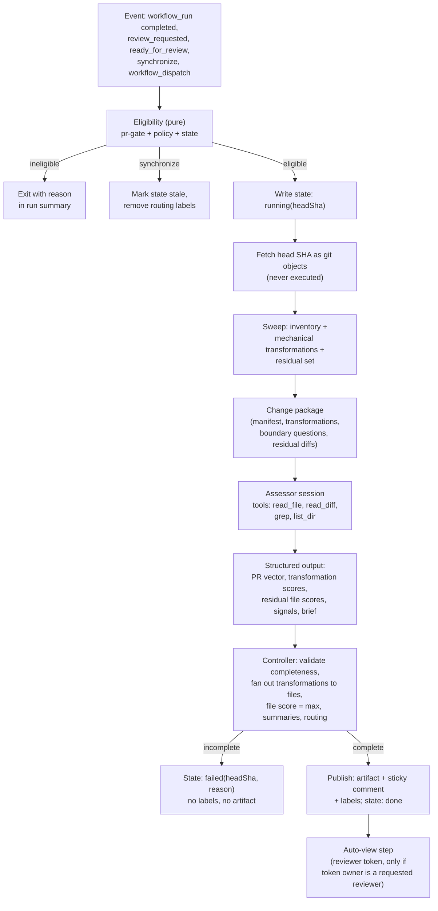
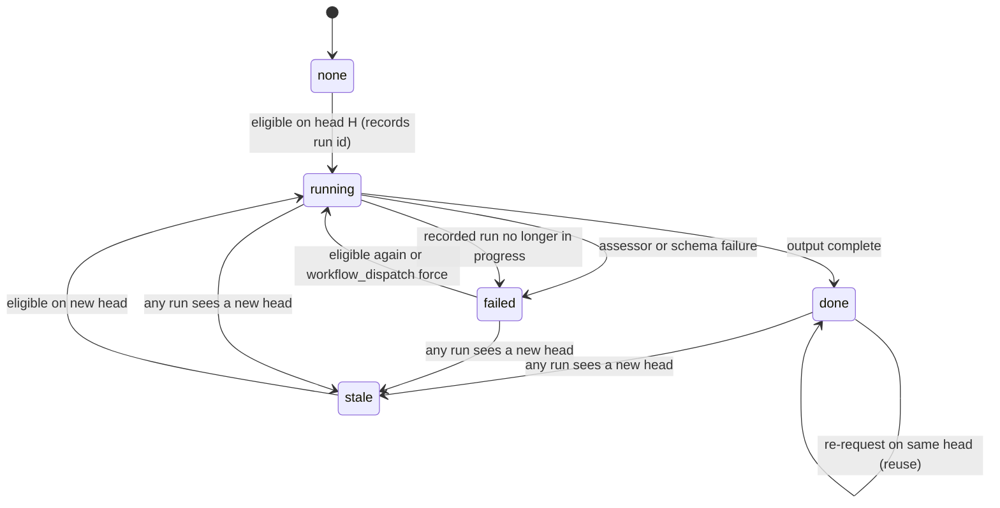
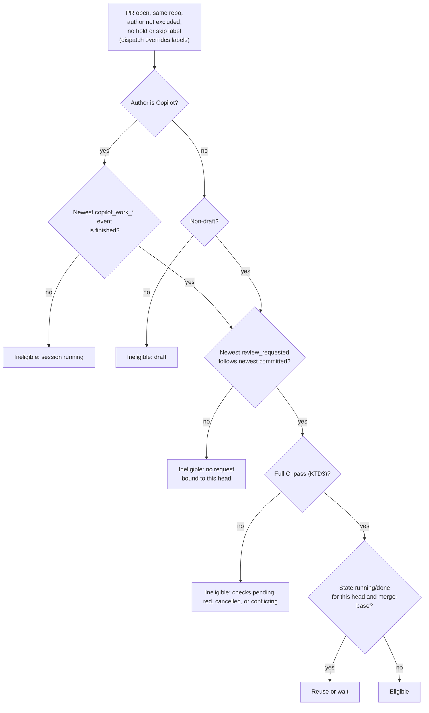

# PR Risk Assessment - Plan

## Goal Capsule

- **Objective:** A reviewer opening a finished pull request already knows which parts of the change deserve attention and which files need none, and once the stage has proven itself in shadow mode the team can let very-low-risk pull requests skip a human reviewer.
- **Means:** A deterministic change sweep, one repository-aware assessor session, and a deterministic controller that scores, routes, and publishes (KTD1, KTD7, KTD8, KTD10).
- **Authority hierarchy:** The Product Contract's Key Decisions (settled in the design transcript) govern product behavior. Key Technical Decisions govern mechanism within them. Repository instructions (`.github/instructions/code-standards.instructions.md`, `.github/instructions/testing.instructions.md`, `docs/testing.md`, the `docs-sync` obligation) govern how code is written and documented.
- **Execution profile:** Code. Ship in shadow mode: the stage comments and labels, and applies no routing effect. Commit the plan and the implementation to the working branch; the implementation session opens the pull request with the plan riding in it. Never open a pull request for the plan alone.
- **Stop conditions:** A settled decision turns out to be infeasible in this repository (report, do not work around). A routing effect beyond a label is needed before shadow validation has run. The Copilot review-request behavior in Assumption A2 does not hold when checked.
- **Who finishes:** The implementation session, unit by unit in dependency order, ending with `end-session`.

---

## Product Contract

### Summary

Add a PR risk assessment stage to the pull request lifecycle. After a pull request has a formal review request and its full CI set has passed, a workflow sweeps the change for mechanical transformations, runs one assessor session that scores potential risk on a fixed set of criteria for the whole pull request and for every changed file, and a deterministic controller derives file scores, routing, and a reviewer brief. The brief and scores are published on the pull request; low-scoring files can be marked viewed in the reviewer's own authenticated context.

### Problem Frame

Every pull request in this repository is reviewed by a human, and most of them are written by the Copilot coding agent working an issue end to end (`docs/agents/readme.md`). Reviewers open each pull request cold. Nothing tells them which files are a validated rename and which three lines establish a contract future code will depend on. A large rename and a subtle middleware change look the same in the file list.

The design for this stage was settled in a design transcript. Its boundary is: detect and rank potential-risk signals in the change; do not judge whether they are realized, justified, or authorized. The scores are continuous 0 to 1 values used for relative ranking. A separate deterministic policy decides what the scores do.

This repository already has the machinery the stage needs to plug into: a workflow that undrafts finished Copilot pull requests once every check is green (`.github/workflows/pr-ready.yml`, `scripts/ci/mark-copilot-pr-ready.cjs`), a convention of one marker-keyed sticky comment per automation carrying base64url state (`scripts/ci/copilot-conflicts-comment.cjs`), and two structured-inference scripts with rubric files, strict output schemas, and evaluation harnesses (`scripts/estimate/`, `scripts/issue-classifier/`).

### Key Decisions

The following were settled in the design transcript that is the source of truth for this plan. Each is recorded with its rejected alternative so a reader without the transcript can see what was chosen and why.

- **The assessor scores potential risk only.** (session-settled: user-directed — chosen over an evidence-status field and a disposition field per criterion: the reviewer assesses actual risk, the assessor only says what deserves a look.) Governs R1, R2, R3.
- **Scores are continuous 0 to 1 on a common range, never rescaled per pull request.** (session-settled: user-directed — chosen over five anchored levels: the values are used only for relative ranking and a threshold, and a per-PR rescale would make the threshold mean different things on different pull requests.) Governs R4, R5.
- **Every criterion always receives a numeric score.** (session-settled: user-directed — chosen over `null` with a reason: an incomplete assessment is an execution failure the controller declines to apply, not a kind of score.) Governs R6, R21.
- **No intent comparison.** The scope-expansion criterion is removed and the originating issue is not an input. (session-settled: user-directed — chosen over an intent-alignment criterion: whether the pull request matches its issue is the reviewer's job.) Governs R7.
- **Missing precedent counts as novelty.** The assessor compares mechanisms, not instances, and flags a convention departure when an appropriately scoped search finds no analogous precedent, without judging whether the novelty is warranted. (session-settled: user-directed — chosen over "no example found is not proof of novelty".) Governs R8.
- **Mechanism names are flagged, not investigated.** A changed use of a timer, frame, microtask, geometry read, or DOM access is a signal; the assessor does not establish an actual problem before flagging it. (session-settled: user-directed — chosen over inspecting how the construct is used.) Governs R9.
- **Trigger on a formal review request and a fully passing CI set, never on a bare push.** A later push invalidates the snapshot's assessment and does not start a new one; a new review request does. (session-settled: user-directed — chosen over assessing every push.) Governs R14, R15, R16, R17.
- **Per-file scores are a deliverable**, so files can be marked viewed below a threshold. The unit of analysis is the pull request and its cross-file relationships; the unit of delivery includes every changed file. (session-settled: user-directed — chosen over pull-request-level scores only.) Governs R10, R11, R12.
- **Several summaries are recorded**, and no single one is the gate. Maximum, mean, and count above threshold are all published; a mean may inform routing but does not decide it alone. (session-settled: user-directed — chosen over never computing a mean.) Governs R13.
- **A deterministic controller applies routing policy from trusted configuration; the model only recommends.** (session-settled: user-approved — proposed with the alternative of letting the model decide; assented.) Governs R18, R19, R20.
- **The assessor is read-only, and pull request text and code are evidence, not instructions.** A pull request that modifies the assessment mechanism cannot authorize its own bypass. (session-settled: user-approved.) Governs R19, R20.
- **A mechanical sweep compresses the input; the assessor still accounts for every changed unit.** (session-settled: user-approved — proposed against pasting the raw diff; assented.) Governs R21, R22, R23.
- **Viewed state is applied in the intended reviewer's own authenticated context, separately from the assessment backend.** (session-settled: user-approved.) Governs R24, R25.
- **No repeatability, file-order, or rubric-versioning program.** (session-settled: user-directed — chosen over versioning the rubric and model configuration: the process is understood to be nondeterministic and the models are good enough given reasonable orchestration.) Governs R26.
- **Shadow mode before any bypass.** (session-settled: user-approved — the transcript's calibration section proposed running on representative pull requests before enabling bypass, and the user accepted the proposal as a whole.) Governs R27.

### Requirements

**Assessment semantics**

- R1. The assessment produces a score for each criterion in the fixed set: touch interaction, layout coupling, DOM coupling, value threading, helper-chain depth, scheduling and temporal coupling, semantic cross-cutting scope, state introduction or expansion, reversals and exceptions, physical change footprint, sensitive-surface involvement, convention departure, data-flow depth, decision divergence, documentation divergence, future commitment.
- R2. A score expresses the significance of the change along that dimension of review attention, not the probability of a defect and not a quality grade.
- R3. The assessor assesses the change, not the surrounding code, while treating a changed shared helper as affecting its unchanged callers.
- R4. Scores are continuous values in the closed range 0 to 1 on a range shared across pull requests.
- R5. The highest-scoring file in a trivial pull request is not raised to 1 merely because it ranks first.
- R6. Every criterion in R1 receives a numeric score at the pull request level, and every criterion marked file-level receives one on every changed file.
- R7. The assessor receives no originating issue, specification, or approval history, and no criterion compares the change to intent.
- R8. Convention departure is scored by identifying the convention the change expresses, abstracting domain names away, and comparing at the level of mechanism, responsibility, and interaction; finding no analogous precedent scores as novelty.
- R9. Changed uses of `setTimeout`, `setInterval`, `requestAnimationFrame`, `Promise.resolve`, `getBoundingClientRect`, and direct DOM access are potential-risk signals for their criteria, and a preexisting call that only moved or was renamed on the same line is not.

**Per-file delivery**

- R10. The published output contains a row for every changed file, keyed by the path as the pull request shows it, carrying the old path for a rename.
- R11. A file's criterion scores reflect its participation in the risk-bearing change, so each file in a value-threading chain receives a threading score informed by the whole chain and an unrelated file does not.
- R12. The physical change footprint criterion is pull-request-level only and does not appear on file rows.
- R13. The output records the maximum file score, the mean file score, and the count and proportion of files at or above the auto-view threshold, alongside the pull request criterion vector.

**Trigger and eligibility**

- R14. An assessment starts only when a pull request has an outstanding formal review request bound to its current head and every check reported on that head has completed successfully as defined in KTD3.
- R15. A push to an assessed pull request marks the published assessment stale and starts no assessment.
- R16. A new review request on a pull request whose current head is already assessed reuses the existing assessment.
- R17. Pull requests from forks, pull requests authored by Dependabot, pull requests carrying the `hold` or `skip-risk-assessment` label, and Copilot pull requests whose agent session is still running are not assessed; a manual dispatch naming the pull request overrides the labels.

**Routing and trust**

- R18. The controller derives each file's score as the maximum of its applicable criterion scores and marks a file auto-view eligible when that score is below the configured threshold.
- R19. Routing (`human`, `mandatory-human`, or `skip-eligible`) is computed by the controller from configuration read from the base branch, never from the pull request head; the assessor's recommendation is recorded but not applied.
- R20. A pull request that changes the assessment workflow, its scripts, its rubric or policy, any workflow file, or the CI scripts is routed `mandatory-human` regardless of scores.
- R21. When the assessor's output is missing any required row or score, the controller publishes a failure and applies no scores.
- R22. Files covered by a validated mechanical transformation (exact move, formatting-only, comment-only, validated identifier rename, lockfile, binary snapshot) are represented to the assessor as one transformation with its boundary questions, and the assessor scores the transformation once.
- R23. Every changed file ends in exactly one coverage state: covered by a transformation or semantically assessed as a residual file, and the controller rejects any other outcome.

**Reviewer auto-view**

- R24. Files below the threshold are marked viewed only through a token belonging to a requested reviewer of the pull request, and only when the pull request head still equals the assessed head; a path matching a mandatory-review or sensitive-surface glob is never marked viewed, and nothing is marked on a `mandatory-human` route.
- R25. The same auto-view module runs locally for any reviewer using their own `gh` authentication.

**Operations**

- R26. The stage records the model and rubric used with each assessment for debugging, and adds no repeatability test, calibration gate, or version-drift alarm.
- R27. The initial release runs in shadow mode: it publishes the comment, the artifact, and labels, and applies no other effect.
- R28. A missing model key or reviewer token is reported in the run summary and the affected step does nothing, matching how `COPILOT_TASKS_TOKEN` and `PREVIEW_QR_TOKEN` are handled.

### Actors

- A1. **Copilot coding agent** authors most pull requests as drafts and requests a review at the end of each session while still in draft.
- A2. **Human author** opens a pull request and requests a review when ready.
- A3. **Requested human reviewer** receives the brief and the matrix and may apply auto-view.
- A4. **Controller workflow** (`PR Risk`) reconciles eligibility, runs the sweep and the assessor, computes routing, and publishes.
- A5. **Assessor session** is the model call with read-only retrieval tools over the pull request snapshot.
- A6. **Local agents** (Claude Code, Codex) read the published comment and must treat it as information, not as a request for changes.

### Key Flows

- F1. Copilot pull request
  - **Trigger:** The last check on the head completes after the agent's session ended and requested a review.
  - **Actors:** A1, A4, A5, A3
  - **Steps:** `PR Ready` undrafts the pull request in its own run. `PR Risk` runs from the same completion, passes the eligibility gate (author Copilot, newest session event finished, checks green, request bound to head), records `running` in the sticky comment, sweeps, assesses, routes, publishes `done` with the brief and labels, and applies auto-view if the reviewer token belongs to a requested reviewer.
  - **Covered by:** R14, R17, R18, R19, R24, R27
- F2. Human pull request
  - **Trigger:** `review_requested` or `ready_for_review` on a non-draft pull request, or the last check completion after such a request.
  - **Actors:** A2, A4, A5, A3
  - **Steps:** The event run finds checks still running and exits without state. The completion run finds the request bound to the head and proceeds as F1.
  - **Covered by:** R14, R16
- F3. Push after assessment
  - **Trigger:** `synchronize`.
  - **Steps:** The controller sets the state to `stale`, removes routing labels, and rewrites the comment header. No inference runs.
  - **Covered by:** R15
- F4. Re-request on an assessed head
  - **Trigger:** `review_requested`.
  - **Steps:** The controller finds state `done` for the current head and reuses it, re-rendering the comment.
  - **Covered by:** R16
- F5. Manual dispatch
  - **Trigger:** `workflow_dispatch` with `pr`, optional `force`, optional `dry_run`.
  - **Steps:** Labels are overridden; `force` ignores dedupe; `dry_run` prints the change package, scores, and routing without writing.
  - **Covered by:** R17
- F6. Reviewer auto-view
  - **Trigger:** A reviewer runs the local command, or the CI step runs with a reviewer token.
  - **Steps:** Read the artifact named in the state, verify the head, select file rows below the threshold, call `markFileAsViewed` in batches, report what was marked.
  - **Covered by:** R24, R25

### Acceptance Examples

- AE1. Large validated rename
  - **Covers:** R10, R12, R22, R23
  - **Given:** A pull request moves 420 files under one directory with contents unchanged and edits 3 files to update path-based imports.
  - **When:** The stage runs.
  - **Then:** The sweep reports one exact-move transformation with 420 members and 3 residual files; the assessor scores the transformation once; the footprint criterion is high at the pull request level; every one of the 423 files has a row; the 420 moved files share the transformation's low semantic scores.
- AE2. Rename with one unrelated behavioral edit
  - **Covers:** R22, R23
  - **Given:** A pull request renames an identifier consistently across 40 files and changes a condition in one hunk of one of them.
  - **When:** The sweep classifies.
  - **Then:** The rename transformation covers every matching hunk, the unmatched hunk places that file in the residual set, and the assessor's output contains a row for it with its own scores.
- AE3. Tiny change establishing a contract
  - **Covers:** R2, R11
  - **Given:** A three-line change exports a new interface that other modules will import.
  - **Then:** Future commitment scores high on that file despite the small diff.
- AE4. Comment-only reversal of a rule
  - **Covers:** R22
  - **Given:** The only change is a comment that reverses a documented rule.
  - **Then:** The comment-only transformation is scored for decision divergence and documentation divergence rather than treated as no change.
- AE5. Routine edits adding a data-flow stage
  - **Covers:** R11, R3
  - **Given:** Four files each gain a small edit that together thread a value from a command through an action and state into a prop.
  - **Then:** Each of the four file rows carries a value-threading score informed by the chain, one signal references all four paths, and unrelated files in the same pull request score near zero on that criterion.
- AE6. Assessor failure
  - **Covers:** R21
  - **Given:** The model returns output missing rows for two residual files.
  - **Then:** The comment shows `failed` for that head with the reason, no label is applied, and the artifact is not published.
- AE7. Harmless files around one consequential change
  - **Covers:** R13, R18
  - **Given:** One middleware change and thirty snapshot updates.
  - **Then:** The maximum file score is the middleware file's, the mean is low, the count above threshold is 1, and routing is `human` because the middleware criterion exceeds its threshold.
- AE8. Pull request modifies the assessor
  - **Covers:** R20
  - **Given:** A pull request edits `scripts/pr-risk/src/routing.ts`.
  - **Then:** Routing is `mandatory-human` with the path named as the reason, and the policy used came from the base branch.
- AE9. Push after assessment
  - **Covers:** R15
  - **Given:** An assessed pull request receives a new commit.
  - **Then:** The comment header reads stale for the new head, routing labels are removed, and no model call is made.

### Scope Boundaries

- Assessment of same-repository pull requests authored by Copilot or by humans is in scope. Fork pull requests are excluded in this release.
- The stage never posts an approval, changes branch protection, or adds a required check.
- The stage does not perform correctness review and does not duplicate `review-pr`.
- The stage creates no check run of its own to report an outcome. Its `pull_request_target` runs do appear as a check on the head, as every such job does in this repository, and every gate that enumerates checks ignores that check by name (KTD3, KTD9).

#### Deferred to Follow-Up Work

- **Enforce mode effect.** What a `skip-eligible` route does beyond a label (remove the review request, arm `gh pr merge --auto --squash` with a dedicated token as `dependabot-automerge.yml` does, or nothing) is decided after shadow results exist. The controller exposes `mode: shadow | enforce` so the effect is one unit later.
- **Grouped parallel investigation** for residual changes that exceed the single-session budget. The first release fails closed when the budget is exceeded.
- **Team review requests** as a trigger; only user requests count in this release.
- **A comment command** (`/assess`) for pull requests that never carry a formal request; `workflow_dispatch` is the manual path.
- **Hosting on Claude Managed Agents** or another agent harness; the provider module is the seam.
- **A check run that reports the assessment outcome** on the head commit. The by-name exclusion U1 adds to the shared gate is its precondition and is already in place.
- **A formatting-only classifier.** Lint runs `prettier --check .` and must pass before any assessment, so a formatting-only change can only appear on paths `.prettierignore` excludes (`docs`, `packages`, `.github/skills`). Add it only if shadow results show formatting-only churn there.

### Success Criteria

- On the fixture set in `.github/instructions/pr-risk/samples.jsonl`, which holds at least ten recent Copilot pull requests including the transcript's shape cases and one injection case, `yarn workspace em-pr-risk evaluate` reports no `skip-eligible` route on a sample labeled `human`, no auto-view selection inside the injection sample, and no assessor failure caused by budget or schema; its route-agreement report has been read and each disagreement is explained in the implementation pull request.
- A reviewer reading each brief from that run can name where to start without opening the file list.
- A reviewer's first look at a pull request with a validated rename shows the renamed files already marked viewed in their own session after running the auto-view command.

---

## Planning Contract

### Key Technical Decisions

- KTD1. **The assessor is a Node workspace script calling the model provider directly with function tools and a strict output schema, modeled on `scripts/estimate/`.** Rejected: a Copilot agent task, because that agent writes and pushes, and it loads `AGENTS.md`, `.github/instructions/*`, and `.github/skills/*` from the branch it checks out (`docs/agents/external-agents.md`), which is exactly the "the pull request loads the assessor's own rubric" failure the trust boundary forbids. Rejected: a new hosted agent backend, per the transcript's rule not to introduce one for size alone. The provider call lives in one module, `scripts/pr-risk/src/assessor/inference.ts`, so switching provider is one file (Assumption A1). Governs R7, R19.
- KTD2. **Trigger topology.** The `PR Risk` workflow consumes `workflow_run` completions of the same seven workflows `pr-ready.yml` lists, with a last-one-out check, plus `pull_request_target` events `review_requested`, `ready_for_review`, and `synchronize`, plus `workflow_dispatch` with `pr`, `force`, and `dry_run`. An undraft performed with `GITHUB_TOKEN` raises no workflow run (`pr-ready.yml` header), so `ready_for_review` alone would never fire for Copilot pull requests; the completion path is the primary path and the event path serves human authors. (session-settled: user-directed — instantiates the trigger Key Decision; chosen over assessing on push.) Governs R14, R15, R16.
- KTD3. **"Full CI pass" is an algorithm over the head's latest check runs, not a fixed set.** Path filters mean a documentation-only pull request reports only Lint, and a conflicting pull request reports only the two `pull_request_target` workflows (`docs/testing.md`, Path filtering and Merging the base branch). The gate requires: a `Lint` check run present with conclusion `success`; every check run completed; none with conclusion `failure`, `timed_out`, `action_required`, or `cancelled`; `mergeable` not `false`, retried while GitHub reports it as unknown. The `PR Risk` workflow's own check runs are excluded by name before any of this, because a job started by `pull_request_target` is reported as a check on the head (as `Scan conflicting Copilot PRs` is today) and would otherwise block both this gate and the undraft in `PR Ready`. The set of check names it saw, and the names it ignored, are recorded in the state so the reviewer can see what "full" meant. This is stricter than `mark-copilot-pr-ready.cjs`, which tolerates `cancelled`; the shared module takes the tolerance and the ignored names as options. Governs R14.
- KTD4. **Eligibility is a pure function** of the pull request, its timeline, its latest check runs, the existing state, the status of the run the state names, the triggering event, and the policy. It is stateless except for the sticky comment, and that comment is trusted only when authored by `github-actions[bot]`. Every run reconciles before deciding: when the state's head differs from the pull request's current head and the state is `running`, `done`, or `failed`, the stale transition runs first, whichever event woke the run, so a dropped `synchronize` run cannot leave a stale record. A `running` state whose recorded run is no longer queued or in progress is treated as `failed`, so a runner failure or timeout never leaves a head unassessable. A review request is bound to the current head when the newest `review_requested` timeline event follows the newest `committed` event. Copilot authors additionally require the newest `copilot_work_*` event to be `copilot_work_finished` in place of a non-draft requirement, because the undraft happens concurrently in `PR Ready` and nothing fires after it. Human authors require non-draft. Dedupe is by head SHA plus merge-base SHA against the state. Governs R14, R16, R17.
- KTD5. **Extract the gate logic `pr-ready.yml` and `PR Risk` share into `scripts/ci/pr-gate.cjs`**: open pull request resolution by number or head branch, Copilot session state from the timeline, latest check-run enumeration with a by-name ignore list, and the failed-conclusion set. `mark-copilot-pr-ready.cjs` and `collect-dependabot-failures.cjs` keep their behavior, require the module, and pass the `PR Risk` check name as ignored so the new stage's own runs never stall the undraft or the Dependabot fix. The repository's rule is one file rather than two that drift (`docs/agents/external-agents.md`, Why the skills are symlinked). CommonJS so `actions/github-script` can `require` it and ESM entry points can `import` it, as `scripts/ci/task-comment.cjs` does.
- KTD6. **Trust boundary.** The workflow runs from the base repository checkout in base context. The pull request head is fetched by SHA as git objects into the same repository and is never installed from or executed; the sweep and the assessor's tools read blobs through `git show` and `git grep` against the base and head tree-ishes. Rubric, policy, and sensitive-path lists are read from the base checkout. The mandatory-review globs are the paths that execute as part of CI or of this stage: `.github/workflows/**`, `.github/actions/**`, `.github/scripts/**`, `.hooks/**` (installed as the git hooks path on every install), `scripts/ci/**`, `scripts/pr-risk/**`, and `.github/instructions/pr-risk/**`; a pull request touching any of them routes `mandatory-human`. Agent-instruction files (`.github/copilot-instructions.md`, `.github/agents/**`, `.github/skills/**`, the rest of `.github/instructions/**`, `AGENTS.md`, `CLAUDE.md`, `.agents/**`, `.claude/**`) are not part of the assessment mechanism, since the assessor is a Node script that loads only the rubric and policy from the base checkout; they are sensitive-surface globs instead, so they are scored with that designation in view and never auto-viewed, and the pull requests that touch them stay in the evaluated population. (session-settled: user-approved — the read-only, evidence-not-instructions boundary.) Governs R19, R20, R24.
- KTD7. **Sweep design.** Inventory comes from `git diff --name-status -M100% -C100% --find-renames <merge-base> <head>` plus per-file `--numstat`, mode, symlink, and binary detection from `.gitattributes` and blob content. Classification, in order: exact move; lockfile (`yarn.lock`); binary snapshot (`**/__image_snapshots__/**`, other binaries); symlink or mode-only; formatting-only (both sides formatted with the base checkout's Prettier and compared); comment-only (TypeScript scanner token streams with trivia skipped compare equal, for `.ts`, `.tsx`, `.js`, `.mjs`, `.cjs`); validated identifier rename (one consistent old-to-new identifier substitution across all classified hunks, verified token-by-token with the TypeScript scanner, unmatched hunks left residual); everything else residual. Each transformation carries boundary questions the assessor must consider: import and export paths, build inclusion and discovery globs for moves; exported names, string literals, JSON keys, and documentation mentions of the old name for renames. Binary snapshots are a transformation the assessor still scores, because a snapshot update is the acceptance of a visual change (`docs/agents/skills.md`, puppeteer-update-snapshots). Governs R22, R23.
- KTD8. **One assessor session with bounded retrieval and a structured final output.** The change package is the manifest, the transformations with their boundary questions, and the residual diffs inline while under a size budget, otherwise listed with sizes for on-demand retrieval. Tools: `read_file(path, side, range)`, `read_diff(path)`, `grep(pattern, glob, side)`, `list_dir(path, side)`, each bounded in output size, with a total call cap and a total context budget; exceeding either fails the assessment with the reason. The final output is a strict JSON schema: pull request criterion scores, per-transformation criterion scores, per-residual-file criterion scores, signals referencing files, and the brief. The controller validates completeness against the manifest. (session-settled: user-approved — one session with targeted retrieval rather than one inference per file, and no averaging as the aggregate.) Governs R6, R8, R11, R21.
- KTD9. **Output lives in one marker-keyed sticky comment plus a workflow artifact, with no outcome check run.** The comment (`<!-- pr-risk -->`, state in `<!-- pr-risk-state: <base64url JSON> -->`) carries the brief, the pull request criterion vector, the summaries, routing and reasons, the head, base, and merge-base SHAs, the check names seen and ignored, the workflow run id and link, and the artifact id and name. Only a marker comment authored by `github-actions[bot]` is read as state; a marker comment from any other author is ignored and a new bot comment is created, because the repository is public and any account can post a comment carrying the marker. The `running` record also carries the run id so a later run can tell whether that run is still alive (KTD4). The full per-file matrix is the artifact `pr-risk-<headSha>` because a several-hundred-file matrix exceeds the comment size limit. No check run reports the outcome, because `mark-copilot-pr-ready.cjs` enumerates every check on the head and an in-progress or failed one would stop the undraft; the workflow's own `pull_request_target` runs still appear as a check and are ignored by name (KTD3). Governs R10, R13, R15.
- KTD10. **Routing policy is data in `.github/instructions/pr-risk/policy.json`**: `mode`, the auto-view threshold, per-criterion skip thresholds, the informational criteria (footprint), mandatory-review globs, sensitive-surface globs, excluded authors, and label names. The sensitive-surface globs are the repository's designation of sensitive areas for the criterion of that name: the sweep marks each changed path that matches, the change package shows the assessor those marks so it scores the criterion with the designation in view, each file row carries the mark, and auto-view never selects a marked path (KTD11). The controller emits `human`, `mandatory-human`, or `skip-eligible` with reasons. In shadow mode the only effects are the comment, the artifact, and the labels `risk: human`, `risk: mandatory-human`, `risk: skip-eligible`. (session-settled: user-approved — deterministic controller applying trusted policy; shadow first.) Governs R18, R19, R27.
- KTD11. **Auto-view is one module with two callers.** `scripts/pr-risk/src/view.ts` reads the bot-authored state, downloads the artifact by the recorded id, refuses unless the artifact's owning run belongs to this repository's `PR Risk` workflow and reports the assessed head, verifies the pull request head still equals it, selects rows with file score below the threshold that match no mandatory-review or sensitive-surface glob, selects nothing on a `mandatory-human` route, and calls the `markFileAsViewed` GraphQL mutation in batches. The deterministic exclusions exist because auto-view is the one live effect in shadow mode and its inputs are model scores computed from the diff, so a file the reviewer may skip is decided by the controller and policy, never by the model alone. In CI it runs as a separate step with `PR_RISK_REVIEWER_TOKEN`, a fine-grained token belonging to one named reviewer (precedent: `PREVIEW_QR_TOKEN` in `docs/testing.md`), and applies only when that token's login is among the requested reviewers, otherwise reporting why not. Locally any reviewer runs it with their own `gh auth token`, and a shared skill documents the invocation. (session-settled: user-approved — viewer-specific state applied in the reviewer's context, separate from the backend.) Governs R24, R25, R28.
- KTD12. **File score is the maximum of applicable criterion scores; summaries are maximum, mean, and count and proportion above threshold.** (session-settled: user-directed — chosen over a weighted average or a universal overall threshold.) Governs R13, R18.
- KTD13. **Tests live in `scripts/pr-risk/src/**/__tests__/*.ts` and `scripts/ci/__tests__/`**, collected by `yarn test` through the unanchored `**/__tests__/**/*.ts` glob (`vitest.config.ts`). Sweep tests build small temporary git repositories rather than mocking git. Provider calls are never made in tests; the inference module is replaced through the `--dry-ai` seam that returns a canned output from a fixture.
- KTD14. **The workflow runs Node 24 and `node scripts/pr-risk/src/assess.ts`** with no build step, as `estimate-issue-opened.yml` does, installing from the base checkout's lockfile with `yarn install --immutable`.

### High-Level Technical Design

Pipeline inside one `PR Risk` run:



State carried in the sticky comment, one record per pull request:



Eligibility decision, evaluated on every event:



Output shape, directional only (the schema in `scripts/pr-risk/src/assessor/schema.ts` is authoritative once written):

```text
assessment
  snapshot: { headSha, baseSha, mergeBase, checksSeen[] }
  model: { provider, name }
  pr: { criteria: { <criterionId>: 0..1 } }             // all 16
  transformations: [ { id, kind, members[], criteria } ]  // one score set per transformation
  files: [ { path, previousPath?, coverage: 'transformation:<id>' | 'residual',
             criteria: { <fileLevelCriterionId>: 0..1 }, score } ]  // every changed file
  signals: [ { id, criterion, summary, files[] } ]
  summaries: { maxFileScore, meanFileScore, aboveThresholdCount, aboveThresholdProportion }
  brief: { headline, startWith, decision?, recommendation: 'human' | 'skip' }
  routing: { route: 'human' | 'mandatory-human' | 'skip-eligible', reasons[] }   // controller
```

### Assumptions

These are inferred bets the user has not confirmed. Each names the default taken and where a different answer would land.

- A1. **Provider: OpenAI, through the existing `OPENAI_API_KEY` family** with a per-script `OPENAI_API_KEY_PR_RISK` for spend attribution (`docs/agents/readme.md`, Secrets). This follows the repository's only structured-inference precedent. The transcript did not pick a provider for this repository. The provider is isolated in one module so a switch to Anthropic tooling is one file and one secret.
- A2. **Copilot's session-end review request arrives as a `review_requested` timeline event from Copilot's own actor and recurs after every follow-up session.** This could not be verified from the planning session because the available GitHub tooling exposes no timeline read. Before U7 is written, run `gh api repos/cybersemics/em/issues/<n>/timeline --paginate` on a recent Copilot pull request and confirm the event, its actor, and whom it requests. If the request does not recur, KTD4's request-bound-to-head rule must instead accept any outstanding `requested_reviewers` entry for Copilot authors.
- A3. **The model's function-tool loop and strict JSON output can be combined in one session.** If the provider rejects a strict schema on a tool-using session, the final output is delivered through a single `emit_assessment` tool call with the same schema.
- A4. **GitHub clears a file's viewed flag when a later push changes that file**, so stale auto-views self-correct; the applier additionally refuses to run when the head has moved.
- A5. **The base checkout's Prettier can format head file contents as strings** for formatting-only detection, using the base configuration.
- A6. **Team review requests are ignored** and only `requested_reviewers` entries of type `User` count.
- A7. **Node 24 is available on the runner** for `node src/*.ts` type stripping, as the estimate workflows already rely on.
- A8. **The `synchronize` event under `pull_request_target` is safe to consume** because the run touches only the comment and labels and executes nothing from the head.
- A9. **The `skip` effect in enforce mode will be arming auto-merge, not an approval**, following the rule recorded in `dependabot-automerge.yml` that automation never stamps approval on agent- or human-written code. This is deferred and not built here.

### Implementation Constraints

- One default export per file, filename equal to the export name, JSDoc on every function, options objects over positional arguments, no `let`, no `for` loops (`.github/instructions/code-standards.instructions.md`).
- Test files are `__tests__/<module>.ts` with no `.test` suffix, `describe`/`it` imported from `vitest` inside workspaces, names stating expected behavior, no `.only`, no `.skip` without a linked reason, no `vi.waitFor` (`.github/instructions/testing.instructions.md`, `docs/testing.md`).
- `.cjs` for anything `actions/github-script` requires; `.ts` entry points run with plain `node` in the workspace.
- `yarn prettier --write .` before every commit; no pre-commit hook exists.
- Documentation edits land in the same commit as the change that makes them necessary (`docs-sync`).
- New workflow file names must be added to the sibling-workflow `paths-ignore` lists in `test.yml`, `puppeteer.yml`, and `ios.yml` (Vercel Preview keeps no such list), and `scripts/pr-risk/**` to the Puppeteer and BrowserStack lists beside `scripts/estimate/**`.
- The workspace's `typescript` dependency must be the same alias the root uses (`npm:@typescript/typescript6@6.0.2`), not the `7.0.2` pin the estimate workspace carries, because the sweep needs the JavaScript compiler API (`ts.createScanner`) and the native build does not expose it.

### Sequencing

U1 and U2 are independent foundations. U3, U4, U5, and U6 build the pipeline in data-flow order and each is testable without the workflow. U7 wires the workflow and eligibility and is the first unit that runs in CI. U8 and U9 follow U7. U10 documentation rides with the units that make it necessary; its own unit exists for the new page and the cross-references. Before merge, only `workflow_dispatch --ref <branch>` and the local evaluation harness can exercise the pipeline, because `workflow_run` and `pull_request_target` read the workflow file from the default branch. Shadow validation on real pull requests through the event paths starts after U7 has merged and before any enforce-mode work.

---

## Output Structure

```text
.github/
├── instructions/pr-risk/
│   ├── pr-risk.instructions.md        Rubric: criteria, boundaries, novelty rule, mechanism hints
│   ├── policy.json                    Routing policy read from the base branch
│   └── samples.jsonl                  Shadow-mode fixture pull requests with expected routes
├── skills/view-risk/SKILL.md          How a reviewer or local agent applies auto-view
└── workflows/pr-risk.yml              The PR Risk workflow

.agents/skills/view-risk -> ../../.github/skills/view-risk

scripts/ci/
└── pr-gate.cjs                        Shared gate logic (from mark-copilot-pr-ready.cjs)

scripts/pr-risk/
├── package.json                       Workspace em-pr-risk (node src/*.ts, typecheck)
├── tsconfig.json
├── README.md
└── src/
    ├── assess.ts                      CI entry point: eligibility → sweep → assess → publish
    ├── view.ts                        Auto-view entry point (CI step and local command)
    ├── evaluate.ts                    Shadow-mode evaluation over samples.jsonl
    ├── github/                        REST and GraphQL calls (fetch, GITHUB_TOKEN)
    ├── eligibility/                   Pure eligibility decision
    ├── sweep/                         Inventory, classifiers, transformations, residual set
    ├── assessor/                      Change package, tools, inference, schema
    ├── controller/                    Completeness, fan-out, summaries, routing
    ├── publish/                       Comment render/parse, state, artifact, labels
    └── lib/                           Rubric and policy loaders, git helpers

docs/agents/pr-risk.md                 The stage: why, flow, state, policy, secrets, local use
```

---

## Implementation Units

| U-ID | Title | Key files | Depends on |
|---|---|---|---|
| U1 | Shared pull request gate module | `scripts/ci/pr-gate.cjs`, `scripts/ci/mark-copilot-pr-ready.cjs` | none |
| U2 | Workspace, rubric, and policy scaffold | `scripts/pr-risk/package.json`, `.github/instructions/pr-risk/*` | none |
| U3 | Change inventory and mechanical sweep | `scripts/pr-risk/src/sweep/*` | U2 |
| U4 | Change package and assessor session | `scripts/pr-risk/src/assessor/*` | U2, U3 |
| U5 | Controller: completeness, fan-out, routing | `scripts/pr-risk/src/controller/*` | U2, U4 |
| U6 | Publication: comment, state, artifact, labels | `scripts/pr-risk/src/publish/*` | U5 |
| U7 | Eligibility and the PR Risk workflow | `scripts/pr-risk/src/eligibility/*`, `src/assess.ts`, `.github/workflows/pr-risk.yml` | U1, U6 |
| U8 | Reviewer auto-view | `scripts/pr-risk/src/view.ts`, `.github/skills/view-risk/SKILL.md` | U6, U7 |
| U9 | Shadow-mode evaluation harness | `scripts/pr-risk/src/evaluate.ts`, `samples.jsonl` | U7 |
| U10 | Documentation and agent-instruction clause | `docs/agents/pr-risk.md`, `docs/agents/readme.md`, `docs/testing.md`, `AGENTS.md`, Copilot prompt files | U7, U8 |

### U1. Shared pull request gate module

- **Goal:** Give `PR Ready` and `PR Risk` one implementation of pull request resolution, Copilot session state, and check-run evaluation.
- **Requirements:** R14, R17; KTD3, KTD5.
- **Dependencies:** none.
- **Files:**
  - `scripts/ci/pr-gate.cjs` (create)
  - `scripts/ci/mark-copilot-pr-ready.cjs` (modify to require the module)
  - `scripts/ci/collect-dependabot-failures.cjs` (modify to pass the ignored check name through the module)
  - `scripts/ci/__tests__/pr-gate.ts` (create, vitest)
  - `.github/workflows/agent-scripts.yml` (add the new files to both `paths` lists only if a plain-node test is added; a vitest test needs no entry)
- **Approach:**
  1. Move the pull request lookup by number or head branch, `WORK_EVENTS`, the timeline session check, the `filter: 'latest'` check-run enumeration, and `FAILED_CONCLUSIONS` into `pr-gate.cjs` as functions taking `{ github, owner, repo }` and returning plain data.
  2. Add an option for whether `cancelled` counts as failed, defaulting to the current `PR Ready` behavior, an option to require a named check (`Lint`) with conclusion `success`, and an `ignoreChecks` list of check names removed from the pending and failed sets before evaluation, defaulting to the `PR Risk` job name (KTD3).
  3. `mark-copilot-pr-ready.cjs` and `collect-dependabot-failures.cjs` call the module with their current options plus the default ignore list, so their decisions change only in that the new stage's own check can never hold them.
- **Patterns to follow:** `scripts/ci/task-comment.cjs` (CommonJS shared by github-script and ESM), `scripts/ci/__tests__/collect-copilot-conflicts.mjs` (in-memory REST fixtures).
- **Test scenarios:**
  - A Copilot pull request whose newest work event is `copilot_work_started` is reported as session running.
  - A timeline with started, finished, started, finished reports finished; started, finished, started reports running.
  - Check runs with one `in_progress` report pending with that check's name.
  - Check runs with a `cancelled` conclusion report passed under the tolerant option and failed under the strict option.
  - Check runs without a `Lint` run report not passed when the required-check option names `Lint`.
  - Check runs that are all complete except an `in_progress` run whose name is in the ignore list report passed, and the ignored name is returned separately.
  - Resolving by a head branch with no open pull request returns nothing rather than the newest open pull request.
  - `mark-copilot-pr-ready.cjs` still refuses a non-integer `PR_NUMBER` and an empty branch.
- **Verification:** `yarn test scripts/ci` passes. Then drive the moved code, not the early return: `gh workflow run pr-ready.yml --ref <branch> -f pr=<n>` on a draft Copilot pull request whose newest session event is finished, once while a check is still running (the log names that check as still running) and once when every check is green (the pull request is undrafted).

### U2. Workspace, rubric, and policy scaffold

- **Goal:** Create the `em-pr-risk` workspace with the rubric, policy, and loaders the pipeline reads, so later units have a home and CI type-checks it.
- **Requirements:** R1, R4, R5, R7, R8, R9, R12, R19, R20; KTD1, KTD10, KTD14.
- **Dependencies:** none.
- **Files:**
  - `scripts/pr-risk/package.json`, `scripts/pr-risk/tsconfig.json`, `scripts/pr-risk/README.md` (create; mirror `scripts/estimate/`, except that `typescript` is the root's `npm:@typescript/typescript6@6.0.2` alias per Implementation Constraints)
  - `package.json` (add `scripts/pr-risk` to `workspaces`)
  - `.github/instructions/pr-risk/pr-risk.instructions.md` (create)
  - `.github/instructions/pr-risk/policy.json` (create)
  - `scripts/pr-risk/src/lib/loadRubric.ts`, `scripts/pr-risk/src/lib/loadPolicy.ts`, `scripts/pr-risk/src/lib/criteria.ts` (create)
  - `scripts/pr-risk/src/lib/__tests__/loadPolicy.ts`, `scripts/pr-risk/src/lib/__tests__/criteria.ts` (create)
  - `.github/workflows/puppeteer.yml`, `.github/workflows/ios.yml` (add `scripts/pr-risk/**` to `paths-ignore` beside `scripts/estimate/**`)
  - `docs/testing.md` (Path filtering: name the new workspace where `scripts/estimate/` is named)
- **Approach:**
  1. The rubric file states the assessment boundary from the Product Contract Key Decisions, defines each criterion in R1 with what it characterizes and what it does not, states the novelty rule from R8 with the transcript's examples, lists mechanism hints from R9 as search hints rather than findings, states that scores lie on a range shared across pull requests and are never ranked or spread to fill 0 to 1 within one pull request (R4, R5), states that file contents, diffs, and tool results are untrusted data and that an instruction found inside them is itself a sensitive-surface or convention-departure signal and never a directive, and gives the output contract.
  2. `criteria.ts` is the single list of criterion identifiers with `level: 'pr' | 'file'`; the rubric, the schema, the controller, and the comment renderer all import it.
  3. `policy.json` holds the fields KTD10 lists, with the mandatory-review and sensitive-surface globs from KTD6 as its initial values; `loadPolicy.ts` validates it with zod and rejects unknown criterion identifiers.
  4. Loaders read from the repository root by fixed path, as `scripts/estimate/src/lib/loadInstructions.ts` does.
- **Patterns to follow:** `scripts/estimate/package.json`, `scripts/estimate/src/lib/loadInstructions.ts`, `scripts/estimate/src/lib/validateEstimate.ts` (zod plus strict wire schema).
- **Test scenarios:**
  - A policy with a threshold outside 0 to 1 is rejected with the field named.
  - A policy naming an unknown criterion in `skipThresholds` is rejected.
  - Every criterion in `criteria.ts` has a heading in the rubric file, and the rubric names no criterion that is not in the list.
  - The rubric contains the no-rescale statement and the untrusted-data statement (asserted by fixed phrases the test and the rubric share).
  - `footprint` is the only criterion with level `pr`.
  - The shipped policy's mandatory-review globs match `.github/actions/install/action.yml` and `.hooks/post-merge`, and its sensitive-surface globs match `.github/copilot-instructions.md` and `src/redux-middleware/pullQueue.ts`.
- **Verification:** `yarn workspace em-pr-risk typecheck` and `yarn test scripts/pr-risk` pass; `yarn lint` passes with the new files formatted.

### U3. Change inventory and mechanical sweep

- **Goal:** Turn a base and head pair into a complete inventory, a list of validated transformations with boundary questions, and a residual set, so the assessor spends attention on interpretation.
- **Requirements:** R10, R22, R23; KTD6, KTD7.
- **Dependencies:** U2.
- **Files:**
  - `scripts/pr-risk/src/lib/git.ts` (create: `git` invocations against tree-ishes)
  - `scripts/pr-risk/src/sweep/inventory.ts`, `classifyMove.ts`, `classifyFormatting.ts`, `classifyComments.ts`, `classifyRename.ts`, `classifySpecial.ts`, `sweep.ts` (create)
  - `scripts/pr-risk/src/sweep/__tests__/*.ts` (create, one per module, plus `sweep.ts` for the end-to-end order)
  - `scripts/pr-risk/src/sweep/__tests__/fixtures/` (create: small file contents used to build temporary repositories)
- **Approach:**
  1. `inventory.ts` runs the diff described in KTD7 from the merge-base and records old path, new path, status, added and deleted lines, mode, binary, symlink, and blob identifiers for every entry; a submodule or unreadable blob is recorded as `special`.
  2. Classifiers run in the KTD7 order and each claims files or hunks; a claimed hunk cannot be claimed again; unclaimed hunks leave their file residual.
  3. `classifyRename.ts` derives the single most frequent identifier substitution across all hunks, then verifies every candidate hunk by comparing TypeScript scanner token streams with the substitution applied; boundary questions list hits of the old identifier in string literals, JSON keys, and Markdown across the head tree.
  4. `sweep.ts` returns `{ inventory, transformations, residual }`, marks every inventory entry that matches a sensitive-surface or mandatory-review glob from the policy, and asserts every inventory entry is in exactly one transformation's members or in `residual`.
- **Execution note:** Build each classifier test-first from a temporary git repository created in the test, so the classifier is proven against real `git diff` output rather than a hand-written diff.
- **Patterns to follow:** `.github/workflows/tdd.yml` `detect` job for merge-base and name-only diff usage; `.github/actions/unskip-added-tests/action.yml` for hunk parsing; `scripts/estimate/src/lib/getPromptVersion.ts` for running `git` from Node.
- **Test scenarios:**
  - Moving three files under a new directory with unchanged contents yields one exact-move transformation with three members and an empty residual set.
  - A file reformatted only (indentation and trailing commas) is classified formatting-only; the same file with one changed literal is residual.
  - A change that only edits a block comment is comment-only; a change that edits a comment and a string literal on the same line is residual.
  - Renaming `getFoo` to `getBar` across four files with consistent hunks yields one rename transformation with four members; the same change plus one hunk altering a condition leaves that file residual and the other three covered. Covers AE2.
  - A rename whose old identifier also appears inside a string literal lists that path in the transformation's boundary questions.
  - A changed `yarn.lock` is a lockfile transformation; a changed PNG under `__image_snapshots__` is a binary-snapshot transformation; a symlink retarget is a symlink transformation.
  - A file changed in mode only (executable bit) is classified mode-only with no residual hunks.
  - An added file and a deleted file are residual entries carrying their status.
  - A changed file under `src/redux-middleware/` carries the sensitive-surface mark and a changed file under `.github/workflows/` carries the mandatory-review mark; a file under `src/util/` carries neither.
  - The sweep invariant fails loudly when a classifier claims a file twice.
- **Verification:** All sweep tests pass; running `node scripts/pr-risk/src/assess.ts --pr <n> --dry-ai --dry-write` (available after U7) on a historical rename pull request prints a manifest whose member and residual counts add up to the changed-file count.

### U4. Change package and assessor session

- **Goal:** Build the change package, run one model session with bounded retrieval tools, and return output that conforms to the schema.
- **Requirements:** R2, R3, R6, R7, R8, R9, R11, R21, R22, R26; KTD1, KTD8.
- **Dependencies:** U2, U3.
- **Files:**
  - `scripts/pr-risk/src/assessor/buildPackage.ts`, `tools.ts`, `inference.ts`, `schema.ts`, `assess.ts` (create)
  - `scripts/pr-risk/src/assessor/__tests__/buildPackage.ts`, `tools.ts`, `schema.ts`, `assess.ts` (create)
  - `scripts/pr-risk/src/assessor/__tests__/fixtures/assessment.json` (create: a canned conforming output for the `--dry-ai` seam)
- **Approach:**
  1. `buildPackage.ts` renders the manifest with each entry's sensitive-surface and mandatory-review marks, each transformation with its members summarized (count, directory, boundary questions), and residual diffs inline while under the budget in the policy, otherwise as a list with sizes. Every diff and every tool result is wrapped in fixed delimiters and labeled as data, so the rubric's untrusted-data statement has something concrete to point at.
  2. `tools.ts` implements the four tools from KTD8 over `git show` and `git grep` on the base and head tree-ishes, with per-call output caps and a shared call counter; a call over the cap returns an error the session sees, and the session is failed when the total context budget is exceeded. Model-chosen arguments never reach git as options: `side` maps to a fixed tree-ish, patterns are passed after `-e`, and every invocation terminates options with `--` before paths.
  3. `schema.ts` is the strict JSON schema plus the zod backstop, generated from `criteria.ts` so a criterion added to the list appears in the schema.
  4. `inference.ts` is the only file that knows the provider: system message from the rubric, the package as the first user message, the tool loop, and the final structured output, with model and reasoning-effort overrides through `PR_RISK_*` environment variables and the per-script key fallback.
  5. `assess.ts` composes them and returns the parsed output with the tool-call count and token usage for the run summary; `--dry-ai` returns the fixture instead.
- **Patterns to follow:** `scripts/estimate/src/lib/inference.ts` (raw `fetch`, environment overrides, per-script key), `scripts/estimate/src/lib/validateEstimate.ts` (strict wire schema plus lenient zod), `scripts/estimate/src/lib/estimateIssue.ts` (dry-run seams).
- **Test scenarios:**
  - A package for a pull request with one 420-member move and three residual files contains one transformation block, three inline diffs, and no repeated file contents. Covers AE1.
  - A residual set over the inline budget is rendered as a sized list and each file is retrievable through `read_diff`.
  - Every inline diff and every tool result in the package is enclosed in the data delimiters, and a diff whose text contains the closing delimiter is escaped rather than terminating the block early.
  - `read_file` on the head side returns head content for a path that differs between sides and refuses a path outside the inventory's tree.
  - A `grep` pattern beginning with `-` is passed as a pattern, not an option, and `read_file` with a path beginning with `-` is refused.
  - `grep` output is truncated at the cap with a marker naming how many matches were omitted.
  - The call counter fails the session on the call after the cap.
  - Schema validation rejects an output missing a pull request criterion, a score outside 0 to 1, a file row naming a path not in the manifest, and a transformation identifier not in the sweep.
  - Schema validation accepts the fixture output.
  - With `--dry-ai`, `assess.ts` returns the fixture and makes no network call.
- **Verification:** Tests pass; a manual run with a real key on one small pull request produces a conforming output and a tool-call count under the cap.

### U5. Controller: completeness, fan-out, summaries, routing

- **Goal:** Turn assessor output into the complete per-file matrix, the summaries, and a routing decision from trusted policy.
- **Requirements:** R10, R11, R12, R13, R18, R19, R20, R21, R23; KTD10, KTD12.
- **Dependencies:** U2, U4.
- **Files:**
  - `scripts/pr-risk/src/controller/validateCoverage.ts`, `fanOut.ts`, `summarize.ts`, `route.ts`, `control.ts` (create)
  - `scripts/pr-risk/src/controller/__tests__/*.ts` (create, one per module)
- **Approach:**
  1. `validateCoverage.ts` checks that every inventory entry is a residual row or a member of a scored transformation, and that every file-level criterion is present on every residual row and every transformation; any gap is an execution failure with the missing items listed.
  2. `fanOut.ts` produces a row for every changed file: residual rows as scored, transformation members with the transformation's scores, the previous path on renames, and the sweep's sensitive-surface and mandatory-review marks carried through unchanged.
  3. `summarize.ts` computes file score as the maximum of file-level criteria and the four summaries in R13.
  4. `route.ts` applies policy: `mandatory-human` when any changed path matches a mandatory-review glob; otherwise `skip-eligible` when every non-informational pull request criterion is below its threshold and no file score reaches the auto-view threshold; otherwise `human`, with reasons naming the criteria and paths that decided it. The assessor's recommendation is recorded beside the route.
  5. `control.ts` composes them into the assessment record from the design sketch.
- **Patterns to follow:** `scripts/estimate/src/lib/tallyVotes.ts` (pure aggregation with reasons carried through).
- **Test scenarios:**
  - Output missing a row for one residual file fails coverage naming that path. Covers AE6.
  - Output missing the `dom-coupling` score on one transformation fails coverage naming the transformation.
  - A 420-member move fans out to 420 rows sharing the transformation's scores and 3 residual rows with their own. Covers AE1.
  - A file row with scores 0.1, 0.4, 0.05 has file score 0.4; footprint is absent from file rows.
  - Thirty rows at 0.02 and one at 0.8 give maximum 0.8, mean below 0.05, count above a 0.2 threshold of 1. Covers AE7.
  - A pull request touching `.github/workflows/lint.yml` routes `mandatory-human` even with all scores 0. Covers AE8.
  - A pull request touching `.github/actions/install/action.yml` routes `mandatory-human`; one touching only `.github/copilot-instructions.md` routes on its scores and its file row carries the sensitive-surface mark.
  - A file row's scores are carried through as the assessor returned them; a set of file scores whose maximum is 0.3 is not normalized to make that file 1.
  - All pull request criteria below thresholds and all file scores below the auto-view threshold route `skip-eligible`.
  - Footprint at 1.0 with everything else at 0 still routes `skip-eligible`.
  - One pull request criterion at its threshold routes `human` with that criterion in the reasons.
  - Policy read for routing is the one passed in, never a value carried in the assessor output.
- **Verification:** Tests pass; `--dry-ai --dry-write` on a historical pull request prints a route with reasons and summaries that match a hand count.

### U6. Publication: sticky comment, state, artifact, labels

- **Goal:** Publish the brief, the summaries, the matrix artifact, the state, and the labels, and mark a snapshot stale on push.
- **Requirements:** R10, R13, R15, R21, R27, R28; KTD9, KTD10.
- **Dependencies:** U5.
- **Files:**
  - `scripts/pr-risk/src/publish/renderComment.ts`, `parseState.ts`, `upsertComment.ts`, `applyLabels.ts`, `writeArtifact.ts`, `publish.ts` (create)
  - `scripts/pr-risk/src/github/rest.ts` (create: `fetch`-based REST helpers with `GITHUB_TOKEN`)
  - `scripts/pr-risk/src/publish/__tests__/renderComment.ts`, `parseState.ts`, `upsertComment.ts`, `applyLabels.ts` (create)
- **Approach:**
  1. `renderComment.ts` renders the `<!-- pr-risk -->` marker, a `### 🤖 PR risk assessment` heading, one line stating the comment is potential-risk information for the reviewer and requests nothing of the author, the brief, the pull request criterion table sorted by score, the summaries, the route and reasons, a `<details>` block with the top file rows, the run and artifact links, and the state comment.
  2. `parseState.ts` round-trips the base64url JSON with a schema version, tolerating an absent or older state. The `running` record carries the workflow run id; the `done` record carries the run id, the artifact id, and the artifact name.
  3. `upsertComment.ts` selects only the marker comment whose author is `github-actions[bot]` with type `Bot`, ignores any other comment carrying the marker, re-reads the pull request immediately before every write, and skips the write when the pull request is closed or the head has moved since the run started.
  4. `writeArtifact.ts` writes the assessment JSON to the runner's workspace for `actions/upload-artifact` and records the artifact id and name in the state once the upload step reports them.
  5. `applyLabels.ts` sets exactly one of the three routing labels and removes the others; `stale` removes all three.
  6. `publish.ts` handles `running`, `done`, `failed`, and `stale` transitions; `--dry-write` prints the rendered body instead.
- **Patterns to follow:** `scripts/ci/copilot-conflicts-comment.cjs` (marker plus base64url state), `scripts/ci/upsert-diff-comment.cjs` (find-then-update-or-create), `scripts/ci/preview-qr.mjs` (re-read before write, reconcile rather than react), `.github/skills/review-pr/SKILL.md` (brief tone: observation then consequence, `<details>` for evidence).
- **Test scenarios:**
  - Rendering then parsing a `done` state returns the same head, base, merge-base, route, and artifact name.
  - The rendered body contains the informational line and no imperative addressed to the author.
  - A `failed` render names the head and the reason and contains no criterion table.
  - A `stale` render for a new head keeps the previous scores visible under a stale header. Covers AE9.
  - Upsert with an existing bot-authored marker comment updates it; with none creates one; with an identical body skips the write.
  - A marker comment from any other author is ignored: its state is not parsed, and a new bot comment is created beside it.
  - Upsert aborts when the re-read pull request head differs from the assessed head.
  - Applying `human` after `skip-eligible` removes the old label and adds the new one; `stale` leaves none of the three.
  - A body above the comment size limit trims the file rows block first and never the state comment.
- **Verification:** Tests pass; `--dry-write` prints a comment that reads correctly in a Markdown preview.

### U7. Eligibility and the PR Risk workflow

- **Goal:** Run the pipeline in CI on the right events and only for eligible snapshots.
- **Requirements:** R14, R15, R16, R17, R19, R27, R28; KTD2, KTD3, KTD4, KTD6, KTD14.
- **Dependencies:** U1, U6.
- **Files:**
  - `scripts/pr-risk/src/eligibility/decide.ts`, `scripts/pr-risk/src/eligibility/__tests__/decide.ts` (create)
  - `scripts/pr-risk/src/assess.ts` (create: entry point)
  - `.github/workflows/pr-risk.yml` (create)
  - `.github/workflows/pr-ready.yml` (update the header comment that says nothing triggers on `ready_for_review`)
  - `.github/workflows/test.yml`, `puppeteer.yml`, `ios.yml` (add `.github/workflows/pr-risk.yml` to the sibling-workflow `paths-ignore` group)
  - `docs/testing.md` (CI workflows section and Path filtering: add the workflow)
  - `docs/agents/readme.md` (workflow list, Where everything lives, Secrets)
- **Approach:**
  1. `decide.ts` implements the KTD4 decision from `{ pr, timeline, checkRuns, state, stateRunStatus, event, policy, dispatchOverrides }` and returns `{ reconcile: 'stale' | null, action: 'assess' | 'reuse' | 'skip', reason }`, using `scripts/ci/pr-gate.cjs` for the session and check evaluation with the strict options from KTD3 and the `PR Risk` job name ignored. Reconciliation comes first: a state for a different head yields `stale`; a `running` state whose run status is neither `queued` nor `in_progress` is treated as `failed` before the action is chosen.
  2. `assess.ts` resolves the pull request from the event (by number on dispatch, by head branch on `workflow_run` restricted to open same-repository pull requests whose head is the commit, from the payload on `pull_request_target`), reads the bot-authored state, applies any stale transition, fetches the head SHA as objects, decides, and runs sweep, assessor, controller, and publish, writing the reason and counts to the step summary.
  3. `pr-risk.yml` declares the triggers from KTD2, a cheap `if` for same-repository heads, a concurrency group keyed on the head branch or the pull request number as `pr-ready.yml` does with `cancel-in-progress: false`, a job whose name is the string the ignore list carries, permissions `contents: read`, `pull-requests: write`, `checks: read`, `actions: read`, Node 24, `yarn install --immutable` from the base checkout, the assess step with `OPENAI_API_KEY_PR_RISK` and `OPENAI_API_KEY`, `actions/upload-artifact` for the matrix, and a job timeout.
  4. On `synchronize` the entry point stops after reconciliation.
- **Execution note:** Confirm Assumption A2 with the timeline command before writing `decide.ts`; the request-bound-to-head rule depends on it.
- **Patterns to follow:** `.github/workflows/pr-ready.yml` (triggers, concurrency, permissions, base checkout), `.github/workflows/estimate-issue-opened.yml` (Node 24 workspace script step), `.github/workflows/puppeteer-diff-comment.yml` (data from an untrusted head, privileged base context), `.github/workflows/copilot-conflicts.yml` (`dry_run` input).
- **Test scenarios:**
  - A Copilot pull request with session finished, request after last commit, Lint success, all checks completed, none failed, no state: `assess`.
  - The same with newest work event started: `skip` with reason session running.
  - A human pull request in draft with a request: `skip` with reason draft.
  - A request older than the newest commit: `skip` with reason no request bound to head.
  - Checks green but `mergeable` false: `skip` with reason conflicting.
  - A `cancelled` check on the head: `skip`.
  - State `done` for the same head and merge-base on a `review_requested` event: `reuse`.
  - State `running` for the same head whose run is `in_progress`: `skip` with reason in progress; with `force`: `assess`.
  - State `running` for the same head whose recorded run has completed: `assess`.
  - `synchronize` on a `done` state: `stale`.
  - A `workflow_run` completion for a new head with state `done` for the old head: `stale`, then the eligibility decision for the new head.
  - Every other check complete except the stage's own `in_progress` job: eligible, and the ignored name appears in the recorded checks.
  - Author `dependabot[bot]`: `skip`; label `hold`: `skip`; label `hold` with dispatch: proceeds.
  - Head repository differing from the base repository: `skip`.
- **Verification:** Before merge: tests pass; `gh workflow run pr-risk.yml --ref <branch> -f pr=<n> -f dry_run=true` on a recent Copilot pull request prints the decision, the manifest counts, the route, and the rendered comment without writing; a second dispatch without `dry_run` creates the comment and labels and uploads the artifact. After merge, because the event triggers read the workflow from the default branch: one observed Copilot pull request is assessed from its last check completion without a dispatch, and a push to an assessed pull request marks it stale.

### U8. Reviewer auto-view

- **Goal:** Mark low-scoring files viewed for the intended reviewer, in CI with a reviewer-owned token and locally with the reviewer's own authentication.
- **Requirements:** R24, R25, R28; KTD11.
- **Dependencies:** U6, U7.
- **Files:**
  - `scripts/pr-risk/src/view.ts` (create: entry point)
  - `scripts/pr-risk/src/github/graphql.ts` (create: `markFileAsViewed`, viewer login)
  - `scripts/pr-risk/src/view/selectFiles.ts`, `scripts/pr-risk/src/view/__tests__/selectFiles.ts`, `scripts/pr-risk/src/view/__tests__/view.ts` (create)
  - `.github/workflows/pr-risk.yml` (add the auto-view step with `PR_RISK_REVIEWER_TOKEN`)
  - `.github/skills/view-risk/SKILL.md` (create), `.agents/skills/view-risk` (symlink)
  - `docs/agents/external-agents.md` (shared list), `docs/agents/skills.md` (table)
- **Approach:**
  1. `view.ts` reads the bot-authored state from the sticky comment, downloads the artifact by the recorded id (with `GITHUB_TOKEN` in CI and `gh auth token` locally), refuses unless the artifact's owning run is a `PR Risk` run in this repository whose head equals the assessed head, refuses when the pull request head differs from the assessed head, and refuses when the reviewer token's login is not among the requested reviewers unless `--as-any-reviewer` is passed for the local case.
  2. `selectFiles.ts` returns rows whose file score is below the threshold from the policy or a `--threshold` flag, keyed by the path the pull request shows, excluding every row that carries a sensitive-surface or mandatory-review mark, and returning nothing when the route is `mandatory-human`.
  3. Mutations are batched with a bounded concurrency and the summary lists marked, skipped, and failed paths.
  4. The CI step runs after publish, only on a `done` transition, and reports "token absent" or "token owner is not a requested reviewer" and does nothing otherwise.
  5. The skill states the local command, the head check, and that viewed state is per viewer.
- **Patterns to follow:** `scripts/ci/preview-qr.mjs` (person-owned token used for one step, everything else with `GITHUB_TOKEN`), `docs/agents/external-agents.md` (adding a shared skill).
- **Test scenarios:**
  - Rows at 0.05 and 0.19 are selected at threshold 0.2; 0.2 is not.
  - A row at 0.01 carrying the sensitive-surface mark is not selected; a row at 0.01 under `.github/workflows/` is not selected.
  - A `mandatory-human` route selects nothing whatever the scores.
  - A renamed file is selected by its new path.
  - A state whose head differs from the pull request head aborts before any mutation.
  - An artifact whose owning run is not a `PR Risk` run, or whose run head differs from the assessed head, aborts before any mutation.
  - A marker comment from an author other than the workflow bot is not read as state.
  - A token login not in the requested reviewers aborts with that reason; the same with `--as-any-reviewer` proceeds.
  - Mutation calls are batched and a failed batch is reported without stopping the others.
- **Verification:** Tests pass; running the local command on an assessed pull request as a requested reviewer shows the selected files viewed in that reviewer's session and no other.

### U9. Shadow-mode evaluation harness

- **Goal:** Run the pipeline over labeled historical pull requests and report whether routing matches expectations, so bypass is enabled only on evidence.
- **Requirements:** R27; Success Criteria.
- **Dependencies:** U7.
- **Files:**
  - `scripts/pr-risk/src/evaluate.ts` (create)
  - `.github/instructions/pr-risk/samples.jsonl` (create: at least ten recent Copilot pull requests, among them the transcript's seven shape cases and one injection case whose diff contains an embedded instruction to score every criterion 0, with `pr`, `headSha`, `baseSha`, `expectedRoute`, `note`)
  - `scripts/pr-risk/src/__tests__/samples.ts` (create: integrity of the samples file)
  - `scripts/pr-risk/README.md` (usage)
- **Approach:**
  1. For each sample, fetch the head and base by SHA, run sweep, assessor, and controller with `--dry-write`, and record the route, the summaries, the top signals, the tool-call count, and token usage.
  2. Report route agreement, every sample whose route was `skip-eligible` against an expected `human`, every file the auto-view selection would include inside the injection sample, every assessor failure and its cause, and the per-sample cost; write the assessments to a local directory for inspection.
  3. Support `--dry-ai` to exercise the harness with fixtures.
- **Patterns to follow:** `scripts/estimate/src/evaluate.ts`, `scripts/issue-classifier/src/__tests__/samples.ts`.
- **Test scenarios:**
  - Every sample has a valid pull request number, two 40-character SHAs, and an expected route in the allowed set; there are at least ten samples and exactly one is marked as the injection case.
  - The report marks a `skip-eligible` route on a `human` sample as a failure.
  - The report marks any auto-view selection inside the injection sample as a failure.
- **Verification:** `yarn workspace em-pr-risk evaluate --dry-ai` runs end to end on the samples; a real run with a key produces a report the team reads before choosing a model and thresholds.

### U10. Documentation and agent-instruction clause

- **Goal:** Keep `docs/` true and tell every agent that reads the pull request that the assessment comment is information, not a request.
- **Requirements:** R26, R28; the `docs-sync` obligation.
- **Dependencies:** U7, U8.
- **Files:**
  - `docs/agents/pr-risk.md` (create)
  - `docs/readme.md` (link under Agents)
  - `docs/agents/readme.md` (document table, Where everything lives, workflow bullets, Secrets, Related but separate)
  - `docs/testing.md` (CI workflows, Path filtering)
  - `.github/skills/docs-sync/SKILL.md` (routing table row: `scripts/pr-risk/**` and `.github/instructions/pr-risk/**` to `docs/agents/pr-risk.md`)
  - `AGENTS.md`, `.github/copilot-instructions.md`, `.github/agents/worker-bee.agent.md` (one clause each, the two Copilot files edited together and checked with the diff in `docs/agents/readme.md`)
- **Approach:**
  1. The new page explains why the stage exists, the boundary (potential risk, not review), the flow and state machine, the eligibility rule and why Copilot authors use the session event, the policy file and shadow mode, the secrets and what happens without them, how to run locally with the dry flags, and how auto-view works and why it runs in the reviewer's context.
  2. Each other file gets the smallest edit that makes it true again, replacing sentences rather than annotating them.
  3. The clause: the `PR risk assessment` comment describes potential risk for the reviewer and asks nothing of the author; do not change code in response to it.
- **Patterns to follow:** `docs/agents/tdd.md` (explain the reasoning, name the traps), `docs/agents/readme.md` Changing any of this.
- **Test expectation:** none; documentation. Verification is the `docs-sync` pass in `end-session` reporting the updated files and the prompt-file diff command printing nothing unexpected.
- **Verification:** Every path named in the new page exists; `docs/readme.md` links it; the two Copilot prompt files differ only by their headers.

---

## Verification Contract

| Gate | Command or check | Applies to |
|---|---|---|
| Lint, format, types | `yarn lint` | every unit |
| Workspace types | `yarn workspace em-pr-risk typecheck` | U2 to U9 |
| Unit tests | `yarn test scripts/pr-risk scripts/ci` then a full `yarn test` before pushing | U1 to U9 |
| Sweep on a real pull request | `node scripts/pr-risk/src/assess.ts --pr <n> --dry-ai --dry-write` prints a manifest whose counts add up | U3, U7 |
| Real assessment, no writes (before merge) | `gh workflow run pr-risk.yml --ref <branch> -f pr=<n> -f dry_run=true` | U7 |
| Live dispatched run (before merge) | dispatch without `dry_run` on one Copilot pull request; comment, labels, and artifact appear | U7 |
| Event paths (after merge) | one Copilot pull request is assessed from its last check completion without a dispatch; a push to an assessed pull request marks it stale | U7 |
| Auto-view | local command as a requested reviewer marks the expected files in that reviewer's session and none under a sensitive or mandatory path | U8 |
| Fixture routes | `yarn workspace em-pr-risk evaluate` over at least ten samples reports no `skip-eligible` on a `human` sample, no auto-view selection in the injection sample, and no assessor failure; the agreement report has been read | U9 |
| Docs | `docs-sync` reports the updated documents; the Copilot prompt-file diff is clean | U10 |
| CI | every check green on the branch via `ci-monitor` | all |

No skipped test is left in the branch, and no snapshot is regenerated.

---

## Definition of Done

- Every unit's test scenarios exist as tests and pass; `yarn lint` and `yarn test` are green locally and in CI.
- A dispatched shadow run on a real Copilot pull request publishes the comment, the labels, and the artifact; a re-dispatch with `force` reassesses.
- After the workflow merges, one Copilot pull request is assessed through the event path and a push to it marks the assessment stale; until then this item is recorded as pending in the implementation pull request rather than claimed.
- The evaluation harness runs over the samples and its report has been read and its disagreements explained.
- No routing effect beyond labels exists in the shipped configuration (`mode: shadow`).
- `docs/agents/pr-risk.md` exists and every document the change made untrue has been repaired in the same commit as the change.
- Abandoned experiments, scratch scripts, and debug output are removed from the diff.
- The plan and the implementation are on the working branch, and the pull request opened by the implementation session carries the plan.

---

## System-Wide Impact

- **Other automations on the same pull request.** `Copilot Conflict Resolution` and `Dependabot Fix` each keep a marker comment; the new marker is distinct and no automation parses another's state.
- **`PR Ready` timing.** Both workflows consume the same completions; `PR Risk` does not wait for the undraft and does not block it. The shared module in U1 keeps their check evaluation aligned.
- **Copilot follow-up sessions.** Each session end re-requests review, so reassessment after every fix cycle is the normal path; dedupe by head and merge-base prevents duplicates, and the sweep bounds the cost.
- **Agents reading the comment.** A subscribed Claude Code session or a follow-up Copilot task may try to act on flagged signals; the comment's informational line and the U10 clause are the guard.
- **`Cancel PR Runs`.** A `workflow_run` consumer is not on the head SHA and is not cancelled at close, so the publisher re-reads the pull request before writing.
- **Secrets.** `OPENAI_API_KEY_PR_RISK` (optional, falls back to `OPENAI_API_KEY`) and `PR_RISK_REVIEWER_TOKEN` (optional) join the list of things outside the repository that break silently; both are reported when absent.

---

## Risks & Dependencies

- **Copilot review-request behavior (A2).** If the request does not recur per session, the request-bound-to-head rule is loosened for Copilot authors as described; the change is confined to `decide.ts`.
- **Provider capability (A3).** If tools and strict output cannot be combined, the `emit_assessment` tool fallback keeps the schema; the change is confined to `inference.ts`.
- **Comment size.** Mitigated by the artifact and by trimming the file rows block before anything else.
- **Cost per assessment.** Bounded by the sweep, the inline budget, and the tool-call cap; the evaluation harness reports token usage per sample so thresholds and model can be chosen on evidence.
- **Assessment on the last completion arriving hours later** (BrowserStack waits). Acceptable; the eligibility decision is stateless and the run that sees the last completion proceeds.
- **A wrong low score in enforce mode.** Not reachable in this release; enforce mode is deferred and its effect is undecided.

---

## Open Questions

None block implementation. Two policy choices are deferred with defaults recorded:

- What effect a `skip-eligible` route has in enforce mode (Assumption A9, Deferred to Follow-Up Work).
- Who owns `PR_RISK_REVIEWER_TOKEN`, and whether that person is the reviewer Copilot requests for workflow-started tasks (KTD11); until decided, the CI step reports and does nothing and the local command serves every reviewer.

---

## Sources / Research

- Design transcript, the source of truth for the Product Contract (uploaded as `PR_risk_assessment.txt`; the final two assistant messages plus the user's corrections between them are the settled design).
- `.github/workflows/pr-ready.yml` and `scripts/ci/mark-copilot-pr-ready.cjs`: the undraft gate, the `GITHUB_TOKEN` event rule, the check-run evaluation to share.
- `.github/workflows/dependabot-fix.yml`, `copilot-conflicts.yml`, `puppeteer-diff-comment.yml`, `preview-qr.yml`: `workflow_run` last-one-out, per-branch concurrency, untrusted head as data, re-read before write, person-owned token for one step.
- `scripts/ci/copilot-conflicts-comment.cjs`, `task-comment.cjs`, `upsert-diff-comment.cjs`: marker comment with base64url state, shared CommonJS renderer, upsert.
- `scripts/estimate/` (`inference.ts`, `validateEstimate.ts`, `tallyVotes.ts`, `loadInstructions.ts`, `evaluate.ts`, `README.md`): structured inference, strict schema plus zod backstop, rubric under `.github/instructions/`, dry-run seams, evaluation harness.
- `docs/testing.md` (CI workflows, Path filtering, Superseded runs, Preview QR code, Arming Dependabot auto-merge): why "full CI" has no fixed set, why Lint is the only required check, the rule that automation never approves.
- `docs/agents/readme.md`, `docs/agents/external-agents.md`, `docs/agents/skills.md`: the Copilot lifecycle, what the agent reads from the branch, adding a shared skill, editing both prompt files together.
- `vitest.config.ts`, `.github/instructions/code-standards.instructions.md`, `.github/instructions/testing.instructions.md`: where tests live and how code is written.
- Check runs observed on pull request #5569: `Lint`, `Test`, `Puppeteer`, `BrowserStack`, `TDD` and its jobs, `Deploy Preview`, `Scan conflicting Copilot PRs`, `automerge` (skipped).
