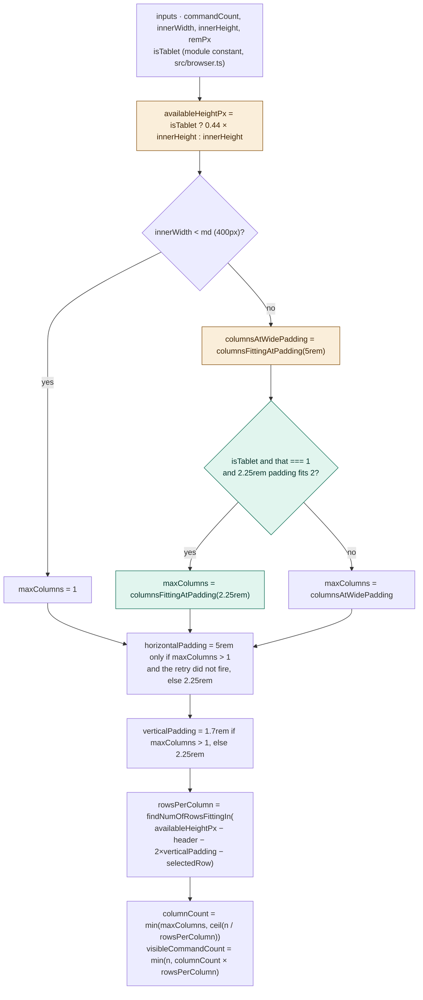

# Plan: Gesture Menu tablet safe zone (#4533 review)

Hold a tablet's command list to the top 44% of the screen, so it stops running down into the band where
the hand holding the device covers it.

Branch: `gesturemenu/multi-column-layout`. Review feedback on
[#4533](https://github.com/cybersemics/em/pull/4533), not a new issue.

## Context

`fbmcipher`'s `CHANGES_REQUESTED`
([review](https://github.com/cybersemics/em/pull/4533#pullrequestreview-3736516716)) photographed a
12.9″ iPad held in both orientations and marked the region the hand covers in red:

> On tablets, the hand naturally sits in the bottom-left of the screen – so if the command list gets
> long enough, the user's finger can actually cover the commands. […] My proposed solution: set a
> "max-height" on the command list so it breaks into a new column early – before hitting the bottom of
> the screen. […] the red area varies with screen height […] maybe scale the values proportionally
> with height? […] Note we only want this on tablets.

The panel itself stays full-screen. Only the **column height budget** changes.

### The measurement

From the Figma frames (`oQnevfxv79fhTJnOs0fz9k`, node `12294-186180`), which annotate the same iPad
twice:

| orientation | viewport | safe zone | hand zone | safe ÷ innerHeight |
| --- | --- | --- | --- | --- |
| landscape | 1366 × 1024pt | 450pt | 542pt | **0.4395** |
| portrait | 1024 × 1366pt | 600pt | 728pt | **0.4392** |

The two agree to 0.1%, so "scale proportionally with height" needs no per-device table: the safe zone is
**44% of `innerHeight`, measured from the top of the viewport**. The header, the panel's vertical
padding and the selected-row allowance all sit inside that 44%.

Worth recording what the model implies: the band is **not** a fixed physical reach — 542pt is 104 mm
and 728pt is 140 mm — it scales with the screen. One device in two orientations cannot prove that, but
it is what the design asserts.

## Design decisions

- **A hard cap, not a preferred one (2026-08-21, user).** On a tablet the list gets 44% of
  `innerHeight` and the overflow is trimmed. A soft cap that grew the column back rather than lose a
  command was drafted and **rejected**: the band is to be respected unconditionally.
- **Cancel and Command Universe trim like any other command (2026-08-21, user).** They sort last
  (`useFilteredCommands.ts:109` returns the sort key `\x99` for both), so they are the *first* two
  dropped. Consistent with this branch's "they are ordinary list items" model, and knowingly at odds
  with the review note calling their behavior "perfect and should stay exactly as-is" — see
  [Known gaps](#known-gaps).
- **A narrow tablet gets its second column back (2026-08-21, user).** `maxColumns` is measured against
  the wide 5rem gutters, and on an iPad mini in portrait that is what refuses the second column, not the
  screen. Without the retry the cap has **no effect at all** there, because a one-column layout takes
  `GestureMenu`'s scrolling path and never reads `visibleCommandCount`.
- **`isTablet` reads `window.screen`, not the viewport (2026-08-21, review).** The reviewer asked for a
  PandaCSS breakpoint instead of a hardcoded `600`, and floated `useBreakpoint('lg')`. The token part is
  taken; the hook is not. `useBreakpoint` reads `viewportStore.innerWidth`, so an iPhone 17 Pro in
  landscape (874pt) clears `lg` and would be treated as a tablet — exactly the "600 is currently
  labelled *landscape mobile device*" risk raised in the same comment. Taking the **minimum of the two
  screen dimensions** makes the test orientation-invariant: `min(402, 874) = 402`.
- **The retry keys on the wide-padding result, computed first.** This qualifies the earlier decision
  that "`maxColumns` is measured against the wide padding, so it describes the viewport alone", but
  keeps what that decision protected against: the padding ↔ `columnCount` circularity. Nothing in the
  retry reads `columnCount`.

## Implementation

Three pieces. `GestureMenu.tsx` is untouched — it already consumes `columnCount`, `rowsPerColumn`,
`visibleCommandCount` and the paddings from the hook.

| Where | What |
| --- | --- |
| [`src/browser.ts`](../../src/browser.ts) | `isTablet` — `isTouch && min(screen.width, screen.height) >= parseInt(token('breakpoints.lg'))`. |
| [`useGestureMenuLayout.ts`](../../src/hooks/useGestureMenuLayout.ts) | `columnsFittingAtPadding()`, `retryAtNarrowPadding`, and `horizontalPaddingRem` coupled to the padding the budget used. |
| [`useGestureMenuLayout.ts`](../../src/hooks/useGestureMenuLayout.ts) | `GESTURE_MENU_TABLET_SAFE_HEIGHT_RATIO = 0.44`, and `availableHeightPx = isTablet ? innerHeight * ratio : innerHeight`. |

The cap is one assignment. Everything downstream is unchanged: `gridHeightPx` already subtracts the
header, both paddings and the selected row from `availableHeightPx`, and `findNumOfRowsFittingIn`
already turns that into `rowsPerColumn`. No new branch, no second height, no gate.

Teal is new, amber is an existing step that gained an input or was pulled into a function, grey is
untouched. Three paths leave the width step, not two — the `innerWidth < md` short-circuit is the
original's first branch and forces `maxColumns` to 1 before any width arithmetic runs.

## What it costs

Measured, 28 commands (the widest the list gets), 18px root. Lists shrink as the gesture refines, so
trimming eases with every stroke. Every row is asserted in
[the hook's tests](../../src/hooks/__tests__/useGestureMenuLayout.ts).

| device | today | after | shown |
| --- | --- | --- | --- |
| iPad mini portrait 744×1133 | 1c × 24r, all 28, scrolls | 2c × 8r | **16 / 28** |
| iPad mini landscape 1133×744 | 2c × 14r | 3c × 4r | **12 / 28** |
| iPad 11 portrait 834×1194 | 2c × 26r | 2c × 9r | **18 / 28** |
| iPad 11 landscape 1194×834 | 2c × 17r | 3c × 5r | **15 / 28** |
| iPad 12.9 portrait 1024×1366 | 1c × 30r | 2c × 11r | **22 / 28** |
| iPad 12.9 landscape 1366×1024 | 2c × 22r | 3c × 7r | **21 / 28** |
| iPhone 17 Pro portrait 402×874 | 1c × 17r | unchanged | all |
| iPhone 17 Pro landscape 874×402 | 2c × 6r | unchanged | all |
| Desktop | — | unchanged | all |

## Behavior spec

### Tablet detection

- **IF** the device is a touchscreen whose smaller *screen* dimension is at least `lg` (600px), **THEN**
  `isTablet` is true — whichever way round the two dimensions are reported. `[unit]`
- **IF** it is a touchscreen below `lg` in its smaller dimension — including a phone held in landscape,
  whose *viewport* width clears `lg` — **THEN** `isTablet` is false. `[unit]`
- **IF** the device is not a touchscreen, **THEN** `isTablet` is false whatever the screen size. `[unit]`

### Narrow-tablet column width

- **IF** `isTablet` and the wide 5rem gutters fit only one minimum-width column while the narrow 2.25rem
  padding fits two, **THEN** `maxColumns` is 2, `horizontalPaddingRem` is 2.25 and `verticalPaddingRem`
  tightens to 1.7. At 744×1133 that is two 313.5px columns. `[unit]`
- **IF** the wide gutters already fit two or more columns, **THEN** the retry does not fire and both
  `maxColumns` and `horizontalPaddingRem` are what they were before this change. `[unit]`
- **IF** `!isTablet`, **THEN** the retry never fires at any width. `[unit]`
- **IF** the retry fires, **THEN** every rendered column is still at least
  `GESTURE_MENU_MIN_COLUMN_WIDTH_REM` wide. `[unit]`

### Tablet safe zone

- **IF** `isTablet`, **THEN** `rowsPerColumn` is what fits in 44% of `innerHeight` less the header, both
  vertical paddings and the selected-row allowance. `[unit]`
- **IF** `isTablet` and the commands exceed `columnCount × rowsPerColumn`, **THEN** the overflow is
  trimmed from the end — including Cancel and Command Universe, which sort last. `[unit]`
- **IF** `isTablet` and the list already fits inside the band, **THEN** nothing is trimmed. `[unit]`
- **IF** `!isTablet`, **THEN** the budget is the full viewport height at every geometry, so phone,
  landscape-phone and desktop layouts are byte-identical to before this change. `[unit]` `[e2e]`
- **IF** the cap is in effect, **THEN** the panel is still full-screen; only the column's row count
  moves. The paddings *do* move on a retried narrow tablet, which is the width retry, not the cap.
  `[visual]`

## Known gaps

- **Cancel and Command Universe are trimmed on every tablet at a long list.** They sort last, so they go
  first. Accepted deliberately (see Design decisions), and at odds with the review note that their
  behavior should stay exactly as-is. Must be raised explicitly in the PR reply rather than left to be
  discovered.
- **No affordance marks the cut.** The grid drops overflow silently; the fog that fades the trailing
  rows lives on `gesturemenu/controls-overflow-single-col` and is not on this branch.
- **Every tablet still overshoots the band at a full list.** The cap fixes the row budget, but width
  limits the layout to 2–3 columns, so 28 commands cannot fit inside 44% on any current tablet. Short
  and medium lists land inside it outright.
- **The 44% is calibrated from one device in two orientations.** The proportional model is an assertion
  of the design, not a measurement across tablet sizes.

## Interaction with `gesturemenu/controls-overflow-single-col` (#4992)

That branch (draft) collapses `GestureMenu` to one grid at every viewport: nothing scrolls,
`visibleCommandCount` is applied unconditionally, and a one-column list fogs its trailing rows. It drops
`isMultiColumn`, `isMobilePortrait`, `columnWidth` and `dividerWidth` from the hook's return, and still
carries the pre-rounding `15.556` / `1.944` constants — the merge must keep this branch's `15.5` / `2`.

Neither piece of this change is in the render tree #4992 rewrites, so they do not conflict. Two things
change when it lands:

- **Its fog fixes the second Known gap above** for the one-column case; the grid still has no fog.
- **A tablet held to one column (Split View) starts honoring the cap.** Today it scrolls and shows
  everything; after #4992 it would trim to 8 of 28 plus fog.

## Verification status

**2026-08-21, on `gesturemenu/multi-column-layout`.**

| Check | Result |
| --- | --- |
| `npx vitest run --project unit src/hooks/__tests__/useGestureMenuLayout.ts` | **45 passed** (28 pre-existing + 17 new) |
| `npx vitest run --project unit src/__tests__/browser.ts` | **6 passed** |
| `npx vitest run --project unit` (whole project) | **1768 passed, 0 failed, 75 skipped** (skips pre-existing) |
| `npx tsc --noEmit` | **clean** |
| `npx eslint` on all four touched files | **clean** |

Every row of [What it costs](#what-it-costs) is asserted by a unit test, including the unchanged phone
and non-tablet rows.

**Still unverified:** the visual result on a real tablet. The unit tests prove the arithmetic, not that
the menu looks like the reviewer's mockup. When checking in a browser, note that `isTouch` and
`isTablet` are both evaluated at import — **reload after resizing**, or the emulated device keeps its
load-time answer and the screenshot proves nothing.
